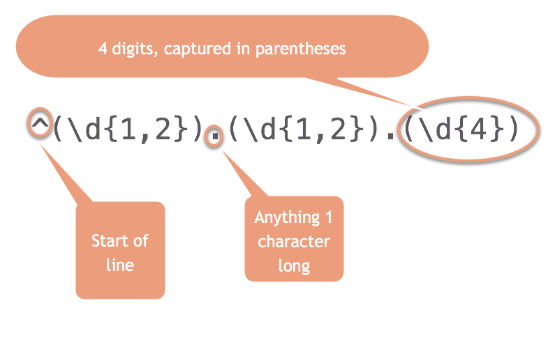
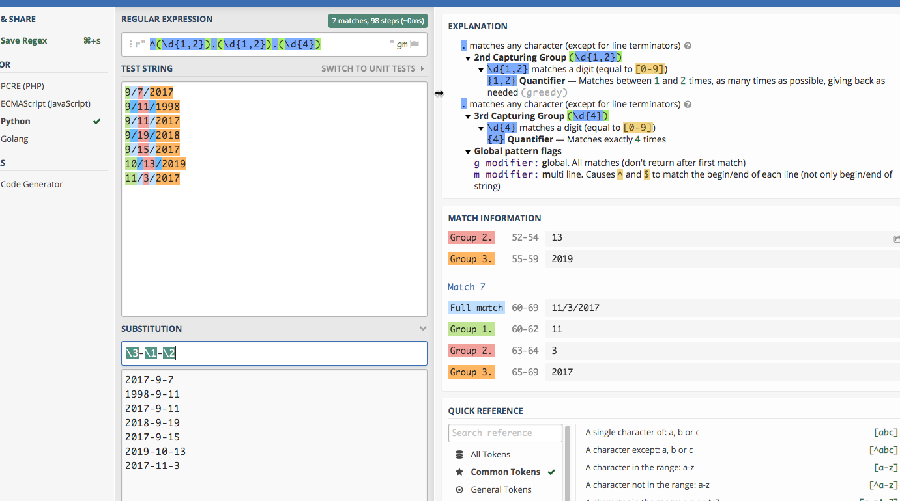

# Regular Expressions for pattern matching {#advanced-regex} 

*Regular expressions* are used to find and replace text based on *patterns* rather than *characters*. They're particularly useful when trying to pull apart and standardize variables in a database such as names, phone numbers and addresses to make grouping and joining more effective.

A human can easily discern that the name *John W. Smith, Jr.*  and *Smith, John W Jr* are probably the same. A computer sees them as completely different -- they don't start with the same characters, they have commas in different places, etc. A regular expression can help you pull apart names based on their pieces and then put them back together in another form.

There are two or or three parts to a regular expression:   

1. The pattern you are trying to find.
2. An optional replacement, which could use part of what you've found in the original seeking phase.
3. Options - the big one in R is `negate=TRUE`, which means to match everything EXCEPT what is found.

In practice, you'll usually save the pieces of each pattern you've found into a variable, then put them back together differently.

Here are two other good tutorials on regular expressions: 

* [From Justin Meyer](https://cronkitedata.s3.amazonaws.com/docs/meyer_regex.pdf) at a recent IRE conference that can serve as a guide.  
* [From Prof. Christian McDonald of UT-Austin](https://cronkitedata.s3.amazonaws.com/docs/regex_for_rest_of_us.pdf)

If you're using R, you can use a regex using the `stringr` package (part of the tidyverse) using the functions *str_detect* , *str_extract* and their cousins. They look like this:  

```markdown
    str_detect(var_name, regex("pattern")) 
````

## Types of regular expression patterns

### Literal strings

These are just letters, like "abc" or "Mary". They are case-sensitive and no different than using text in a filter.

You can tell the regex that you want to find your pattern at the beginning or end of a line:

```markdown
  ^   = "Find only at the beginning of a line"
  $   = "Find only at the end of a line"
```

### Wild cards

A wild card is a character you use to indicate the word "anything". Here are some ways to use wild cards in regex:

```markdown
    .      = "any single character of any type"
    .?     = "a possible single character of any type (but it might not exist)"
    .*     = "anything or nothing of any length"
    .+     = "anything one or more times"
    .{1,3} = "anything running between 1 and 3 characters long"
```

Regular expressions also have wild cards of specific types. In R, they are "escaped" using two backslashes. In other languages and in the example <https://regex101.com> site they only use one backslash:

```markdown
      \\d   = "Any digit"
      \\w   = "Any word character"
      \\s   = "Any whitespace (tab, space, etc.)"
      \\b   = "Any word boundary" (period, comma, space, etc.)
```

When you upper-case them, it's the opposite:

```markdown
      \\D = "Anything but a digit"
```
### Character classes

Sometimes you want to tell the regex what characters it is allowed to accept. For example, say you don't know whether there is an alternative spelling for a name -- you can tell the regex to either ignore a character, or take one of several.

In R, we saw that there were alternative spellings for words like "summarize" -- the British and the American spellings. You could, for example, use this pattern to pick up either spelling:

```markdown
        summari[sz]e
```

The bracket tells the regex that it's allowed to take either one of those characters. You can also use ranges:

      [a-zA-Z0-9]

means that any lower case, upper case or numeric character is allowed.

### Escaping

Because they're already being used for special purposes, some characters have to be "escaped" before you can search for them. Notably, they are parentheses (), periods, backslashes, dollar signs, question marks, dashes and carets.

This means that to find a period or question mark, you have to use the pattern

        \\. or
        \\?

In the Regex101, this is the biggest difference among the flavors of regex -- Python generally requires the least amount of escaping.

### Match groups

Use parentheses within a pattern to pick out pieces, which you can then use over again. The end of this chapter shows how to do this in R, which is a little complicated because we haven't done much with `lists`. 


## Sample data

Here are three small text files that you can copy and paste from your browser into the [regex101.com](https://regex101.com/) site. It's a site that lets you test out regular expressions, while explaining to you what's happening with them.

1. A [list of phone numbers](https://cronkitedata.s3.amazonaws.com/csv/regex_phones.txt) in different formats
2. A [list of dates](https://cronkitedata.s3.amazonaws.com/csv/regex_dates.txt) that you need to convert into a different form.
3. A [list of addresses](https://cronkitedata.s3.amazonaws.com/csv/regex_addresses.txt) that are in multiple lines, and you need to pull out the pieces. (Courtesy of IRE)
4. A [small chunk of the H2B visa applications](https://cronkitedata.s3.amazonaws.com/csv/regex_h2bvisas.txt) from Arizona companies or worksites that has been kind of messed up for this demonstration, in tab-delimited format.

## Testing and examining patterns with Regex101 

[Regex 101](https://regex101.com) is a website that lets you copy part of your data into a box, then test different patterns to see how they get applied. Regular expressions are very difficult to write and to read, but Regex101 lets you do it a little piece at a time. Just remember that every time you use '\' in regex101, you will need '\\` in R. 

### Looking for specific words or characters

The easiest regex is one that has just the characters  you're looking for when you know that they are the right case. They're called *literals* because you are literally looking for those letters or characters.

{width=100%}

## Practice #1: Extract date parts

In Regex 101, change the "Flavor" to "Python" -- otherwise, you have to escape more of the characters.^[Each language implements regular expressions slightly differently -- when you begin to learn more languages, this will be one of the first things you'll need to look up.]

We want to turn dates that look like this:

      1/24/2018

into something that looks like this:

     2008-1-24

Copy and paste these numbers into the regex 101 window:

    9/7/2017
    9/11/1998
    9/11/2017
    9/19/2018
    9/15/2017
    10/13/2019
    11/3/2017

First, you can use any digit using the pattern "\d". Try to do it in pieces. First, see if you can find one or two digits at the beginning of the line.

      ^\d{1,2}

Try coming up with the rest of it on your own before you type in the answer:

      ^\d{1,2}.\d{1,2}.\d{4}

(This works because regular expressions normally are "greedy". That is, if you tell it "one or two digits", it will always take two if they exist.)

Put parentheses around any pieces that you want to use for later:

```{r advanced-regex-image4, out.width='80%', echo=FALSE}




```

Now each piece has its section, numbered 0 for the whole match, and then 1-3 for the pieces.

{width=100%}

## Practice #2: Extract pieces of phone numbers

Here are some phone numbers in different formats:

```markdown
    623-374-1167
    760.352.5212
    831-676-3833
    (831)-676-3833
    623-374-1167 ext 203
    831-775-0370
    (602)-955-0222  x20
    928-627-8080
    831-784-1453
```

This is a little more complicated than it looks, so try piecing together what this one says:

```markdown
      (\d{3})[-.\)]+(\d{3})[-.]+(\d{4})
```

(This won't work in the "substitute" area -- it would be easier to create a new variable with the results than to replace the originals.)

Anything within parentheses will be "captured" in a block.

## Practice #3: Extract address pieces

Here are a few lines of the data from [Prof. McDonald's tutorial](https://cronkitedata.s3.amazonaws.com/docs/regex_for_rest_of_us.pdf), which you can copy and paste to go his exercise. (He uses the Javascript version of regular expressions, but for our purposes in this exercise, it doesn't matter which one you use. If you choose Python,  you'll have one extra step, of putting a slash (\) before the quotes. The colors work a little better if you leave it on the default PHP method.)

```markdown
    "10111 N LAMAR BLVD
    AUSTIN, TX 78753
    (30.370945933000485, -97.6925542359997)"
    "3636 N FM 620 RD
    AUSTIN, TX 78734
    (30.377873241000486, -97.9523496219997)"
    "9919 SERVICE AVE
    AUSTIN, TX 78743
    (30.205028616000448, -97.6625588019997)"
    "10601 N LAMAR BLVD
    AUSTIN, TX 78753
    (30.37476574700048, -97.6903937089997)"
    "801 E WILLIAM CANNON DR Unit 205
    AUSTIN, TX 78745
    (30.190914575000477, -97.77193838799968)"
    "4408 LONG CHAMP DR
    AUSTIN, TX 78746
    (30.340981111000474, -97.7983147919997)"
    "625 W BEN WHITE BLVD EB
    AUSTIN, TX 78745
    (30.206884239000487, -97.7956469989997)"
    "3914 N LAMAR BLVD
    AUSTIN, TX 78756
    (30.307477098000447, -97.74169675199965)"
    "15201 FALCON HEAD BLVD
    BEE CAVE, TX 78738
    (30.32068282700044, -97.96890311999965)"
    "11905 FM 2244 RD Unit 100
    BEE CAVE, TX 78738
    (30.308363203000454, -97.92393357799966)"
    "3801 JUNIPER TRCE
    BEE CAVE, TX 78738
    (30.308247975000484, -97.93511531999968)"
    "12800 GALLERIA CIR Unit 101
    BEE CAVE, TX 78738
    (30.307996778000472, -97.94065088199966)"
    "12400 W SH 71 Unit 510
    BEE CAVE, TX 78733
    (30.330682136000462, -97.86979886299969)"
    "716 W 6TH ST
    AUSTIN, TX 78701
    (30.27019732500048, -97.75036306299967)"
    "3003 BEE CAVES RD
    ROLLINGWOOD, TX 78746
    (30.271592738000436, -97.79583786499967)"
```

## On your own

[This is a small list of H2A visa applications](https://cronkitedata.s3.amazonaws.com/csv/regex_h2bvisas.txt), which are requests for agricultural and seasonal workers, from companies or worksites in Arizona. Try importing it into Excel, then copying some of the cells to practice your regular expression skills.

You might try:

* Finding all of the LLC's in the list (limited liability companies) of names. (You should turn on the case-insensitive flag in Regex 101 or set that flag in your program if you do.)
* See how far you can get in standardizing the addresses.
* Split the city, state and zip code of the worksite.
* Find all of the jobs related to field crops such as lettuce or celery.


