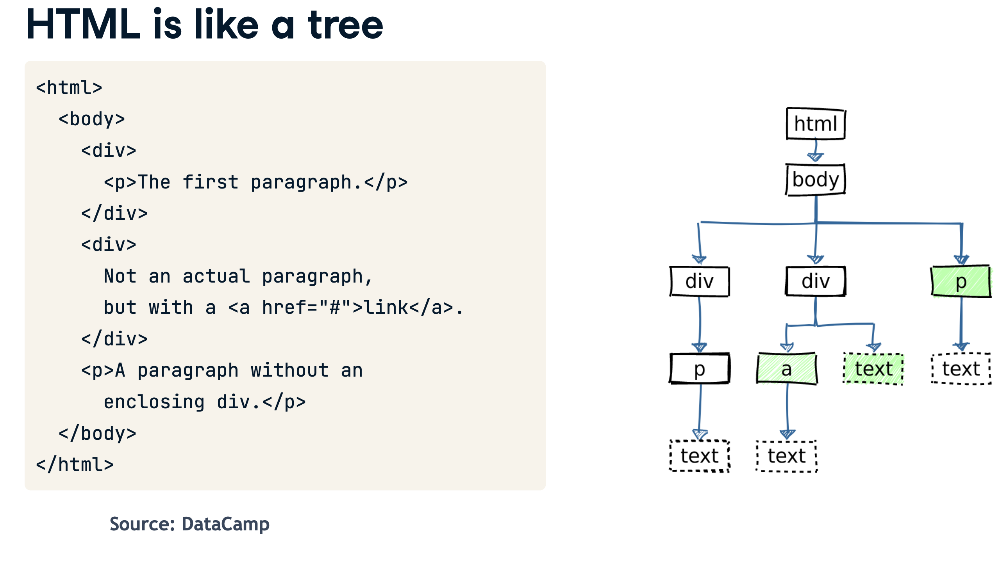
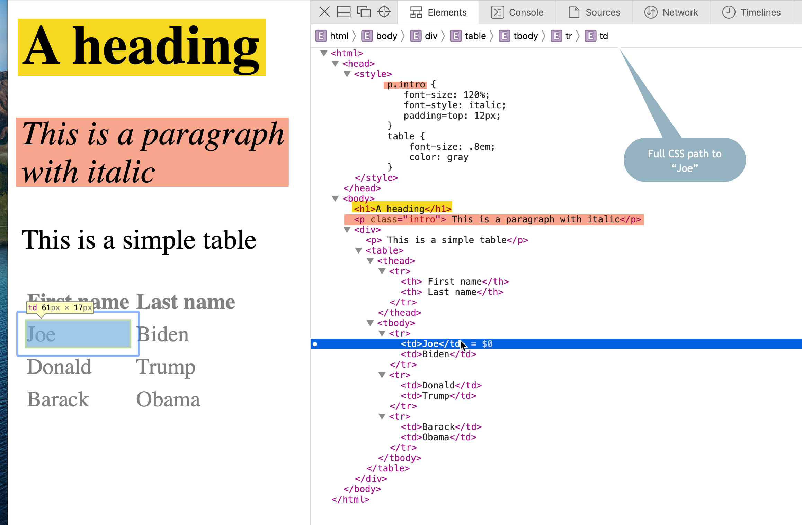
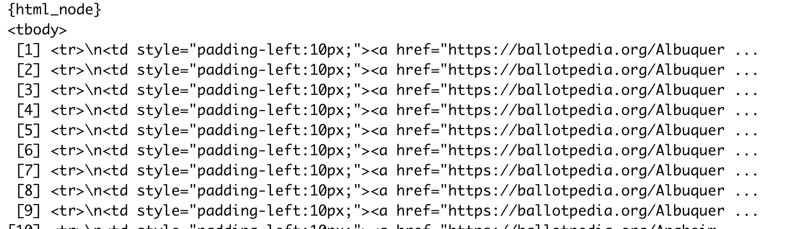

# Introduction to scraping in R {#advanced-scrape2}

This chapter introduces the `rvest` -- short for "harvest" - library in R. See the [glossary](appendix-glossary.html) in the Appendix for terms used in this tutorial. 

There are a lot of really good tutorials on the web for rvest. Here are a few: 

* [A chapter in the advanced data wrangling textbook](https://dcl-wrangle.stanford.edu/rvest.html) used at Stanford. (The whole book is pretty good, and would be good for you now that you're no longer beginners.) It uses the page from [Our World in Data](https://ourworldindata.org/famines) on famines as its example.

* A [free chapter from DataQuest](https://www.dataquest.io/blog/web-scraping-in-r-rvest/) on the basics of scraping

Cronkite students: I have also posted some PDF's in Canvas from DataCamp's scraping course, which can't be shared publicly. They're clearer than a lot of the tutorials and can be used as a reference. In the next few weeks, I'll get you 6 months' of access to the site and will send you a link to join.

This chapter assumes you are, by now, relatively comfortable with R code chunks. In particular, it's assumed you know how to assign the output of a piece of code to a new variable, and that you understand the pipe structure with the key verbs of the tidyverse.

## Understanding a web page and its structure

Web pages are written in HTML, even if they don't have "html" at the end of the file name. 

HTML is like an upside-down tree. It has a trunk, which is an `<html>` tag, then two main branches: `<head>` and `<body>`. The content of the page branches out from the `body` tag: 

{width=100%}


All of HTML is just text. The *tags* tell your browser how to render each *element*, while *attributes* give them extra information, like the URL of a link, or a formatting class. 

We can navigate the tree using RVest.


* Open or create a project in RStudio, and create a new document. You can do this as a new markdown document, or as an R Script. 

* The code to load two libraries:


```r
library(tidyverse)
library(rvest) 
```

* Select both lines, and either press Ctl-Enter or choose "Run" at the top of the screen to run the lines you selected. 

The library `rvest` parses the tree into its distinct elements, retaining the structure of the tree.  The `read_html()` function takes a chunk of text, a page saved on your computer, or a page on the internet and parses it into its pieces. 

We're going to parse the page using "css selectors", which tells the program how to navigate the page. The css selector can use the tag , an attribute, or both to find elements on the page. In this case, there is only one table, so we can just find one element using the "table" tag. 

This method of scraping doesn't work if the page was created on the fly by executing a Javascript program on your browser, the way that the simple page in the last chapter did. Those pages usually have a json dataset that you can grab more easily.  


Here's what the page looks like when rendered, with the full tree shown on the right. 


{width=100%}


* Parse the [simple page]("https://cronkitedata.s3.amazonaws.com/docs/presidents.html) at the address shown into its pieces, and save the result as `my_html`You may notice that I've broken up the code to do one thing at a time. First, it saves the address in a variable called "url". Then it uses the same piping we used in data work.^[We glossed over this before, but any time you use a pipe, whatever comes above a command is used as the first argument of the current command. So this code is the same as `read_html(url)`. Sometimes you need it as something other than the first argument, in which case you reference it using a period.]


```r
url <- "https://cronkitedata.s3.amazonaws.com/docs/presidents.html"

my_html <-
  url %>%  
  read_html


print(my_html)
```

```
## {html_document}
## <html>
## [1] <head>\n<meta http-equiv="Content-Type" content="text/html; charset=UTF-8 ...
## [2] <body>\n   <h1>A heading</h1>\n   <p class="intro"> This is  a paragraph  ...
```

This is a complex object, and you're only seeing the beginning of it -- the two elements that are at the top of the tree. You'll notice that there is a new object (our  new word for "variable") that is a list rather than a data frame in you environment.  Lists are used to store complicated structures that don't fit neatly into rectangle.

To find any element, like the table, use its tag in an `html_node()` . To find all of the elements of a type, make it plural, like `html_nodes()`.^[A newer version of rvest prefers the use of `html_element()` instead of node. For us, they mean the same thing and both work. The newer syntax throws a warning in your RStudio environment that I can't troubleshoot, so I'm waiting for an update to the rvest package to switch.]

Use the tag name or CSS selector to get just a piece of the page.


```r
my_html %>%
 html_node("body") 
```

```
## {html_node}
## <body>
## [1] <h1>A heading</h1>
## [2] <p class="intro"> This is  a paragraph with italic</p>
## [3] <div>\n     <p> This is a simple table</p>\n     <table>\n<thead><tr>\n<t ...
```


To get all of the paragraphs, make the command plural. Note how you now get the HTML of the selected elements in their entirety.


```r
my_html %>%
  html_nodes ("p")
```

```
## {xml_nodeset (2)}
## [1] <p class="intro"> This is  a paragraph with italic</p>
## [2] <p> This is a simple table</p>
```

And to get everything with a class of "intro", use a period to indicate a class, and convert it to text using the `html_text` function, asking R to remove extra whitespace with the "trim" argument. 


```r
my_html %>%
  html_nodes (".intro") %>%
  html_text (trim=T)
```

```
## [1] "This is  a paragraph with italic"
```

### A special type: table {-}

Tables are so commonly scraped that rvest has special way to extract the values, just as we did in Google Sheets, which puts it right into a data frame:


```r
my_html %>%
  html_node ("table")  %>%
  html_table
```

<div class="kable-table">

|First name |Last name |
|:----------|:---------|
|Joe        |Biden     |
|Donald     |Trump     |
|Barack     |Obama     |

</div>

The singular version of html_node picks out the first piece that matches the selector. The plural version would result in a list of all of them, from which you can select the number you want using the odd syntax `.[[n]]`, where "n" is the table number. 


### A harder example: Ballotpedia {-}

Here's an example using the ballotpedia page we used in the last section: 


```r
url <-"https://ballotpedia.org/List_of_current_city_council_officials_of_the_top_100_cities_in_the_United_States"

ballotpedia <- 
  url %>%
  read_html %>%
  html_nodes ("table")

print (ballotpedia)
```

```
## {xml_nodeset (12)}
##  [1] <table class="infobox" style="text-align: center; width:200px"><tbody>\n ...
##  [2] <table class="bptable sortable collapsible collapsed" style="background: ...
##  [3] <table class="bptable gray sortable" id="officeholder-table" style="widt ...
##  [4] <table class="wikitable;" style="width=100%"><tbody>\n<tr>\n<th colspan= ...
##  [5] <table class="navbox" cellspacing="0" style=";"><tbody><tr><td style="pa ...
##  [6] <table cellspacing="0" class="nowraplinks collapsible autocollapse" styl ...
##  [7] <table class="navbox" cellspacing="0" style=";"><tbody><tr><td style="pa ...
##  [8] <table cellspacing="0" class="nowraplinks collapsible autocollapse" styl ...
##  [9] <table class="navbox" cellspacing="0" style=";"><tbody><tr><td style="pa ...
## [10] <table cellspacing="0" class="nowraplinks collapsible autocollapse" styl ...
## [11] <table class="navbox" cellspacing="0" style=";"><tbody><tr><td style="pa ...
## [12] <table cellspacing="0" class="nowraplinks collapsible autocollapse" styl ...
```

Looking at this, we have several ways to get at the proper table. We can pick the third element that we just got: 


```r
ballotpedia[[3]]
```

```
## {html_node}
## <table class="bptable gray sortable" id="officeholder-table" style="width:auto; border-bottom:1px solid #bcbcbc;">
## [1] <thead><tr colspan="5" style="background:#4c4c4c!important;color:#fff!imp ...
## [2] <tbody>\n<tr>\n<td style="padding-left:10px;"><a href="https://ballotpedi ...
```

or, you might notice that it has an "id" attribute called 'officeholder-table'. 


```r
office_holders <-
  url %>%
  read_html %>%
  html_node("#officeholder-table > tbody")
```

If you print it, you'll see something like this: 

{width=100%}

### Getting the link


Before, in Google Sheets, we had no way to pick up the list of links that would tell us what city each member was in. If we tried, Google Sheets would have choked on the missing links. That's also true when we use the html_table() function to turn it into a data frame:


```r
office_table <- 
  url %>%
  read_html %>%
  html_node("#officeholder-table") %>%  # keep the whole table to get headings 
  html_table
```


But now we can get a list of the names of cities by extracting an "attribute" from the tag. (This is a little harder than I'd intended because not every row has a link, meaning we have to rejigger the formula to create empty rows when the link doesn't exist.)


```r
city_links <-
  ballotpedia[[3]] %>%  # the third table in our list
  html_nodes ("tbody > tr") %>%  # all rows
  html_node ("td > a") %>%  # justlink tag in the first column 
  html_attr("href")  # the URL
```


We've never done this before, but we can add this list as a column to the data frame using the tidyverse `add_column` syntax. At the same time, you can put your regular expression muscles to work by "extracting" rather than "detecting" a pattern:


```r
office_table %>%
  add_column (city=city_links, .before="Office") %>%
  mutate (city = str_extract(city, "[^/]+$")) %>%
  head()
```

<div class="kable-table">

|city                    |Office                              |State |Name          |Party       |Date assumed office |
|:-----------------------|:-----------------------------------|:-----|:-------------|:-----------|:-------------------|
|Albuquerque,_New_Mexico |Albuquerque City Council District 1 |NM    |Louie Sanchez |Nonpartisan |January 1, 2022     |
|Albuquerque,_New_Mexico |Albuquerque City Council District 2 |NM    |Isaac Benton  |Nonpartisan |2005                |
|Albuquerque,_New_Mexico |Albuquerque City Council District 3 |NM    |Klarissa Peña |Nonpartisan |2013                |
|Albuquerque,_New_Mexico |Albuquerque City Council District 4 |NM    |Brook Bassan  |Nonpartisan |2019                |
|Albuquerque,_New_Mexico |Albuquerque City Council District 5 |NM    |Dan Lewis     |Nonpartisan |January 1, 2022     |
|Albuquerque,_New_Mexico |Albuquerque City Council District 6 |NM    |Patrick Davis |Nonpartisan |2016                |

</div>

(The str_extract () function matches everything after the last slash , because the character class is negated. It means "take everything up to the end where where there is no slash in it.")

## Your turn

A lot of people use IMDB pages as practice for scraping because its HTML is a little primitive. Try extracting the name, year, rating, and rank of each item in this list <https://www.imdb.com/chart/toptv/?ref_=nv_tvv_250>


Hints: 

- If you right-click on the table, you'll see the table has an attribute of `class="chart full-width"`  . That means you can use the class selector `.chart > table` . If you use plural, it will be a list with one item in it. If you use singular, it will be the table itself. 

-  To get three columns in a data frame of text,  `html_table(trim=T) `

- The year is held in  a span element with a class of "secondaryInfo" in the first column. See if you can figure out how to get at it. ^[ `html_nodes ("tbody > tr > .titleColumn > .secondaryInfo") %>% html_text(trim=T)`]

- To extract title and its link, use the `a` tag

- To get the full information from the rating column, including the number of votes that it's based on, use the `strong` tag then the `title` attribute. See if you can figure that one out. 

- To put them all together, use the add_column() verb


## Cheat sheet

### HTML tags / elements {-}

Each tag has an opening and closing it. This is what a "p" open and close tag looks like, with the text inside it shown on the page: 

``` 
<p> This is a paragraph </p>

```

Here is a list of common tags you'll use in scraping: 

tag | description
--- | -----------
`p` |  or a paragraph
`div` | a block of text , or division of the page. 
`span` | An area within a div or p element that is treated specially without it breaking into a new line. 
`a`  |  a link. It should always have an attribute of `href`, which is the URL to the link. 
`h1` through `h6` | which are headline levels. "h1" is the headline, "h2" is a sub-head, and so on. 

Modern websites might have these sections, which are used instead of the "div" tag: 

tag | description
--- | -----------
`nav` |  a navigational menu
`main` | the main block of the page with the content
`aside` | a sidebar
`footer` | the stuff at the bottom. 

Tables are structured like this: 

tag | description
--- | -----------
`table` | the main container. 
`thead` and `tbody` |  A heading area and the body area. These are always just below the table element
`th` | the row that contains the headings . These are the first row within the body
`tr` |  all of the content rows. These are subsequent rows within tbody
`td` | all of the cells (columns). These are always WITHIN a tr or th element.

Any of these can be nested within any others. Typically, a page starts with an "h1" tag, then has "div" tags for different sections, such as the sidebar or the main content.  An "a" tag is typically nested within others. 

Standalone tags: 

A few tags don't have opening and closing versions - they just stand alone: 

`img` - an image to show. It would have a `src` attribute for the link, and an `alt` attribute for text to show for accessibility. example: ``

`br` - A hard line break. 


### Common attributes for tags {-}

tag | description
--- | -----------
`href` | the URL of a link within an `a` tag. 
`src`  | the path to an image, within an `img` tag. 
`class` | a reference to a CSS class. More than one class can be identified, separated with a space. 
`id` | a unique name for this element using CSS

People can also make up their own attributes - they're arbitrary. 

### Rvest functions  {-}

function | description
--- | -----------
`read_html()` | to parse the page. Start with a file name or URL. 
`html_nodes()` or `html_elements`|  to get ALL elements that match your query. It always gives back a list of objects, even if it's empty. To pluck one by number, use `[[n]]`. 
`html_node()` or `html_element` | the FIRST element that matches your query. Always returns a single object. 
`html_table()` | convert a table to a data frame with just its text
`html_text(trim=T)` | get the text within an element. 
`html_attr (attr_name)` | get the value of an attribute, such as the link URL in "href". 
`add_column` | append columns to the end of a dataframe from lists/vectors. They must be in the same order, and there have to be the same number of items as there are rows. 
`add_row` | to append rows at the bottom. These can be by name or position. There can't be any columns in the row you want to add that aren't in the one you're adding to. 

Use these with pipes, for example: 

```markdown

url %>% 
  read_html %>%
  html_nodes ( "table") %>%
  .[[3]] %>%
  html_table(trim=T)
  
NB: In the fourth line, you need a period before the [[3]] . 
I don't know why. 
It stands for "whatever came before this", and is usually implied when we use the pipe.
  
```


(You'll often see these operations as `cbind` and `rbind` - they're similar. Our way is just the tidyverse way.)


### Examples of common CSS selectors {-}

This uses an example assuming the tag "p" , class "myclass" and id "myid" are used. You substitute the tags, classes, and id's you want.  See <https://www.scraperapi.com/blog/css-selectors-cheat-sheet/> for a more in-depth cheat sheet. 

selector | description
---   | ---- 
`p`   | a "p" element
`.myclass` | any element with class="myclass"
`p .myclass` | "p" element with a class of "myclass". 
`p > .myclass` | every child element of p with a class of 'myclass' regardless of the tag. Must be a direct child. 
`#myid` | Any element with "id='myid'"
`body > div > table .content-table > tbody > tr` | A row within a table classed "content-table" within a div. 

You have to go through the whole path to an element if you need it, which is why you have to look in the inspector section of your browser or use the CSS Selector Gadget (a chrome extension that I've never been able to work properly!)


[]


  


