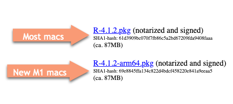
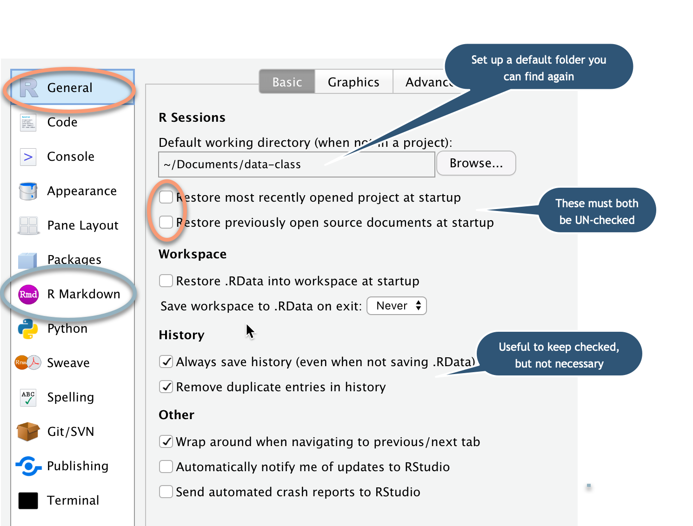
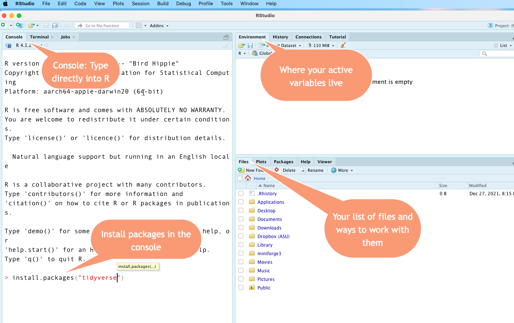

# Getting started with R and RStudio { #r-start }

:::{.alert .alert-secondary}

 In this chapter

* Install R , RStudio
* The power of packages, especially the `tidyverse`
* Set up defaults for reporting with data
* Issue your first R commands 
* Work in projects 
* Relax!
:::

This is probably your first introduction to coding. Don't be worried. With effort, much of what reporters do in coding can be learned in a few weeks. 

Like most reporters, I learned the coding that I know (which isn't a lot) because I wanted to get a story done. In our class, we are not trying to become a programmer or social scientist. We're working on stories. 

You saw during the pivot table lesson that spreadsheets have limits. We couldn't easily get the city with the most police shootings because we would have had to put both city and state into the pivot table. A median is missing from pivot tables entirely.  It's easy to lose track of where you are and what you did. That's the reason to learn some coding --  there is something we want to know that isn't very easy to get in other ways.

All programming languages have one thing in common: You write instructions, called algorithms, and the program executes your statements in order.   It means you can do more complicated work in computer programming than in point-and-click parts of Excel. It can also scale -- you can repeat your instructions millions of times, tweak it a little, and re-run the program without messing anything else up. The computer won't mind. Really. 

Writing code can also be self-documenting. You can largely eliminate those painstaking Excel data diaries and replace them with documents that explain your work as you go. You'll still need to record information about your interviews and decisions, but you'll no longer have to write down every mouse click.  

If you're nervous about getting started with programming, take  look at the Appendix: [A gentle introduction to programming](appendix-program.html) and Jesse Lecy's "[Learning how to Learn](http://ds4ps.org/dp4ss-textbook/ch-032-learning_r.html)", where he says: 

>If this is your first programming language, you will get frustrated at times. Take a step back and remember that after a semester of Spanish you can only operate at the level of a three-year old. You only know one verb tense, a few dozen verbs, and several hundred words. You have so many emotions that you can’t express in your new language!

All I ask is that if you get very frustrated, walk away from the computer for a little while. Get help if, after a break, you don't know what you might do next to make some progress. #dj-sos on Slack is one option. Use it. If you're stuck, it's quite likely others are as well. But don't let it get to you. As Lecy says, your morale is a limited commodity.

### R or Python? {-}

If you ask a data scientist or technologist which language you should learn first, you'll start a heated debate often between advocates of R, Python, Javascript , SQL, Julia and others. Ask the same question of a data journalist and the answer will be: "Choose one that is free and that your colleagues use so you can get help."  For our purposes, it really doesn't matter -- any of the standard languages will do. 

The only rule I would make is to try to stick to your first language for a little while before deciding you want to learn a different one. It would be like trying to learn Portuguese and Spanish at the same time, when you know neither one to begin with. They're related, but very different.

Employers who hire data reporters usually don't care which programming language you know because it's relatively easy to learn another once you're comfortable with the concepts and good data journalism habits. In a few cases, such as the Associated Press, R is preferred. In others, like the Los Angeles Times, it's a little easier to work with the team if you work in Python. But most employers will just be happy that you are reasonably self-sufficient in either one. 

I chose R because I find it a little easier to use when trying to puzzle something out step by step, and it is particularly good at working with the weird and varied forms of data thrown at us. But it's really just a matter of taste and comfort. 

## Install R and RStudio

* R is the programming language itself, and has to be installed first 
* RStudio is the way we'll interact with the programming language. Install it second. 
* Packages are sets of programs written by volunteers and data scientists that perform specialized jobs more easily that working with the "base" R language.  A package must be installed once on your computer, then invoked to use them in a program. T

:::{.alert .alert-primary}

Follow this interactive tutorial on installing R, RStudio and the tidyverse on your computer: 

 <https://learnr-examples.shinyapps.io/ex-setup-r/#section-welcome> .
 
:::
 
 

There are two differences between the video and today:

* The tidyverse will take much longer to finish installation. It has a lot to do and often looks like it's stalled. 
* There are two versions of R for Mac users: The traditional one and the one for the new M1 chip on the latest machines.  Choose the one that matches your machine by checking the apple in the upper left and looking at "About this Mac". It will say "Apple M1" as the processor if you have it. 

### Cronkite students: R and RStudio in labs {-}

I will update this to let you know which labs in Cronkite have the software you need. If you are using the lab, put the folders below on your portable hard drive.

### Mac users - "Command line tools" error {-}

If you get an error during or after installation about "command line tools", ask me to help you. It's a simple fix. RStudio will actually work without it, but you'll get a lot of annoying warnings. 

## Unlocking packages and the tidyverse

The real power of R comes with packages. Packages are bundles of programs that others have found useful to extend the base R language. R is almost useless without them. There are more than 10,000 packages available for R, each doing a special job.

If you followed along with the tutorial, the last thing you did was install a "package" called the `tidyverse`.  Almost everything we do from now on depends on that step. 

Most of the materials you see related to programming in R have some reference to the tidyverse. One problem with having a lot of packages, often written by hobbyists, is that they’re not very consistent. One might use a comma where another uses some dots, for example. One might expect your data to come in the "spreadsheet" form that we studied earlier in this book, and others might expect it to come in the "database" form. 

The tidyverse packages up a whole set of other packages that are designed to work together smoothly with similar grammar and syntax. It’s particularly useful for the kind of work reporters do – importing, cleaning and analyzing data that we get from others and can’t control how it’s structured. It works best on granular data that arrives in database form rather than tabular statistics that come in aggregated spreadsheets, but it has methods to convert across these forms. 

For many reporters (myself included), R was too difficult to learn before the tidyverse came around. We’ll be working almost exclusively within the tidyverse in this course. I strongly suggest that when you Google for help, put the word "tidyverse" somewhere in your query. Otherwise, you may get answers that look inscrutable and unfamiliar. 

The tidyverse is the brainchild of Hadley Wickham, a statistician from New Zealand, who famously identified **tidy data** principles we’ve implicitly followed all semester. He’s currently the chief data scientist for RStudio in Houston.
 
## Set up RStudio for data reporting

Staying organized is one of the challenges of data reporting -- you're constantly re-downloading and re-jiggering your analysis and it's easy to get your material separated. This setup helps ensure that you always know where to find your work and can move it to another comptuer seamlessly.

Before you start, decide on a folder you'll use to store all of your R work. Within my Documents folder, I created a sub-folder called `data-class`. It will make this guide a little easier if you do the same thing, especially if you're not very familiar with using directories and folders. 

:::{ .float-right .w-50 .p-3}

:::

Start up RStudio once you've made your folder.  Make sure you start up RStudio (not the R language) by searching for it in Spotlight or in the Search bar in Windows. Here's what they look like:

:::{.alert .alert-primary}

Get to the Preferences (under the RStudio menu item on a Mac) and make sure it looks like this in the General tab:

{width=100%}
:::

(I've turned OFF all of the options to restore anything when you start up RStudio and set up a default working directory by browsing to the one I just created.)

Under the R Markdown options, make sure that the box called "Execute setup chunk automatically" is checked.

## The screen

This is what your screen probably looks like:

{width=100%}

### The Console {-}

The Console is where you can type commands and interact directly with the programming language. Think of it as a very powerful calculator at first. One reason to use it is to install packages. 

If you followed the installation demo, you've already used the console to install one package. (Go back and do that part now if you skipped it.) Install a few more that will be useful in this course. 

:::{.alert .alert-primary}
Copy these commands one a a time, and paste them into the Console, then hit Return/Enter to execute the command.

       install.packages("janitor")
       install.packages("rmarkdown")
       install.packages("skimr")
       install.packages("swirl")
::: 

These package names should all be in quotes. We'll be installing other packages later in this guide, but for now that is everything you need. 

### Files tab  {-}

We won't be using many of the tabs in the lower right, but the Files tab can help you if you're having trouble navigating your work. Under the More button, you can choose "Go to working directory", since that's where R thinks you've parked all of your work.  This can be confusing in R, which is why we'll be working in "projects" that bundle up all of your work in one place. 

### Environment  {-}

The upper right screen is the Environment, which is where your active *variables* live. A variable is a named thing. It might be a word, a list of words or numbers, or a data frame (spreadsheet). Anything that you want to use has to be listed in that environment before you can reference it. This will make more sense later. 

### Typing into the console {-}

When you type this: `5+5` after the > prompt, you'll get this back after you press Return/Enter:
``[1] 10``

When you type this: `"Sarah"` (with quotes) after the > prompt, you'll get this back:
``[1] "Sarah"``

To create a new variable, you'll use the *assignment* operator `<-` (two characters : A less than sign and a hyphen). Here is how I would create the variable called `my_name` (lower case, no spaces). Notice how it appears in the Environment after being created. Then I can print it by typing the name of the variable instead of the letters of my name in quotes: 

The console remembers your commands, but you have to type them one at a time and it will forget them when you leave for the day. That's why we're going to work in programs called R Markdown documents most of the time. 

## Work in projects 

One of the things that trips up new users of R is that it's hard to tell the program where to find things on your computer. The "working directory" can be confusing. 

We'll be working entirely in projects in this course.  Projects keep everything needed together so that they can run on almost any machine. Create a new project by hitting the second green + sign at the top of your screen, create a new directory within the one that we're working (you can also find it under the File menu item):

## Optional: Take a tutorial

One of the packages you installed earler was called `swirl`. Invoke it now by typing `library(swirl)` into the Console. You can follow the instructions from there. Don't bother going beyond the first chapter -- it's more geared at other kinds of jobs than ours. 

<figure class="figure float-right col-6">

<figcaption class="text-secondary small"> Relax by Silwia Bartyzel via Unsplash</figcaption>
</figure>

## Relax! 

You're all set up and we're ready to start programming. Congratulate yourself - everything is new, nothing is intuitive and the screen is intimidating. You've come a long way. 

## Other resources 

Sharon Machlis' [Practical R for Mass Communications and Journalism](http://www.machlis.com/R4Journalists/a-brief-introduction-to-rstudio.html) has an intro to R and RStudio in chapters 2.3 through 2.6

Ben Stenhaug created a fast-paced video introducing the RStudio interface. Don't worry too much about what some of it means just yet -- just see if you can get used to the different parts of the screen. 

<iframe width="560" height="315" src="https://www.youtube.com/embed/lTTJPRwnONE" frameborder="0" allow="accelerometer; encrypted-media; gyroscope; picture-in-picture" allowfullscreen></iframe>
