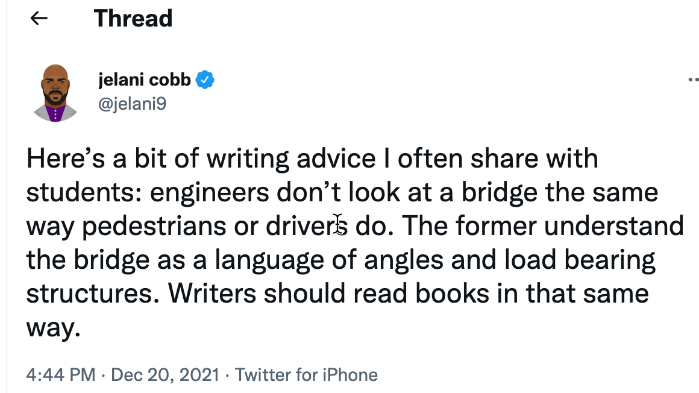
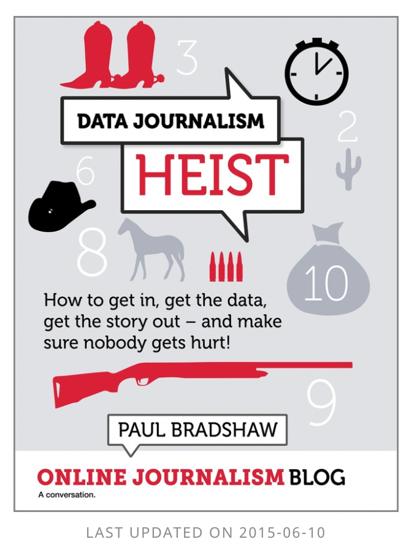

# Learn a new way to read   { #start-story }

Getting started in data journalism often feels as if you've left the newsroom and entered the land of statistics, computer programming and data science. This chapter will help you start seeing data reporting in a new way, by learning how to study great works of the craft as a writer rather than a reader. 

::::: {.image-wrapper .float-right .col-md-8 .mr-3}
{ width=90% }
:::::

[Jelani Cobb](https://twitter.com/jelani9/status/1473046796205117443) recently tweeted, "an engineer doesn't look at a bridge the same way pedestrians or drivers do." They see it as a "language of angles and load bearing structures." We just see a bridge. While  he was referring to long-form writing, reporting with data can also be learned by example -- if you spend enough time with the examples. 

Almost all good writers and reporters try to learn from examplary work. I know more than one reporter who studies prize-winning journalism to hone their craft. This site will have plenty of examples,but you should stay on the lookout for others. 

## Read like a reporter

Try to approach data or empirical reporting as a reporter first, and a consumer second. The goal is to triangulate how the story was discovered, reported and constructed. You'll want to think about why *this* story, told this way, at this time,  was considered newsworthy enough to publish when another approach on the same topic might not have been. 

### What were the questions? {-}

In data journalism, we often start with a tip, or a hypothesis. Sometimes it's a simple question. Walt Bogdanich of The New York Times is renowned for seeing stories around every corner. Bogdanich has said that the prize-winning story "[A Disability Epidemic Among a Railroad's Retirees](https://www.nytimes.com/2008/09/21/nyregion/21lirr.html)" came from a simple question he had when railway workers went on strike over pension benefits -- how much were they worth? The story led to an FBI investigation and arrests, along with pension reform at the largest commuter rail in the country. ^[Note to self: check this with Walt. It's how I remember it, but I'm not positive.] 

The hypothesis for some stories might be more directed. In 2021, the Howard Center for Investigative Journalism at ASU published "[Little victims everywhere](https://cronkitenews.azpbs.org/littlevictims/little-victims-everywhere/chapter-1.html)", a set of stories on the lack of justice for survivors of child sexual assault on Native American reservations. That story came after previous reporters for the center analyzed data from the Justice Department showing that the FBI dropped most of the cases it investigated, and the Justice Department then only prosecuted about half of the matters referred to it by investigators. The hypothesis was that they were rarely pursued because federal prosecutors -- usually focused on immigration, white collar crime and drugs -- weren't as prepared to pursue violent crime in Indian Country. 

When studying a data-driven investigation, try to imagine what the reporters were trying to prove or disprove, and what they used to do it. In journalism, we rely on a mixture of quantitative and qualitative methods. It's not enough to prove the "numbers" or have the statistical evidence. That is just the beginning of the story. We are supposed to ground-truth them with the stories of actual people and places. 

### Go beyond the numbers {-}

It's easy to focus on the numbers or statistics that make up the key findings, or the reason for the story. Some reporters make the mistake of thinking all of the numbers came from the same place -- a rarity in most long-form investigations. Instead, the sources have been woven together and are a mix of original research and research done by others. Try to pay attention to any sourcing done in the piece. Sometimes, it will tell you that the analysis was original. Other times it's more subtle. 

But don't just look at the statistics being reported in the story. In many (most?) investigations, some of the key people, places or time elements come directly from a database.

When I was analyzing some housing court data for The New York Times, one fact hit me as I was looking at a timeline of eviction cases: The most cases ever filed in one of the city's courts happened during a Thanksgiving week one year. It was the kind of detail that could have been compelling in a story if it had been more recent. 

Often, the place that a reporter visits is determined by examples found in data. In [this story on rural development](assets/pdfs/rural_development.pdf) funds, all of the examples came from an analysis of the database. Once the data gave us a good lead, we examined press releases and other easy-to-get sources before calling and visiting the recipients or towns. 

## Reading tips

You'll get better at reading  investigations and data-driven work over time, but for now, remember to go beyond the obvious:

* Where might the reporters have found their key examples, and what made them good characters or illustrations of the larger issue? Could they have come from the data?

* What do you think came first -- a narrative single example that was broadened by data (naively, qualitative method), or a big idea that was illustrated with characters (quantitative method)?

* What records were used? Were they public records, leaks, or proprietary data?

* What methods did they use? Did they do their own testing, use statistical analysis, or geographic methods? You won't always know, but look for a methodology section or a description alongside each story.

* How  might you localize or adapt these methods to find your own stories?

* Pick out the key findings (usually in the nut graf or in a series of bullets after the opening chapter): are they controvesial? How might they have been derived? What might have been the investigative hypothesis?  Have they given critics their due and tried to falsify their own work?

* How effective is the writing and presentation of the story? What makes it compelling journalism rather than a dry study? How might you have done it differently? Is a video story better told in text, or would a text story have made a good documentary? Are the visual elements well integrated? Does the writing draw you in and keep you reading? Think about structure, story length, entry points and graphics all working together.

* Are you convinced? Are there holes or questions that didn't get addressed?

## Analyze data for story, not study  

As journalists we'll often be using data, social science methods and even interviewing differently than true experts. We're seeking stories, not studies. Recognizing news in data is one of the hardest skills for less experienced reporters new to data journalism. This list of potential newsworthy data points is adapted from Paul Bradshaw's "[Data Journalism Heist](https://leanpub.com/DataJournalismHeist)".

::::: {.image-wrapper .float-right .col-md-5}
{ width=90% }
:::::

* Compare the claims of powerful people and institutions against facts -- the classic investigative approach.
* Report on *unexpected* highs and lows (of change, or of some other characteristic)
* Look for outliers -- individual values that buck a trend seen in the rest
* Verify or bust some myths
* Find signs of distress, happiness or dishonesty or any other emotion.
* Uncover *new* or *under-reported* long-term trends.
* Find data suggesting your area is *the same* or *different* than most others of its kind.

Bradshaw also did a recent study of data journalism pieces: "[Here are the angles journalists use most often to tell the stories in data](https://onlinejournalismblog.com/2020/08/11/here-are-the-7-types-of-stories-most-often-found-in-data/)", in Online Journalism Blog. I'm not sure I agree, only because he's looking mainly at visualizations rather than stories, but they're worth considering. 

## Exercises

* If you're a member of Investigative Reporters and Editors, go to the site and find a recent prize-winning entry (usually text rather than broadcast). Get a copy of the IRE contest entry from the Resources page. Try to match up what the reporters said they did and how they did it with key portions of the story. 

* The next time you find a good data source, try to find a story that references it. If your data is local, you might look for a story that used similar data elsewhere, such as 911 response times or overdose deaths. But many stories use federal datasets that can easily be localized. Look at a description of the dataset and then the story to see how the data might have been used. 

