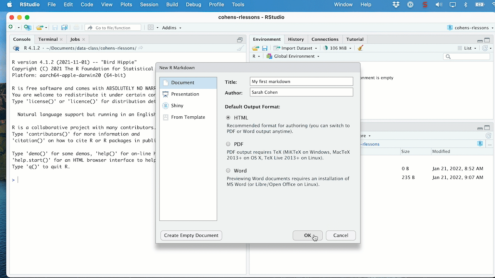
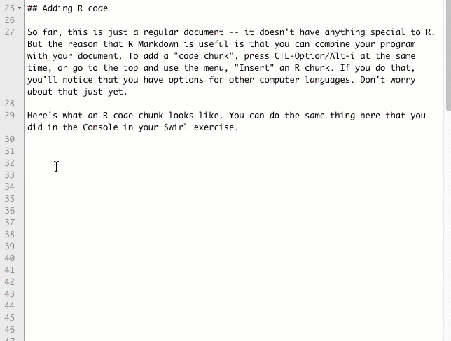

# R Markdown { #r-markdown}

:::{.alert .alert-secondary}

<p class="alert-heading font-weight-bolder fs-3">
In this chapter
</p>


* Create a new markdown document in a project
* Write narrative sections including headlines, subheads and formatting using R Markdown 
* Set the "front matter" or YAML for the page
* Insert your first code chunk and run some R code!
* Knit your document - you can do it as often as you want to see drafts.
* Optional: download <a href="https://cronkitedata.s3.amazonaws.com/markdown_templates/markdown_template.Rmd">a new skeleton</a> page you can use in class with some formatting options pre-set.

:::


Creating documents with R Markdown lets you ditch those tiresome data diaries and combine your documentation, code and results all in one, reproducible page. It's a variant of the markdown language that was was invented as an easy way for early contributors to Wikipedia to author documents that would translate to the web. 

You will write your document around chunks of R code, which integrates your analysis with your writing. (R Markdown is also designed to output your work in other formats, like an actual printed book or slides.) Some news organizations do much of their internal work using R Markdown documents and code. 

:::{.alert .alert-info .opacity-2}
Shannon Pileggi [created a series of gifs](https://www.pipinghotdata.com/posts/2020-09-07-introducing-the-rstudio-ide-and-r-markdown/) that illustrate some of the nuances of the RStudio interface -- look there for illustrations on customizing your windows and troubleshooting documents as we move forward. A lot of it has to do with R Markdown documents. 
::: 

## Your first markdown 

:::{.alert .alert-primary}
Open the **project** you created in the last chapter. After that, use the File menu to choose "New File", or press the leftmost green plus sign at the top of your screen, then choose "R Markdown."  You'll be prompted for a headline and the author, and then it will create a new, unsaved filed. Save it as `yourlastname-firstmarkdown.Rmd`. Then delete everything after the last set of three dashes. Create your own Markdown document by following along ([Specific steps are in the walkthrough](#walkthrough))
:::


```{r firstmarkdown-image, echo=FALSE, out.width="100%"}

if(knitr::is_html_output()) knitr::include_graphics("assets/images/r-markdown-firstmarkdown.gif") else 

```


## The anatomy of a document

There are four parts to an R Markdown document: 

1. The "front matter", or YAML. 
2. Narrative and document features including headlines, subheads, images and other elements you'd normally see on a web page. You don't have to write in HTML - Markdown writes it for you. 
3. Code chunks -- your R computer code.
4. The results of code chunks - what you get back when you execute the code, including charts, graphs, tables and maps.


### Markdown punctuation and symbols {-}

The narrative part follows a few basic rules. [This markdown cheatsheet from Adam Pritchard](https://github.com/adam-p/markdown-here/wiki/Markdown-Cheatsheet) goes through them, but the most common are:  

Symbol | Format | Comments
---- | ---- | ---
`## ` | Headline | Technically, this is a second-level outline. But R uses the title as the first level.
`###` | Subhead |  You can go to the 6th level of these by adding more #'s
`-` at the beginning of a line  | A bulleted list item | Separate from the text by one empty line and leave a space after the dash. 
`1`, `2`... at the beginning of a line  | A numbered list | Ditto
`[]()` | A link | `[my link words](https//....)`
`` | An image  | `{width=100%}` <br> Change width to shrink or grow, but there can't be any spaces before or between anything. 
`<>` | A simple link shown as an address | `<https/cronkitedata.github...`>
`**` | Bold text |  `**This would be bold**` <br> This time with no spaces 
`*`  | Italic text | `*This would be italic*` <br> No spaces
back-ticks (\`) |  Computer code format | \``this is how you print code`\` 


### Front matter / YAML at the top {-}

The way the R knows how to process the page is by reading the very top of the file and looking at the section between three dashes. This is called YAML, or front matter, and it's extremely picky. 


The default YAML is very basic -- there are no options. You might want to set up a skeleton document in your r-projects folder that you can use as a starting point each time. Here is some YAML you can copy and put at the top of your document that will make it look a little more polished. 


```
---
title: "A title for your page"
autor: "Your name"
date:  "A date"
output: 
  html_document: 
    theme: cerulean
    toc: true
    toc_float: true
    df_print: paged
    fig_width: 5
    code_download: true
---
```

Another way to customize it is to use the Output Options under the gear. 


## Knitting your document

Look at the top of your screen, and  you'll see a knitting needle and the word, "Knit". Pressing that button will convert your markdown into the finished document. 

Here's how it looks pre-knitted and after knitting: 

{width=100%}

There are several reasons it might not work:

1. You haven't saved the document yet. 
2. There is an error in that top YAML section. Just copy one that works and try again. 
3. There is an error in your R code. (You'll see how to skip a chunk with an error later on.) 
4. Everything's too smushed together. Give your document room to breathe , by inserting blank lines between elements.


## Including R code and its results

So far, this is just a simple document. It doesn't contain any R code.  To add code, you insert a "code chunk".  You can add it by pressing the green "+C" button at the top of the document, or by pressing *`Option/Alt-Ctl-i`* . Write your code in the gray area between the triple-backtic symbols.  Run the code chunk by pressing the arrow button within it, or by pressing `Cmd/Ctl-Shft-Enter`  (either Cmd or Ctl)


```{r add-code-image, out.width="100%", echo=FALSE}

if (knitr::is_html_output())  else knitr::include_graphics ( "assets/images/r-markdown-add-code.png")

```

The following code chunk creates a new variable called `my_variable`, another called `my_name`, then prints out the value stored in the `my_name` one.  

```{r example_firstcode , echo=TRUE}

#this is a comment - it won't be run

my_variable <- 13
my_name <- "Sarah"

my_name

```


This might not seem like much, but think about how it helps you do your analysis. You can write all of your notes right where you do the work. You don't have to copy and paste information from one place to another, or share out-of-date spreadsheets with your teammates.

## More markdown details

Take a minute now and explore the toolbar above your document. Now that you know what a lot of this means it will make more sense. 

{width=100%}


:::{.alert .alert-info}
As you're working, you might knit every time you do a significant amount of work on your document to make sure it's coming out the way you expect. There's no harm in doing it and it will get you used to seeing how your markdown and code looks when it's a finished document.
:::


### R starts from scratch {-}

When you close down your computer, you will have to run any program you've written from the start - it doesn't remember where you left off. This includes loading any libraries and data. This is actually good -- it ensures that your project is reproducible. 

For long programs or working on complicated datasets, you might split your analysis into several of these programs, saving interim versions of the data as you go along. 

Every time you knit your document, it pretends you've also started over from scratch - you may see variables in your environment, but the computer is doing its work in an entirely new, empty "session", so it starts from the top. 

Make sure that you run every part of your document every time you re-open it.  The easiest way to do that is to get into the habit of running all chunks as soon as you start your work session using the menu or using Alt-Cmd-R, or through the Run menu:

{width=100%}

### A replacement skeleton for you {-}

The skeleton that R gives you by default is a stripped down version of the YAML. Here is a replacement for you to copy that you can copy and paste instead.   It has some options that make your output look a little more polished.  The `code_download` set to true means that you don't need to send anyone your raw Markdown document -- the final version will have it embedded in it.   Make sure you replace everything, including the three dashes at the top and bottom. The colons and indentations are important. 

```
---
title: "A title for your page"
author: "Your name"
date:  "A date in quotes"
output: 
  html_document: 
    theme: cerulean
    toc: true
    df_print: paged
    code_download: true
---

```

### Resources {-}


* "[Data driven docs](https://ds4ps.org/docs/#what-are-data-driven-docs)" walkthrough on DS4PS (or, Data Science for the Public Sector), from Jesse Lecy.
* RStudio has a [quick tour of R Markdown](https://rmarkdown.rstudio.com/authoring_quick_tour.html) that goes through more than you even need. It goes a little fast. 

## Walkthrough 


Make sure you have already installed the `rmarkdown`  package before going further.

Create a new R Markdown document with the following elements: 

* Front matter with your name, the date and a title for your page.
* A heading introducing a subtopic 
* Within that heading, a list of three things about yourself or about a topic you love, in a bulleted list.
* Another heading
* An image that you like (you'll have to save it in your project.)
* Another heading
* A code chunk, in which you create a variable and assign it a value.

Then knit the document and compare the sections.

[Here is one I created about myself](assets/first-markdown.Rmd) that you can use as a guide, but I implore you not to copy it -- just use it as a guide if you have questions or if something is happening that you don't expect. Here is  a rendered version if you want to see how it translates into an HTML page: <https://rpubs.com/cohensh/firstmarkdown>

