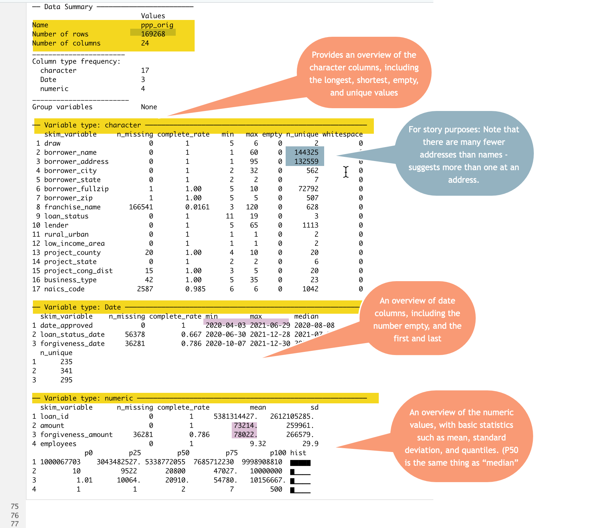

# Verbs in depth: Aggregating with groups {#r-verb-groupby}


```{r setup, include=FALSE, message=FALSE}

library(tidyverse)
library(lubridate)
library(janitor)


```


:::{.alert .alert-secondary}

<p class="alert-heading font-weight-bolder fs-3">
In this chapter
</p>

* `group_by` and `summarise` are the tidyverse's version of Excel pivot tables, with many more possibilities.
* R is picky and will create different rows for the tiniest difference between values, such as "Lettuce" vs. "lettuce". 
* You will rarely use `group_by` without `summarise`. 
* You will often have to accommodate missing data, or the dreaded "NA" values.
* Pivoting a result to spreadsheet rather than database format. 

::: 


This chapter continues with the Paycheck Protection Program, or PPP, loans in Arizona.   Full documentation of the dataset is in the [Appendix](appendix-ppp.html). If you haven't already, look through that documentation before you start. 


As you did in the last chapter, create a new R Markdown document [with the usual biolerplate at the top]((https://gist.githubusercontent.com/sarahcnyt/e60ad2d7ccf65498fc88791f3bb683ae/raw/bcf4fb844d183b62f531a74a445271c5571f3a1d/cronkite-boilerplate.Rmd)), and read in the data from the internet using the same code chunk as before: 

```{r read-orig, echo=TRUE, eval=TRUE}

ppp_orig <- readRDS( url ( "https://cronkitedata.s3.amazonaws.com/rdata/ppp_az_loans.RDS"))


```


### Get an overview of your data with `skimr` {-}

Get an overview of the data using the `skimr` package that I suggested that you install earlier in the book. If you haven't yet (or if you're on Cronkite computers), install it now in the Console using the command `install.packages("skimr")`. 

This command uses the package without loading it in the first chunk by naming the package (`skimr`) and a function or action that comes with that package (`skim`). Sometimes you'll do that when you're only using it once, or when you want to indicate to your readers which package contributes the function. 

```{r skimppp, eval=FALSE, echo=TRUE}

skimr::skim(ppp_orig)


```

{width=100%}

Using the `skimr` package is an easy way to get a very detailed overview of your data without having to examine each column.^[It can take some time to run on very large datasets. Go get some tea and come back in 5 minutes if that happens. Also, the image above was run on a data frame slightly different than the one you have. Your answers might be slightly different.]


## `summarise` 

The `summarise`^[Much of the tidyverse uses British spelling, but often American spelling will work as well.]  verb computes summary statistics the number of rows, a sum, and an average. It creates a new data frame with just the summary statistics, and none of the columns from the original data frame. Using it alone produces a data frame with one row. It's the equivalent of putting nothing in your pivot table in Excel other than the "Values" area. 
 
### The dreaded NA 

Missing data in computers is always a problem. In R, they are noted as `NA` (without quotes), to show they're not available. Sometimes you'll see `NaN`, for "Not a number", which is a form of missing data.  The problem is that because they're unknown, they can't match anything else, they can't be considered 0, and they can warp any answers you get.^[The same is true with `NULL` values, which is what most other languages call "missing".]

But there's usually nothing you can do about missing data, so you have to tell the program exactly what to do about them. There are two choices: 

* Let them infect everything they touch, turning everything into `NA`. 
* Ignore them in a computation completely. 

There's no right answer, and it depends on what you're doing.  In some cases, you know that they stand for the value `0`, and in others you don't. We will usually ignore them by adding an *argument* to every summary function that could be infected by them : `na.rm = TRUE` , which means, "remove NA's before you do anything.". 


### Summary functions 

Some of the common functions you'll use to summarize are : 

* `mean (column_name, na.rm=T)` --  for an average
* `sum (column_name, na.rm = T)`
* `n()` -- for "how many", or "count"
* `median (column_name, na.rm=T)` 
* `min (column_name, na.rm=T)`
* `max (column_name , na.rm=T)`


Here is an example, creating some of the summary statistics that appeared in the `skimr` report: 


```{r summary_stats, echo=TRUE, eval=knitr::is_html_output()}

ppp_orig %>%
  summarise ( n(), 
              mean (amount, na.rm=T), 
              mean (forgiveness_amount, na.rm=T), 
              min (date_approved, na.rm=T), 
              max (date_approved, na.rm= T)
  ) %>%
  glimpse()
              

```


This produced a data frame with 1 row and 5 columns. The column names are the same as the formulas that created them, which is difficult to work with. Create new column names using the name (in back-ticks if it's got spaces or special characters) and assign them the values of the summaries using the `=` sign:


```{r summary_stats_named, echo=TRUE, eval=knitr::is_html_output()}

ppp_orig %>%
  summarise ( number_of_rows =  n(), 
              mean_amount = mean (amount, na.rm=T), 
              mean_forgiven = mean (forgiveness_amount, na.rm=T), 
              first_loan = min (date_approved, na.rm=T), 
              last_loan = max (date_approved, na.rm= T)
  ) %>%
  glimpse()
              

```


## Grouping 

Now that you know how to summarize the whole data frame, you'll want to start getting totals by category. This is the same thing as a pivot table -- the columns you use as "groups" are the equivalent of the Rows area in Excel: 


{width=100%}

### Grouping by one column

In the PPP data, the "draw" refers to which of the two programs was involved - the original one, or the one passed by Congress in late 2020. 

Here's how we'd get some key statistics by draw: 


```{r group_draw, echo=TRUE, eval=knitr::is_html_output()}

ppp_orig %>%
  group_by ( draw ) %>%
  summarise ( first_loan = min ( date_approved ), 
              total_amount = sum (amount), 
              total_forgiven = sum (forgiveness_amount, na.rm=T), 
              `# of loans` = n() 
  )


```


You can do math at the same time as your summarization. This code chunk expresses the amounts in millions of dollars, making it a little easier to read. There is no `na.rm=T` for the `date_approved` and the `amount` columns because they're always filled in, according to the `skimr` report above.  The `n()` function never takes an argument, and counts rows rather than values.


```{r millions , results="hide", echo=TRUE, eval=TRUE}


ppp_orig %>%
  group_by ( draw ) %>%
  summarise ( first_loan = min ( date_approved ), 
              amount_million = sum (amount/1000000), 
              forgiven_million = sum (forgiveness_amount/1000000, na.rm=T), 
              `# of loans` = n() 
  )


```


Notice that unlike pivot tables, we don't get a total across the bottom. That has to be a separate step (for now, until we go through how to make better looking tables. )

### Grouping by more than one column 

If you wanted to know the numbers outstanding and forgiven by draw, you could add another column to the group by: 


```{r twogroups, echo=TRUE, eval=knitr::is_html_output()}

ppp_orig %>%
  group_by ( loan_status, draw ) %>%
  summarise ( first_loan = min ( date_approved ), 
              total_amount = sum (amount), 
              total_forgiven = sum (forgiveness_amount, na.rm=T), 
              `# of loans` = n() 
  )


```

The `summarise` verb here has created a data frame that has only the variables you identified in the `group_by` and `summarise` commands - everything else has been removed, since it's a *summary* of your data.


### Understanding grouped data  {-}

You may have noticed an odd warning after you ran the last code chunk that said:  

```markdown
"`summarise()` has grouped output by 'loan_status'. You can override using the `.groups` argument." 
```

What does that mean? 

When you grouped by loan status and draw, R effectively split up your data frame into five independent and completely divorced piles - one for each combination of draw and status that it found. It processed them one by one to create the output data frame that was printed out. 

After it's done summarizing your data, R doesn't know what you want to do with the piles -- keep them, or put everything back together again.  

By default, after you group by more than one column, it maintains the separate piles for all but the last group in your list under `group_by` -- in this case the `loan_status`. Here, everything you do after this will work on three piles seperately.The message tells you what it did with the piles, and how to change that behavior.

That's often what you want, as you'll see in the next chapter. But if you want to stop it from doing that, then add an argument that looks like this at the end of the `summarise` statement:

```markdown
 summarise ( loan_count = n(), 
            .groups = "drop")

```

or add a line at the end of your code (after a pipe) to return it to normal: `ungroup()`. You can get some really strange answers if you save a data frame that's grouped and you don't notice it. 


Here's what a "glimpse()" looks like for a data frame that has retained some groups: 

```{r lk_groups, echo=TRUE}

ppp_orig %>% group_by ( loan_status) %>% glimpse()


```
Notice the "Groups" row at the top -- that tells you it's still got three piles. 

## Converting to "wide" (spreadsheet) format


Normally, you'll only want to have one summary statistic shown in a rectangle, with one column spread across the top and another column shown in rows. In R, this is done by "pivoting" your tables. 

In this case, we're going from a "long" to a "wide" data structure, so it's called `pivot_wider`.  

Here's an explanation of what the command looks like. Don't try to run this:

```markdown

pivot_wider ( id_cols = *list of columns to keep down the side* , 
            names_from = *the name of the column supplying the headings across the top*, 
            values_from = *the values you want to show in each cell* , 
            values_fill = *what you want to show if it's empty, usually 0 *
            )
```


So here's how you'd do it for the previous example: 

```{r pivotwider, echo=TRUE, eval=knitr::is_html_output()}

ppp_orig %>%
  group_by ( loan_status, draw ) %>%
  summarise ( loan_count = n() ) %>%
  pivot_wider ( id_cols = loan_status, 
                names_from = draw, 
                values_from = loan_count, 
                values_fill = 0)
  


```


Your instinct will often be that you want to see your data in this form, but you can and should actually do most of your work without it, then turn it on its head when you want to display it.  This is usually your very last step. 


### Percentages 

You noticed that when you created the summaries, there was no option to create a "percent of total" such as the percent of loans in each draw, or the percent of money that had been forgiven. 

You'll get more on the `mutate` verb in the next chapter, but it's used to add a column to a data frame. You can use the same summary statistics you create in the `summarise` section, but they'll be added to the existing data frame.  Here's how you can try it first using just one "group_by" column:


```{r grp-pcts, echo=TRUE, eval=knitr::is_html_output()}


ppp_orig %>%
  group_by ( draw) %>%
  summarise ( loan_count = n() ) %>%
  mutate ( pct_of_total = loan_count / sum(loan_count) * 100)
  


```

When you add a second group_by, R keeps those columns and creates a percentage based on the subtotal: 

```{r grp-pctsub, echo=TRUE, eval=knitr::is_html_output()}


ppp_orig %>%
  group_by ( draw, loan_status) %>%
  summarise ( loan_count = n() ) %>%
  mutate ( pct_of_draw = loan_count / sum(loan_count) * 100)
  


```


## Practice

Putting together the grouping and summarizing, along with the commands you learned last chapter to `filter`, `arrange` and display the `head()` and `tail()` of a dataset should equip you to write the code for these questions: 


1. Which lenders provided the most loans? 
2. Which lenders provided the most amount of money loaned? 
3. Which borrowers got the least amount of money? 
4. Show the number of loans in each draw that went to the 24 (including `NA`) types of businesses. To see them all on one screen, add ", rows.print=25" to the heading of the code chunk like this: `{r  , rows.print=25}`
5. Try to compute the percent of loans that went to projects in each county in Arizona. This will require first filtering, then grouping. 


