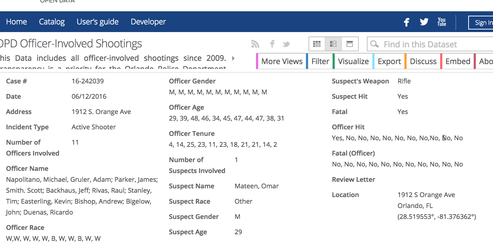
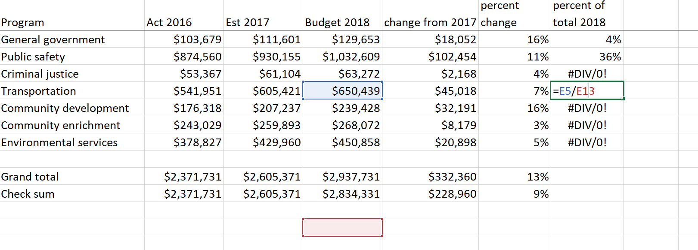
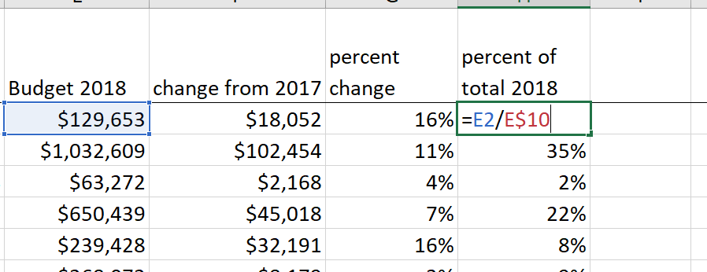
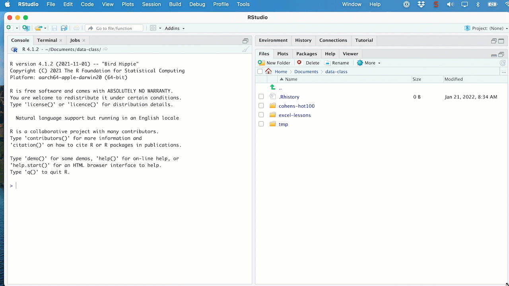
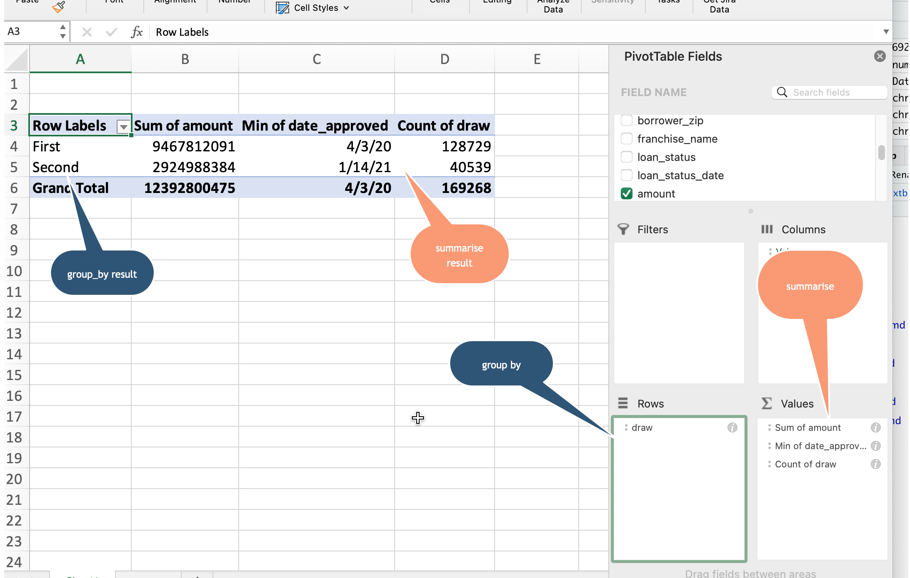
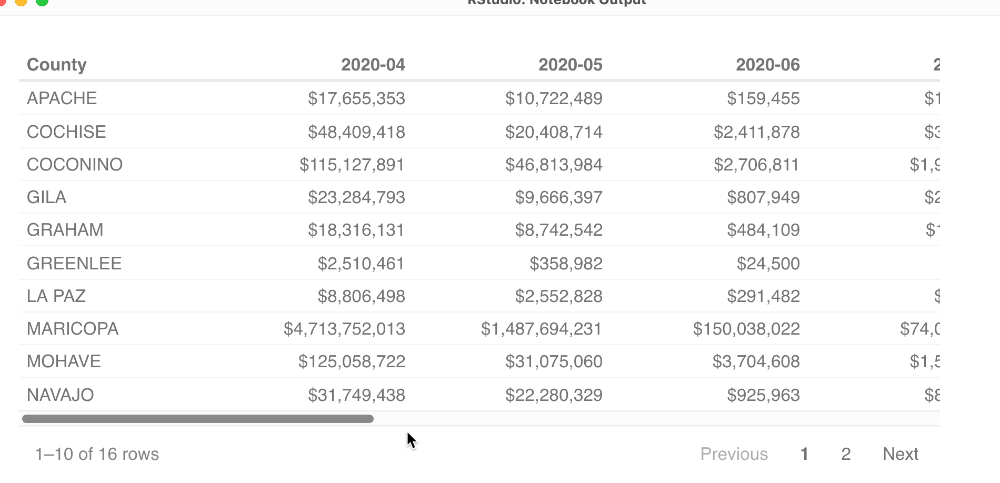
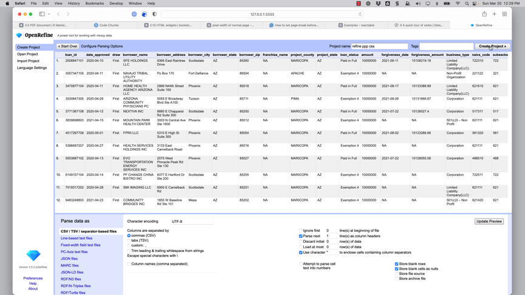

```{r include=FALSE, cache=FALSE}
# example R options set globally
# options(width = 60)

# example chunk options set globally
#knitr::opts_chunk$set(
#  comment = "#>",
#  collapse = TRUE
#  )
```


# Preface {-}

```{r setup, include=FALSE}

knitr::opts_chunk$set(cache = FALSE,
                      error=TRUE,
                      message=FALSE, 
                      warning=FALSE, 
                      echo=FALSE)


#options(knitr.graphics.auto_pdf = TRUE)


```

This online book serves as a compilation of  of handouts, websites and tutorials that I have used in my data reporting class at ASU's [Cronkite School of Journalism and Mass Communication](cronkite.asu.edu). Some of the material will be useful in other courses or for self-study, but it is primarily aimed at the investigative journalism masters' students at Cronkite.

It covers: 

- Reporting and replication in data journalism
- Table stakes: Spreadsheets in the newsroom
- Analyzing data for stories using R and R Markdown


It doesn't cover: 

- Data visualization for publication
- Working with non-tabular data such as images, sound or document collections
- Creating news applications
- Freedom of Information and public records techniques
- Data science. This is a journalism book, not a programming or statistics book. 

A note on language: I'll use the words "read" and "write" in a generic sense. I intend them to cover the range of journalistic media, including listening, watching, and news applications or graphics.  


## Credits {-}

I'm grateful to all of the trainers, experts and collaborators who have made their training materials open to the world, and they are linked prominently throughout this book. Any errors or omissions are my own. 

This book was written in `bookdown` using `RStudio`. The complete source is [available on Github](https://github.com/cronkitedata/djtextbook). It was built using R version 4.1.2, bookdown version 0.24 using the `bs4_book` template (slightly tweaked by me, and style informed by [Stat 545](https://stat545.com) by Jenny Bryan)


<div style="text-align:center">
<a rel="license" href="http://creativecommons.org/licenses/by-nc-sa/4.0/"></a>
</div>


-- Sarah Cohen, Winter 2021-22 [sarah.h.cohen@asu.edu](mailto:sarah.h.cohen@asu.edu)


<!--chapter:end:index.Rmd-->

```{r include=FALSE, cache=FALSE}
# example R options set globally
# options(width = 60)

# example chunk options set globally
#knitr::opts_chunk$set(
#  comment = "#>",
#  collapse = TRUE
#  )
```
# (PART) Reporting with data {.unnumbered}

# In this section  {#starter-intro .unnumbered}

This section has tipsheets, handouts and tutorials that cover the most fundamental parts of investigative reporting with data:

- [Learning to read](start-story) helps you learn from consuming others' work as a reporter rather than a bystander. 

- [Newsroom math](start-math) has some general tips on getting over your fear of math. There is a more complete guide in Appendix A

- [Defining "Data"](start-data-def) walks through what we mean in journalism when we use the word "data", which could mean almost anything to anyone. 

- [Replication and the data diary](start-data-diary) introduces the idea that all of your work should be documented, either in a separate data diary or as self-documenting programs. 


<!--chapter:end:start.Rmd-->

```{r include=FALSE, cache=FALSE}
# example R options set globally
# options(width = 60)

# example chunk options set globally
#knitr::opts_chunk$set(
#  comment = "#>",
#  collapse = TRUE
#  )
```
# Learn a new way to read   { #start-story }

Getting started in data journalism often feels as if you've left the newsroom and entered the land of statistics, computer programming and data science. This chapter will help you start seeing data reporting in a new way, by learning how to study great works of the craft as a writer rather than a reader. 


::::: {.image-wrapper .float-right .col-md-8 .mr-3}
{ width=90% }
:::::


[Jelani Cobb](https://twitter.com/jelani9/status/1473046796205117443) recently tweeted, "an engineer doesn't look at a bridge the same way pedestrians or drivers do." They see it as a "language of angles and load bearing structures." We just see a bridge. While  he was referring to long-form writing, reporting with data can also be learned by example -- if you spend enough time with the examples. 

Almost all good writers and reporters try to learn from examplary work. I know more than one reporter who studies prize-winning journalism to hone their craft. This site will have plenty of examples,but you should stay on the lookout for others. 


## Read like a reporter

Try to approach data or empirical reporting as a reporter first, and a consumer second. The goal is to triangulate how the story was discovered, reported and constructed. You'll want to think about why *this* story, told this way, at this time,  was considered newsworthy enough to publish when another approach on the same topic might not have been. 

### What were the questions? {-}

In data journalism, we often start with a tip, or a hypothesis. Sometimes it's a simple question. Walt Bogdanich of The New York Times is renowned for seeing stories around every corner. Bogdanich has said that the prize-winning story "[A Disability Epidemic Among a Railroad's Retirees](https://www.nytimes.com/2008/09/21/nyregion/21lirr.html)" came from a simple question he had when railway workers went on strike over pension benefits -- how much were they worth? The story led to an FBI investigation and arrests, along with pension reform at the largest commuter rail in the country. ^[Note to self: check this with Walt. It's how I remember it, but I'm not positive.] 

The hypothesis for some stories might be more directed. In 2021, the Howard Center for Investigative Journalism at ASU published "[Little victims everywhere](https://cronkitenews.azpbs.org/littlevictims/little-victims-everywhere/chapter-1.html)", a set of stories on the lack of justice for survivors of child sexual assault on Native American reservations. That story came after previous reporters for the center analyzed data from the Justice Department showing that the FBI dropped most of the cases it investigated, and the Justice Department then only prosecuted about half of the matters referred to it by investigators. The hypothesis was that they were rarely pursued because federal prosecutors -- usually focused on immigration, white collar crime and drugs -- weren't as prepared to pursue violent crime in Indian Country. 

When studying a data-driven investigation, try to imagine what the reporters were trying to prove or disprove, and what they used to do it. In journalism, we rely on a mixture of quantitative and qualitative methods. It's not enough to prove the "numbers" or have the statistical evidence. That is just the beginning of the story. We are supposed to ground-truth them with the stories of actual people and places. 

### Go beyond the numbers {-}

It's easy to focus on the numbers or statistics that make up the key findings, or the reason for the story. Some reporters make the mistake of thinking all of the numbers came from the same place -- a rarity in most long-form investigations. Instead, the sources have been woven together and are a mix of original research and research done by others. Try to pay attention to any sourcing done in the piece. Sometimes, it will tell you that the analysis was original. Other times it's more subtle. 

But don't just look at the statistics being reported in the story. In many (most?) investigations, some of the key people, places or time elements come directly from a database.

When I was analyzing some housing court data for The New York Times, one fact hit me as I was looking at a timeline of eviction cases: The most cases ever filed in one of the city's courts happened during a Thanksgiving week one year. It was the kind of detail that could have been compelling in a story if it had been more recent. 

Often, the place that a reporter visits is determined by examples found in data. In [this story on rural development](assets/pdfs/rural_development.pdf) funds, all of the examples came from an analysis of the database. Once the data gave us a good lead, we examined press releases and other easy-to-get sources before calling and visiting the recipients or towns. 

## Reading tips

You'll get better at reading  investigations and data-driven work over time, but for now, remember to go beyond the obvious:

* Where might the reporters have found their key examples, and what made them good characters or illustrations of the larger issue? Could they have come from the data?

* What do you think came first -- a narrative single example that was broadened by data (naively, qualitative method), or a big idea that was illustrated with characters (quantitative method)?

* What records were used? Were they public records, leaks, or proprietary data?

* What methods did they use? Did they do their own testing, use statistical analysis, or geographic methods? You won't always know, but look for a methodology section or a description alongside each story.

* How  might you localize or adapt these methods to find your own stories?

* Pick out the key findings (usually in the nut graf or in a series of bullets after the opening chapter): are they controvesial? How might they have been derived? What might have been the investigative hypothesis?  Have they given critics their due and tried to falsify their own work?

* How effective is the writing and presentation of the story? What makes it compelling journalism rather than a dry study? How might you have done it differently? Is a video story better told in text, or would a text story have made a good documentary? Are the visual elements well integrated? Does the writing draw you in and keep you reading? Think about structure, story length, entry points and graphics all working together.

* Are you convinced? Are there holes or questions that didn't get addressed?

## Analyze data for story, not study  

As journalists we'll often be using data, social science methods and even interviewing differently than true experts. We're seeking stories, not studies. Recognizing news in data is one of the hardest skills for less experienced reporters new to data journalism. This list of potential newsworthy data points is adapted from Paul Bradshaw's "[Data Journalism Heist](https://leanpub.com/DataJournalismHeist)".

::::: {.image-wrapper .float-right .col-md-5}
{ width=90% }
:::::


* Compare the claims of powerful people and institutions against facts -- the classic investigative approach.
* Report on *unexpected* highs and lows (of change, or of some other characteristic)
* Look for outliers -- individual values that buck a trend seen in the rest
* Verify or bust some myths
* Find signs of distress, happiness or dishonesty or any other emotion.
* Uncover *new* or *under-reported* long-term trends.
* Find data suggesting your area is *the same* or *different* than most others of its kind.

Bradshaw also did a recent study of data journalism pieces: "[Here are the angles journalists use most often to tell the stories in data](https://onlinejournalismblog.com/2020/08/11/here-are-the-7-types-of-stories-most-often-found-in-data/)", in Online Journalism Blog. I'm not sure I agree, only because he's looking mainly at visualizations rather than stories, but they're worth considering. 

## Exercises

* If you're a member of Investigative Reporters and Editors, go to the site and find a recent prize-winning entry (usually text rather than broadcast). Get a copy of the IRE contest entry from the Resources page. Try to match up what the reporters said they did and how they did it with key portions of the story. 

* The next time you find a good data source, try to find a story that references it. If your data is local, you might look for a story that used similar data elsewhere, such as 911 response times or overdose deaths. But many stories use federal datasets that can easily be localized. Look at a description of the dataset and then the story to see how the data might have been used. 


<!--chapter:end:start-story.Rmd-->

```{r include=FALSE, cache=FALSE}
# example R options set globally
# options(width = 60)

# example chunk options set globally
#knitr::opts_chunk$set(
#  comment = "#>",
#  collapse = TRUE
#  )
```
# Newsroom math { #start-math }

>*Statistics are people with the tears washed off*
>
>\- Paul Brodeur

Jo Craven McGinty, then of The New York Times, used simple rates and ratios to discover that a 6-story brick New Jersey hospital was the most expensive in the nation. In 2012, Bayonne Medical Center "charged the highest amounts in the country for nearly one-quarter of the most common hospital treatments," the [Times story said](https://www.nytimes.com/2013/05/17/business/bayonne-medical-center-has-highest-us-billing-rates.html).

To do this story, McGinty only needed to know the number of the procedures reported to the government and the total amount each hospital charged. Dividing those to find an average price, then ranking the most common procedures, led to this surprising result.

## Why numbers?

Using averages, percentages and percent change is the bread and butter of data journalism, leading to stories ranging from home price comparisons to school reports and crime trends. It may have been charming at one time for reporters to announce that they didn't "do" math, but no longer. Instead, it is now an announcement that the reporter can only do some of the job. You will never be able to tackle complicated, in-depth stories without reviewing basic math.

The good news is that most of the math and statistics you need in a newsroom isn't nearly as difficult as high school algebra. You learned it somewhere around the 4th grade. You then had a decade to forget it before deciding you didn't like math. But mastering this most basic arithmetic again is a requirement in the modern age.

In working with typical newsroom math, you will need to learn how to:

* Overcome your fear of numbers
* Integrate numbers into your reporting 
* Routinely compute averages, differences and rates 
* Simplify and select the right numbers for your story

While this chapter covers general tips, you can find specific instructions for typical newsroom math in this [Appendix A](#appendix-math)

## Overcoming your fear of math

When we learned to read, we got used to the idea that 26 letters in American English could be assembled into units that we understand without thinking -- words, sentences, paragraphs and books. We never got the same comfort level with 10 digits, and neither did our audience.

Think of your own reaction to seeing a page of words. Now imagine it as a page of numbers.  

Instead, picture the number "five". It's easy. It might be fingers or it might be a team on a basketball court. But it's simple to understand.

Now picture the number 275 million. It's hard. Unfortunately, 275 billion isn't much harder, even though it's magnitudes larger. (A  million seconds goes by in about 11 days but you may not have been alive for a billion seconds -- about 36 years.)  

The easiest way to get used to some numbers is to learn ways to cut them down to size by calculating rates, ratios or percentages. 
In your analysis, keep an eye out for the simplest *accurate* way to characterize the numbers you want to use. "Characterize" is the important word here -- it's not usually necessary to be overly precise so long as your story doesn't hinge on a nuanced reading of small differences. (And is anything that depends on that news? It may not be.)

Here's one example of putting huge numbers in perspective.  Pay attention to what you really can picture - it's probably the $21 equivalent. 

<blockquote style="font-size:smaller;">
The Chicago hedge fund billionaire Kenneth C. Griffin, for example, earns about $68.5 million a month after taxes, according to court filings made by his wife in their divorce. He has given a total of $300,000 to groups backing Republican presidential candidates. That is a huge sum on its face, yet is the equivalent of only $21.17 for a typical American household, according to Congressional Budget Office data on after-tax income. 
<br><br>
*"[Buying Power](https://www.nytimes.com/interactive/2015/10/11/us/politics/2016-presidential-election-super-pac-donors.html)", Nicholas Confessore, Sarah Cohen and Karen Yourish, The New York Times, October 2015*
</blockquote>

I had written it a even more simply, but editors found the facts so unbelievable that they wanted give readers a chance to do the math themselves. That's reasonable, but here's an even simpler way to say it: "earned nearly $1 billion after taxes...He has given $300,000 to groups backing candidates, the equivalent of a dinner at Olive Garden for the typical American family , based on Congressional Budget Office income data."   (And yes, I checked the price for an Olive Garden meal at the time for four people.)

## Put math in its place

For journalists, numbers -- or facts -- make up the third leg of a stool supported by human stories or anecdotes , and insightful comment from experts. They serve us in three ways:

* **_As summaries_**. Almost by definition, a number counts something, averages something, or otherwise summarizes something. Sometimes, it does a good job, as in the average height of Americans. Sometimes it does a terrible job, as in the average income of Americans. Try to find summaries that accurately characterize the real world.

* **_As opinions_**. Sometimes it's an opinion derived after years of impartial study. Sometimes it's an opinion tinged with partisan or selective choices of facts. Use them accordingly.

* **_As guesses_**. Sometimes it's a good guess, sometimes it's an off-the-cuff guess. And sometimes it's a hopeful guess. Even when everything is presumably counted many times, it's still a (very nearly accurate) guess. Yes, the "audits" of presidential election results in several states in 2021 found a handful of errors -- not a meaningful number, but a few just the same.

Once you find the humanity in your numbers, by cutting them down to size and relegating them to their proper role, you'll find yourself less fearful. You'll be able to characterize what you've learned rather than numb your readers with every number in your notebook. You may even find that finding facts on your own is fun.


## Going further 

### Tipsheets {-}

* Steve Doig's "[Math Crib Sheet](https://businessjournalism.org/2017/09/newsroom-math-crib-sheet/)"
* [Appendix A](#appendix-math): Common newsroom math, adapted from drafts of the book  *[Numbers in the Newsroom](https://www.ire.org/product/numbers-in-the-newsroom-using-math-and-statistics-in-news-second-edition-e-version/)*, by Sarah Cohen. 


### Reading and viewing {-}

* "[Avoiding Numeric Novcain: Writing Well with Numbers](https://www.poynter.org/news/avoiding-numeric-novocain-writing-well-numbers)," by Chip Scanlan, Poynter.com

* T. Christian Miller's "[Writing the data-driven story](https://cronkitedata.s3.amazonaws.com/docs/data-writing-tmiller.pdf)"

* A viral Twitter thread:

<blockquote class="twitter-tweet"><p lang="en" dir="ltr">What happens in your head when you do 27+48?</p>&mdash; Gene Belcher (@Wparks91) <a href="https://twitter.com/Wparks91/status/1143666051793788928?ref_src=twsrc%5Etfw">June 25, 2019</a></blockquote> <script async src="https://platform.twitter.com/widgets.js" charset="utf-8"></script>


## Exercises

* Imagine that someone gave you $1 million and you could spend it on anything you want. Write down a list of things that would add up to about that amount. That should be easy. Now, imagine someone gave you $1 billion and you could spend it on whatever you want, but anything left over after a  year had to be returned. How would you spend it? (You can give away money, but it can't be more than 50% of a charity's annual revenues. So you can't give 10 $100 million gifts!) See how far you get trying to spend it. A few homes, a few yachts, student loan repayments for all of your friends? You've hardly gotten started.

* Imagine it is Jan. 1, 2020 and you are tasked with writing the annual weather story, summarizing the high and low points of the previous year. Using [this  daily summary](https://cronkitedata.s3.amazonaws.com/xlfiles/phoenix_temperatures.xlsx) of temperatures, rain and wind for Phoenix, try to find three interesting facts for your story. If you want to [download your own data from NOAA]( https://www.ncdc.noaa.gov/cdo-web/datasets), choose "Local Climatalogical Data," and keep only the rows that refer to "SOD," or "Summary of Day".


<!--chapter:end:start-math.Rmd-->

```{r include=FALSE, cache=FALSE}
# example R options set globally
# options(width = 60)

# example chunk options set globally
#knitr::opts_chunk$set(
#  comment = "#>",
#  collapse = TRUE
#  )
```
# Defining "Data" { #start-data-def}

>data /ˈdeɪ.tə/ :
>
>information in an electronic form that can be stored and used by a computer, or information, especially facts or numbers, collected to be examined and >considered and used to help decision-making
>
> -- Cambridge Dictionary -- sort of ^[I flipped the order of these two definitions!]


## The birth of a dataset 

Most journalism uses data collected for one purpose for something entirely different. Understanding its original uses -- what matters to the people who collected it, and what doesn't -- will profoundly affect its accuracy or usefulness. 

### Trace data and administrative records {-}

In "[The Art of Access](https://www.amazon.com/Art-Access-Strategies-Acquiring-Records/dp/1604265507)", David Cullier  and Charles N. Davis describe a process of tracking down the life and times of a dataset. Their purpose is to make sure they know how to request it from a government agency. The same idea applies to using data that we acquire elsewhere. 

Understanding how and why data exists is crucial to understanding what you, as a reporter, might do with it. 

Anything you can systematically search or analyze could be considered one piece of of data. As reporters, we usually deal with data that was created in the process of doing something else -- conducting an inspection, delivering a tweet, or scoring a musical. In the sciences, this flotsam and jetsom that is left behind is called "digital trace data" if it was born digitally.

In journalism and in the social sciences, many of our data sources were born during some government process -- a safety inspection, a traffic ticket, or the filing of a death certificate. These administrative records form the basis of much investigative reporting and they are often the subject of public records and FOIA requests. They were born as part of the government doing its job, without any thought given to how it might be used in another way. In the sciences, those are often called "administrative records". 

This trace data might be considered the first part of the definition above -- information that can be stored and used.  

Here's how Chris Bail from Duke University describes it: 

<iframe width="560" height="315" src="https://www.youtube.com/embed/uuSWQN7uYhk" title="YouTube video player" frameborder="0" allow="accelerometer; autoplay; clipboard-write; encrypted-media; gyroscope; picture-in-picture" allowfullscreen></iframe>

### Data collected and curated for analysis {-}

Another kind of data is that which is compiled or collected specifically for the purpose of studying something. It might collected in the form of a survey or a poll, or it might be a system of sampling to measure pollution or weather. But it's there because the information has intrinsic value AS information. 

The video suggests a hard line between trace data and custom data. In practice, it's not that clear. Many newsrooms may curate data published in other sources or in administrative records, such as the Washington Post's police shooting dataset. In other cases, the agencies we are covering get already-compiled data from state and local governments.  

This type of data might be considered the second type in the definition -- tabular information that is used for decision-making.

## Granular and aggregated data 

One of the hardest concepts for a lot of new data journalists is the idea of *granularity* of your data source. There are a lot of ways to think about this: individual items in a list vs. figures in a table; original records vs. compilations; granular data vs. statistics. 

Generally, an investigative reporter is interested in getting data that is as close as possible to the most granular information that exists, at least on computer files. Here's an example , which might give you a little intuition about why it's so important to think this way: 

When someone dies in the US, a standard death certificate is filled out by a series of officials - the attending physician, the institution where they died and even the funeral direcor.  

[Click on this link](https://www.cdc.gov/nchs/data/dvs/death11-03final-acc.pdf) to see a blank version of the standard US death certificate form -- notice the detail and the detailed instructions on how it is supposed to be filled out. ^[You should do this whenever you get a dataset created from administrative records. That is, track down its origin and examine the pieces you were given and the pieces that were left out; look at what is written in free-form vs what is presented as a check box. You may need a copy of the template that an agency uses to collect the information, but many governments make these available on their websites or are willing to provide them without a fuss.]


A good reporter could imagine many stories coming out of these little boxes. Limiting yourself to just to COVID-19-related stories: You could profile the local doctor who signed the most COVID-19-related death certificates in their city, or  examine the number of deaths that had COVID as a contributing, but not underlying or immediate, cause of death. You could compare smoking rates in the city with the number of decedents whose tobacco use likely contributed to their death. Maybe you'd want to know how long patients suffered with the disease before they died. And you could map the deaths to find the block in your town most devastated by the virus. 

Early in the pandemic, Coulter Jones and Jon Kamp examined the records from one of the few states that makes them public, and concluded that "[Coronavirus Deaths were Likely Missed in Michigan, Death Certificates Suggest](https://www.wsj.com/articles/coronavirus-deaths-were-likely-missed-in-michigan-death-certificates-suggest-11590073280] ^[Wall Street Journal, May 21, 2020)"

But you probably can't do that. The reason is that, in most states, death certificates are not public records and are treated as secrets. ^[See "[Secrecy in Death Records: A call to action](https://www.researchgate.net/publication/348322257_Secrecy_in_Death_Records_A_Call_to_Action)", by Megain Craig and Madeleine Davison, Journal of Civic Information, December 2020]. Instead, state and local governments provide limited statistics related to the deaths, usually by county, with no detail.  Here's an example from Arizona: 

{width=90%}

That's the difference between granular data and aggregate data. Here are some of the typical (not universal) characteristics of each: 

Granular                      | Aggregate
-----                         | -----
Intended for some purpose other than your work  | Intended to be presented as is to the public
Many rows (records), few columns (variables)    | Many columns (variables), few rows (records)
Requires a good understanding of the source     | Explanatory notes usually come with the data
Easy to cross-reference and compile             | Often impossible to repurpose 
Has few numeric columns                         | May be almost entirely numerical
Is intended for use in a database               | Is intended for use in a spreadsheet

We often have to consider the trade-offs. Granular data with the detail we need - especially when it involves personally identifiable information like names and addresses - can take months or years of negotiation over public records requests, even when the law allows it. It's often much easier to convince an agency to provide summarized or incomplete data. Don't balk at using it if it works for you. But understand that in the vast majority of cases, it's been summarized in a way that's lost information that could be important to your story. 

## Nouns 

That brings us to one of the most important things you must find out about any data you begin to analyze: What "noun" does each row in a tabular dataset represent? In statistics, they might be called *observations* or *cases*.  In data science, they're usually called *records*. Either way, every row must represent the same thing -- a person, a place, a year, a water sample or a school. And you can't really do anything with it until you figure out what that is. 

In 2015, we did a story at The New York Times called ["More Deportation Follow Minor Crimes, Records Show"](https://www.nytimes.com/2014/04/07/us/more-deportations-follow-minor-crimes-data-shows.html) . The government had claimed it was only removing hardened criminals from the country, but our analysis of the data suggested that many of them were for minor infractions. 

In writing the piece, we had to work around a problem in our data: the agency refused to provide us anything that would help us distinguish individuals from one another. All we knew was that each row represented one deportation -- not one person! Without a column, or *field* or a *variable* or an *attribute* for an individual -- say, name and date of birth, or some scrambled version of an their DHS number --  we had no way to even estimate how often people were deported multiple times. If you read the story, you'll see the very careful wording, except when we had reported out and spoken to people on the ground. 

## Further reading

* ["Basic steps in working with data"](https://datajournalism.com/read/handbook/one/understanding-data/basic-steps-in-working-with-data), the Data Journalism Handbook, Steve Doig, ASU Professor. He describes in this piece the problem of not knowing exactly how the data was compiled. 

* "[Counting the Infected](https://www.nytimes.com/2020/07/08/podcasts/the-daily/coronavirus-data-united-states.html)" , Rob Gebellof on The Daily, July 8, 2020. 

* "[Spreadsheet thinking vs. Database thinking](https://eagereyes.org/basics/spreadsheet-thinking-vs-database-thinking)", by Robert Kosara, gets at the idea that looking at individual items is often a "database", and statistical compilations are often "spreadsheets". 

* "[Tidy Data](https://vita.had.co.nz/papers/tidy-data.pdf)",  in the Journal of Statistical Software (linked here in a pre-print) by Hadley Wickham , is the quintessential article on describing what we think of as "clean" data. For our purposes, much of what he describes as "tidy" comes when we have individual, granular records -- not statistical compilations. It's an academic article, but it has the underlying concepts that we'll be working with all year. 


## Exercises

* Get a copy of a parking ticket from your local government, and try to imagine what a database of those would look like. What would every row represent? What would every column represent? What's missing that you would expect to find, and what is included that surprises you? 

* The next time you get a government statistical report, scour all of the footnotes to find some explanation of where the data came from. You'll be surprised how often they are compilations of administrative records - the government version of trace data. 


<!--chapter:end:start-data-def.Rmd-->

```{r include=FALSE, cache=FALSE}
# example R options set globally
# options(width = 60)

# example chunk options set globally
#knitr::opts_chunk$set(
#  comment = "#>",
#  collapse = TRUE
#  )
```
# Replication and the data diary { #start-data-diary }

At the Associated Press, data reporters issue a simple command when beginning a project, which sets up a common set of files and folders. From there, reporters' work is centrally stored and documented in agreed-upon locations, making it easy for any one on the team to dip in and out of the project.

All of the unit's work, including its story memos, are done using standardized tools that allow for replication at any point in the project and ensure that any communication with all members of the reporting and graphics teams are looking at the same, up-to-date results.

Meghan Hoyer, the team's former manager, said the goal was to make sure that anyone on the team could pick up a project in the event of an emergency without wasting any time.  

One concession Hoyer made was to standardize the team around the R programming language. She doesn't regret it. "It was a big lift at the time," she said. "But now I could never go back" to overseeing projects done using less formal structure and documentation. 

## Replication and the data diary

The formal processes used by AP might not work for smaller endeavors, but anyone can put the underlying ideas to work. At the Center for Public Integrity, [Talia Buford, now at ProPublica, kept a simple Word document](https://cronkitedata.s3.amazonaws.com/docs/TB_Data_Diary.pdf) with her questions and code annotated to help her repeat her work. That "data diary" served as a backstop and roadmap for fact-checking. 

**Your analysis and the way it's characterized in publication must be demonstrably accurate.** That means understanding exactly what you did, why, where it all is and how it should be communicated to a general audience.  If you can't describe exactly where the data came from, what you did to derive your findings, and where to find it all, it simply shouldn't be published.  

<!-- I was watched something recently that had something about how you should have your data in one place, and is it really there? I don't remember what that was. Fleeting vs. permanent. I just can't find it. -->

Think of the data work the same way you think about interview notes or transcripts and any other research for a story. You wouldn't quote a court case without reading it and probably talking to some of the participants. You'd make sure you know where to find the documents and what people say about them. You will consult those documents during your fact-checking. All data work -- even the most short-lived -- should be documented in at least the same detail. Ideally, someone reading through your notes would be able to repeat your work and understand what it means.

You also don't want your future self to curse your present self. It is very likely you'll have to drop the work at some point as other stories become more urgent and return to it months later. You should be able to pick up where you left off after briefly refreshing yourself on your work.   

There are disagreements among reporters about how much to try to make our work replicable  just as scientists do. [Matt Waite's rant](https://github.com/datajtext/DataJournalismTextbook/blob/master/Modules/Replication/introduction.md) on the subject prompted me to [write a rebuttal](https://github.com/datajtext/DataJournalismTextbook/blob/master/Modules/Replication/response.md). The right answer is probably somewhere in between.

## First steps in documentation

Anyone who has taken a hard sciences or computer programming class in school probably had to maintain a lab notebook. Your data diary is the same idea -- a running list of sources and steps taken to get to the final answers. 

Start the documentation process before you even open a new dataset. For a quick daily story, you might be able to keep your work in one short document or as a page in a spreadsheet file. For a longer project, you may find it easier to break your documents apart into logical pieces.
Most computer languages are self-documenting -- they write out the steps taken. A data diary may not be necessary when a programming language is combined with narrative as in Jupyter Notebooks or R Markdown documents. 

Whether doing it alongside computer code or in a separate document, here are some sections that are worth considering whenever you start a story or project.

### Data sourcing {-}

* The source of YOUR data, and how you know it's authentic. Be specific. And don't pretend you got it from the original source when you found it elsewhere, such as in this textbook or in a data.world archive.

* Describe the original source of the data  and how it is collected and released.

* In a separate set of notes, reference other stories and studies that use this or similar data. Include interview notes, advice, warnings and findings along with stories that have already been done.  

* Identify alternative sources for this and similar or related datasets or documents.

* Specifically write down where you have stored all of this and how you have organized your work. You want to make sure you can get back to the latest version easily, and that you have all of the supporting documents you need to check it. 

### Data documentation and  flaws {-}

* Be sure to include links or copies of any original documentation such as a record layout, data dictionary^[A data dictionary lists every table and column in the database, along with definitions. It may be very straightfoward but can become quite complex.] or manual. If there isn't one, consider making a data dictionary with what you've learned.

* Document the ways you checked the integrity of the data. There are many ways it might be inaccurate. Try to reconcile the number of rows and any totals you can produce to  match other reports created by the source, or other reports that have used it. On longer stories, you'll also check for impossible combinations (10-year-olds with DUIs), missing data, improper importing or exporting of dates, among other things. (We'll come back to this.)

* Record any questions (and answers as you get them) about the meaning of fields or the scope of the data.

* Document decisions you've made about the scope or method of your analysis. For example, if you want to look at "serious" crimes, describe how and why you categorized each crime as "serious" or "not serious." Some of these should be vetted by experts or should be verified by documenting industry standards.

* Include a list of interviews conducted / questions asked of officials and what they said.

### Processing notes {-}

Some projects require many steps to get to a dataset that can be analyzed. You may have had to scrape the data, combine it with other sources or fix some entries. Some common elements you should document:

* Hand-made corrections. Try to list every one, but it's ok if you describe HOW you did it, such as clustering and hand-entering using OpenRefine. Link to any spreadsheet, document or program you used. Just be sure to always work on a copy of the data.

* Geocoding (affixing geographic coordinates to addresses). Note how many were correct, how many missing, and what you did about it.

* A description of how you got messy data into a tabular form or a form suitable for analysis. For example, you may have had to strip headings or flip a spreadsheet on its head. Make sure to write down how you did that.

### The good part: Your analysis {-}

 * Each question you asked of your data, and the steps you took to answer it. If you use programming notebooks, write it out in plain language before or after the query or statements.

 * Vetting of your answers: who has looked them over, commented on them

 * Why they might be wrong.

## Examples of documentation

* [A published Jupyter notebook for an analysis of FEC enforcement](http://nbviewer.jupyter.org/github/datadesk/ferc-enforcement-analysis/blob/master/02_analyze.ipynb) actions from the Los Angeles Times' data desk.  Ben Welsh, the author of that notebook, says that there are previous versions with unpublishable work.

* [A 2018 Buzzfeed News repo with start-to-finish documentation](https://github.com/BuzzFeedNews/2018-05-fentanyl-and-cocaine-overdose-deaths) of an opioid deaths story.

* One year, I created a [dataset for practice in class](https://cronkitedata.s3.us-west-1.amazonaws.com/xlfiles/arizona_popchange_2018.xlsx) that contained information on population changes in Arizona counties. It turned out not to be an awesome exercise, but I created an [example data diary](https://docs.google.com/document/d/1EzjZYKmr8u5QIIDEmVKCtyzlzie06VMyFRa2RRqmiT0/edit?usp=sharing) to go with it that is more instructive than the data itself. 

* Data cleaning will come up a lot in the future, but it's closely intertwined with documenting your work. Here's [an email exchange between me and Craig Silverman](https://cronkitedata.s3.amazonaws.com/docs/bulletproof-email.pdf), now at ProPublica, about the process I used at The New York Times in reporting and fact-checking. This isn't the same as a process for replication, but it discusses the kinds of things that should be in it.

<!--chapter:end:start-data-diary.Rmd-->

```{r include=FALSE, cache=FALSE}
# example R options set globally
# options(width = 60)

# example chunk options set globally
#knitr::opts_chunk$set(
#  comment = "#>",
#  collapse = TRUE
#  )
```
# Finding the right data for your story {#start-hunt}


## An example: News21 "Hate in America"

:::{.mb-5}
<iframe title="vimeo-player" src="https://player.vimeo.com/video/285102097" width="640" height="360" frameborder="0" allowfullscreen></iframe>
:::

In 2018, [News 21](https://news21.com) -- the multi-university investigative reporting fellowship hosted by ASU's Cronkite School of Journalism -- chose "Hate in America" as its topic for the year. It was a risk because others had been reporting on the subject for more than a year, making it more difficult for News 21 to break new ground. It was also difficult because it became clear quite quickly that no one had documented every case of hate crimes or hate-driven incidents in the U.S.

#### Data News 21 used

That meant that the team had to find some creative way to quantify the problem. Some of the sources they used included:

* Raw data from the National Crime Victimization Survey, an annual survey of crime victims that asks whether hate was an element of the crime. Reporters Catherine Devine and Allie Bice could have used data from a report produced by the Justice Department, but instead analyzed the raw data in a new way to show that about twice as many incidents may have been motivated by hate than previously acknowledged. That analysis was thoroughly vetted by experts in the survey, in hate crimes, and in criminology. It also created a structure around the entire package and [provided a newsy lead to the overview story](https://hateinamerica.news21.com/millions-victims-of-hate-crimes/)

* A database created by a team of reporters who monitored two weeks' of social media activity from users associated with white nationalists, new-Nazis and other far-right groups on sites including Twitter, Facebook, Gab and VK. It enabled Kia Gardener to write:


>News 21 monitored the daily social media activity of various far-right users, including white nationalists and neo-Nazis, from June 10 to June 24. Those tracked had more than 3 million followers combined. Reporters recorded and compiled more than 2,500 posts on popular platforms, such as Twitter and Facebook, and emerging social media platforms, including Gab and VK. 

>About half the posts were directed at specific demographics or communities, from black Americans and Latinos to Jewish people and LGBTQ members....

>
> -- [Social Media: Where voices of hate find a place to preach](hateinamerica.news21.com/social-media-where-hate-finds-place-to-preach), News 21, August 2018

* Federal prosecutions of hate crimes under the various federal statutes. Reporter Lenny Martinez scraped all of the Justice Department's hate crime-related press releases to find cases the government bragged about. Those cases were supplemented by a list of cases extracted from Westlaw federal case database. The team logged each case in a Google sheet to show [what kinds of incidents were pursued by federal prosecutors](https://hateinamerica.news21.com/police-trained-in-hate-crimes-key-to-convictions/), and where.

* ProPublica's "[Documenting Hate](https://projects.propublica.org/graphics/hatecrimes)" project, which, with the Southern Poverty Law Center, tried to compile as many stories as they could about hate incidents. ProPublica's database was a tip sheet, not a quantification. But it served one key goal of any data source: a source reporters could consult when seeking specific types of examples in specific locations.

* The [FBI Uniform Crime Report's Hate Crime](https://ucr.fbi.gov/hate-crime) series. They quickly learned that the data is seriously flawed because of non-response from local police departments and a squishy definition of what should be included. Another flaw was that others, including ProPublica, had thoroughly reported on those flaws and the trends in the data, meaning it failed the test of newsworthiness.

#### Data the team didn't use

There were also sources that the team considered but didn't pursue, sometimes because of the difficulty and sometimes because they were less useful to the project than expected:

* The Justice Department's U.S. attorney case management system, which provided details on cases that the government chose not to pursue along with those they did. (A subsequent analysis showed that the vast majority of these cases were rejected by prosecutors, but vetting the analysis proved too difficult in the time available.)

* Databases of graffiti maintained by local police departments. This would have required public records requests to each department for records that usually aren't clearly public. The team also contacted Google and other companies that publish street level images to see if it would be possible to isolate the hate symbols. Companies declined release images that their users had flagged as offensive.

* Historical questions from the Roper Center for Public Opinion Research and the General Social Survey that might have shed light on attitudes about race and religion over time. These proved to be difficult to match up over the years and didn't really provide much insight.

These are just some of the ways the News 21 team looked far and wide for any sources that could be methodically used to document their stories. As with any project of this type, the search often failed but along the way the whole team learned more and more about the topic and got to know experts in a way they wouldn't have if they were just seeking quotes.

## Finding data and documents

A big part of data reporting is finding, creating or acquiring records you can use electronically.

Some sources of readily available data could include:

* Government agencies and open government sites
* Hobbyists and interest groups
* Data aggregators and data collectors
* Academic researchers who might share their data
* Microdata from surveys and some government programs, such as the Census, Medicare, the General Social Survey and several other standard sites. 
* Social data through API's from Spotify, Twitter and other services.
* Details scraped from online data sources that aren't available in bulk.

There are also more difficult ways to find data:

* Public records requests
* Whistleblower leaks
* Home made databases created from documents, and free text or image document collections.
* Responses to a survey that you conduct yourself.
* Your own testing on issues such as water quality or soil contamination.

When you start on a project, you'll usually rely on experts and advocates to lead you to a lot of the possible data sources. But you can also use these strategies to troll for interesting datasets that might make for good stories or practice.

Listen to any caveats and warnings. You may decide that they're not important, but you don't want to be blindsided by them in the end. And be sure to ask what they would do if they were you -- often, people who have expertise in data have story or project ideas that they can't get funded or approved, and would be happy for someone else to do them.

When you search using Google, try to use the advanced commands to more precisely hit your target.
[This tipsheet](https://docs.google.com/document/d/1ydVaJJeL1EYbWtlfj9TPfBTE5IBADkQfZrQaBZxqXGs/edit?usp=sharing) goes through all of the Google advanced search operators. It's missing one of the more important ones, which Google doesn't official support but it works: AFTER: and BEFORE: operators, such as `AFTER:2020-01-01` is after Jan. 1, 2020. It has to be in that form.

### Government agency sites

Try to guess what government agencies -- state, local and federal -- have an interest in your topic. Browse through their websites to find "Publications" or "Data and research", or any searchable database. You'll often find downloadable data there. Once you learn more, you can also evaluate how hard it will be to scrape the data you want. Don't limit yourself to the jurisdications you care about. If one city or state has a good dataset, there is a strong chance that your local government will have the same thing.

Look at federal agency sites to find a least common denominator database -- they are usually compiled from more detailed state or local reports.

Even if you can't find the database, you might be able to find the name of a datset that is maintained internally in audits, footnotes of reports, or IT initiatives.

Once you know a good agency to search, use advanced Google searches for filetype:csv or filetype:xlsx, and limit the site to an agency or city site to bring up datasets that they are letting users download.

### News reports

One of the most useful sources to find the names of databases and their original sources is news reports that relied on the data, or refers to a data source quoted by experts. It doesn't matter if you're looking at your own area or others -- most places have the same kinds of information collected and stories are similar across geographic areas.

You should get good at using all of the resources as precisely as you can. That means getting very familiar with advanced searching in Google, and using LexisNexis and other news databases provided by the ASU library. These offer much more targeted searching than the usual Google search, and will result in much more on-point stories. When you find a good story, consider logging it in a spreadsheet or in doc, and identify:

* Who wrote it and when
* What government sources of data are explicitly mentioned.
* What analysis of that data was done by the news outlet, or what research it depended on.
* Any terms of art that seem to be used around your topic. For example, hate crimes are more frequently referred to as "bias" crimes in many articles -- searching for "hate" might not surface them.

#### IRE.org tipsheets

Another source for information on news stories that used data reporting is IRE, which has two ways to search for more details: the ire.org tip sheets and story archive. [Log into IRE.org](https://ire.org) and choose the [tipsheets](https://www.ire.org/resource-center/tipsheets) to look for guides from other reporters; choose the [story database](https://www.ire.org/resource-center/stories) to look for stories on your general topic and then click into the form that the reporters filled out that go through their sources. You'll often find a pair of them -- a story, and a tip sheet -- that were done by the same person the same year.

(The database library is currently undergoing some review, so a lot of the data listed there could be out of date. But it might also point you to standard sources for data.)

### Academic articles

Make sure to do a Google Scholar search for your topic. You will often find one or two researchers who have delved into your subject or a single source. This is often a great shortcut. For example, in the News 21 example, a search of hate crimes in Google Scholar identified an article called "Documenting Hate Crimes in the United States: Some consideration on data sources," from APA PsycNet. Although this was specifically about sexual orientation and gender diversity, it cataloged the different ways that scholars try to document bias crimes. Once Devine settled on the crime victimization survey, another Google scholar search surfaced an expert on the survey who wrote about how it had changed over the years. He turned out to be the former chief of the Justice Department section that ran the survey, and was one of the project's best sources. Another source led her to the book, "Statistics for Criminology and Criminal Justice." One of the authors of that book also provided advice.

Another value of this approach is that it will help you find the technical jargon for the topic you're studying. It's often very difficult to do literature searches without knowing that term.

### Think tanks / interest groups

Try to find some interest groups that care a lot about your topic on all sides. They often have websites with recent research on your topic and might have experts you can consult. Take their advice cautiously because they often have a point to prove and are unabashed about twisting data to make their point. However, you can often use their raw data to draw your own conclusions. Some news organizations frown on this, so be sure to be transparent about who they are and what they've done.

Another good way to use interest groups and think tanks is to get initial versions of public records from them while you wait for your own requests to be processed. At The Washington Post, we used an old version of a weapons trace database for a year while we fought the government for our own; we also used a copy of Agriculture subsidies acquired by the Environmental Working Group while we were waiting for our own public records requests to be completed.

Sometimes, gathering the Tweets from advocates can provide a rich dataset, and it's relatively easy to do. For example, I once used the Twitter posts from the Police Misconduct project out of the Cato Institute to get a list of all of the stories they'd compiled on the topic.

### Data collectors

Several sites are trying to make businesses out of collected and maintaining databases. Others make available data that they have collected in the past.

Be sure to look at the original source for any data you find there. You wouldn't say a news article came from Google News or Lexis, and you wouldn't say a dataset came from Google Data Search. If it's not documented at all, you might have to contact the owner for more detail.

Be careful of most of these. They're often old, undocumented and poorly vetted. But they will give you a sense of what you might be able to get from a more reliable source, or give you ideas for your own data collection effort.


*[data.world](https://data.world)** wants to be the Facebook or Instagram of data. It has both private and public accounts, and users upload data they want to share. This means it's as varied as the people who are in it.

If your newsroom is an AP member, you might have access to its data.world feed, which contains its curated and documented data that local newsrooms can use for their own stories. Some reporters also use data.world to store their public records. Some government agencies are posting their data directly to data.world. But in other cases, they're undocumented hobbyists.

Vet these the same way you would Google results.

*Journalists' sites**  You can often find individual journalists or journalism organizations in various sharing sites, including Github (which doesn't show up in default Google searches), data.world and other versioning. Look through their sites to see what they have collected -- it's there to share.  Fivethirtyeight,  [ProPublica](https://www.propublica.org/datastore/) and the [Los Angeles Times](https://github.com/datadesk) have particularly active data archives.

*[Google data search](https://toolbox.google.com/datasetsearch)** is, well, the Google of data. In general, data search has limited sources and is more and more frequently logging data sets that are posted by state and local government sources.

It makes no attempt to curate the search, though, so be cautious when you find something.

One use for the dataset search is to see what other cities and counties have voluntarily released. When you see that, it often means your local or state government might have similar data you can request.

For example, searching for police shootings brings up a dataset released by the Orlando Police Department, which contains far more detail than the same dataset released by Phoenix in 2018:



Be sure to look for different terms meaning the same thing. For example, searching "use of force" brings you to completely different sets of data than "police shootings".

## Vetting data provenance

Before you even open a dataset, you should know how your dataset was collected, who it originally came from and how current it is. A future chapter will go through many of the ways reporters check data they've found for completeness, mistakes or other problems.

At first blush, look for anything that precludes using the data because you can't identify who is responsible for it or how it was collected. This is the same basic vetting you'd do on any source you hope to use.

Look for:

* The original source. If you are getting it from a secondary source, look to see how hard it will be to get from original. If it's from a secondary source, how reliable is it? Are you going to be comfortable crediting them for the data? If you can't identify where or how the data was collected, you probably can't use it.

* How others have used it and what criticisms were made of that use.

* The timeliness of the data. Anything more than two or three years old will be effectively useless for a news article. If it's old, you should have a plan for how it will be updated.

* Data definitions, data dictionaries or record layouts. These are maps to the underlying data, and those definitions can prove difficult to understand.


<!--chapter:end:start-hunt.Rmd-->

```{r include=FALSE, cache=FALSE}
# example R options set globally
# options(width = 60)

# example chunk options set globally
#knitr::opts_chunk$set(
#  comment = "#>",
#  collapse = TRUE
#  )
```
# (PART) Spreadsheets { .unnumbered}


# Introduction { #xl-intro .unnumbered}

Some people consider using spreasheets the table stakes for getting into data journalism. It's relatively easy to see what you're doing and you can easily share your work with your colleagues. In fact,  pieces of the [Pulitzer-Prize winning COVID-19 coverage](https://www.pulitzer.org/winners/new-york-times-6) from The New York Times was compiled using an elaborate and highly tuned set of Google spreadsheets with dozens of contributors. 

This guide uses Excel for the Mac from Office 365, which most newsrooms still have. The reason is that they're a little easier to get around and in particular have more options for pivot tables -- a crucial part of the table stakes. But Google sheets shine elsewhere in this book, particularly when it comes time to scrape websites or import non-tabular file formats like JSON. 

Excel in Windows is very different -- it has much more capability for working with large and more complex data, and provides better tuning for import and other operations.  

Most of the screen shots and instructions are created with a MacOS Monterey. Some come from earlier Mac versions, but are largely the same now. Windows users should replace any instructions for using the CMD- key with the CTL- key.  There is a table that compares keystrokes for Apple desktops, laptops and Windows machines for Excel at the bottom of [An Excel Refresher](xl-refresher)


## Tutorials {-}

Spreadsheets in the form of Excel or Google Sheets are used in almost every workplace in America. This section covers most of what you need in the newsroom, which is a different set of skills than in other businesses. 

* [An Excel Refresher](xl-refresher.html) : Start over with good habits

* [Sorting and filtering to find stories](xl-filter-sort.html) : The first step of interviewing data

* [Grouping with pivot tables](xl-pivot.html): Aggregating, and the super power of spreadsheets

* [Formulas in Excel](xl-formulas.html): Percents, sums, and other basic computations used in newsrooms.

## Practice exercises {-}

* [Practice with "notice of claims" from Phoenix](xl-practice-noc.html): Filtering and pivot table practice using claims made against the city of Phoenix 2010-2020. 

<!--chapter:end:xl.Rmd-->

```{r include=FALSE, cache=FALSE}
# example R options set globally
# options(width = 60)

# example chunk options set globally
#knitr::opts_chunk$set(
#  comment = "#>",
#  collapse = TRUE
#  )
```
# An Excel Refresher {#xl-refresher}

Spreadsheets are everywhere, so it's worth re-learning how to use them well. Reporters usually use spreadsheets in three ways:

-   To create original databases of events for sorting, filtering and counting. Examples include a long-running court case; the details of each opioid death in a city; a list of police shootings and their documents; or even a list of your own public records requests or contact log.

-   To use data created by others for fast, simple analysis and data cleanup. Many government agencies provide their information in spreadsheet form, but they often require some rejiggering before you can use them.

-   To perform simple, straightforward analysis on data and share with team members. This is becoming less common as more reporters learn programming languages, but it's still common in newsrooms to share data, especially through Google Sheets.

This guide will use Excel rather than Google sheets because it is a little easier to work with larger datasets and is still available in most newsrooms. But the Google Sheets has essentially the same capabilities and is easier to share with teammates. They also have a few features lacking in Excel when it comes to getting data from the Web. [^xl-refresher-1]

[^xl-refresher-1]: This guide is done using a Mac. Windows machines will be a little different, mainly because you'll have more choices in most menus. The Mac CMD key is the same as the Windows CTL key.

Some reporters flinch at typing in 30 or 100 entries into a spreadsheet. You shouldn't. If you learn to take notes in a structured way, you'll always be able to find and verify your work. If you try to calculate a sum of 30 numbers on a calculator, you'll have to type them all in at least twice anyway. Also, getting used to these easy tasks on a spreadsheet keeps your muscles trained for when you need to do more.

## Re-learning Excel from the ground up

### The spreadsheet grid {-}

::: {.pl-2rem .float-right .col-md-4}

:::

When you start up a spreadsheet, you'll see letters across the top and numbers down the side. If you ever played Battleship, you'll recognize the idea -- every little square, or cell, is referenced by the intersection of its column letter and row number:

B2 is the cell that is currently active. You can tell because it's outlined in the sheet and it's shown on the upper left corner.

### Mouse shapes {-}

+------------------------------------------------------------------------------------------------------------------------------------------------------------------------------------------+---------------------------------------------------+
| **BFWPS**: The Big Fat White Plus Sign. This is the default shape, and you can never get into trouble when you see it                                                                    |         |
+------------------------------------------------------------------------------------------------------------------------------------------------------------------------------------------+---------------------------------------------------+
| **The Copy Tool**, or the thin black cross. When you see this, you'll copy anything that's selected. This can be good or bad.                                                            |           |
+------------------------------------------------------------------------------------------------------------------------------------------------------------------------------------------+---------------------------------------------------+
| **The Evil Hand**. (In Windows, this is the Evil Arrow). If you use this symbol, you will MOVE the selection to a new location. This is very rarely a good idea or something you intend. |  |
+------------------------------------------------------------------------------------------------------------------------------------------------------------------------------------------+---------------------------------------------------+

### Selecting cells and ranges {-}

Spreadsheets act only on the cells or regions you have selected. If you begin typing, you'll start entering information into the currently selected cell.

To select: Hold the BFWPS over the cell and clice ONCE -- *not twice*. Check the formula bar to make sure you've selected what you think you've got. You can also look at the bottom right of your spreadsheet for more information.

You'll often work with *ranges* of cells in formulas. These are defined by the corners of the area you want to work on -- often a column of information. In the example below, the range is A1:B6, with the ":" referring to the word "through".  

*To select a group of cells and act on them all at once*: Hover the BFWPS over one corner, click ONCE and drag to the diagonal corner. Make sure the Evil Hand is nowhere to be seen. The entire area will be shaded in except for the currently selected cell. Look at the upper right corner to see how many rows and columns you selected.


```{r xlrefresher-gif, out.width="100%", echo=FALSE}

if (knitr::is_html_output())   

```


:::{.col-md-4 .float-md-right}

:::

*To select a column or row* : Hover the BFWPS over the letter at the top of the column. For a row, hover it over the row number in the margin


::: {style="clear:both" .mt-4}
### Reading the screen {-}
:::

The areas of the spreadsheet have different visual clues, and learning to read them will make your life much easier.

This image shows some key areas on the screen when you're just viewing the sheet:

{width=100%}

This is how it changes when you're editing

{width=100%}

### Entering data {-}

Select the cell and start typing. The information you type won't be locked into the cell until you hit the Return / Enter key, or move your selection to another cell. Hit "Escape" to cancel the entry.

You can't do a lot of things while you're editing, so if you have a lot of greyed out menu items, look at your formula bar to see if you are still editing a cell.

If you're having trouble getting to a menu item or seeing the result of your work, try hitting "Escape" and try again. You may not have actually entered the information into the sheet.

### Locking in headings {-}

As your spreadsheet grows vertically with more rows, you'll want to be able to see the top all the time. When it grows horizontally with more columns, you'll probably want to see columns in the left, such as names. This is called "Freezing Panes" -- you freeze part of the page so it stays in place when you move around.

Select the corner that you want frozen. For example, if you want the first three columns frozen (A:C) and the first row frozen (1), then select the cell in D2. This is the first cell that will move, and everything to the left of it and above it will stay on the screen.

{width=100%}

### Formatting tricks {-}

-   Use the buttons or the format dialog box to make numbers easier to read.

-   If a column is filled with a lot of text, select the column and look on the Home ribbon next to the formatting area for "Wrap Text". This means that when you double-click to widen a column, it will get taller, not wider. This is good when you need to save valuable real estate on the screen.

## Getting started with a dataset

**SLOW DOWN!** Don't do anything until you understand what you have in front of you and can predict what your next mouse click will do to it.

Most data we encounter was created by someone else for some purpose other than ours. This means that you can't assume anything. It may not be complete. It may be inaccurate. It may mean something completely different than it appears at first blush.

### First steps {-}
 
-   Document where you got the spreadsheet and how you can get back to the original.
-   Read anything you can about what it contains. Look for documentation that comes with the data.
-   Save the original into a safe place with its original name and metadata. Work on a copy.
-   If the spreadsheet shows #### instead of words or numbers, widen your columns. If it shows 7E-14 or something like that, format them as numbers, not "General".
-   Check your corners -- look at the top left and bottom right. Is the data all in one area? Are there footnotes or other non-data sections mixed in? We're going to want to fix that later.

### Interview your data {-}

#### Headings {-}

The most fraught part of data reporting is understanding what each *column* actually means. These often have cryptic, bureaucratic names. You may need to go back to the source of the data to be sure you actually understand them.

If your data doesn't have any headings, that's going to be your first priority. In effect, you'll need to build what we call a *data dictionary* or *record layout* if one hasn't been provided. Many reporters create these as a page in a dataset.

#### Unit of analysis {-}

A *unit of analysis* refers to the items that are listed in the rows of your dataset. Ideally, every row should be at the same unit of analysis -- a person, an inspection, or a city, for example. Summaries should be separated by a blank row, or moved to a different sheet. Think of this as the noun you'd use to describe every row.  

#### Row numbers {-}

The data was probably given to you in some sort of natural sort order. Different computer systems sort differently -- some are case-sensitive, others are not. It may depend on when and where the data as created! The order of the data may even depend on a column you don't have. If you don't do something now, you'll never be able to get back to the original order, which could have meaning for both the agency and for fact-checking.

## Video walkthrough 

These first steps, along with adding an ID row, are shown here. You can [follow along with the same dataset](https://cronkitedata.s3.us-west-1.amazonaws.com/xlfiles/phoenix_salaries.xlsx).

<iframe width="560" height="315" src="https://www.youtube.com/embed/iGCpfop0zvs?rel=0" frameborder="0" allow="autoplay; encrypted-media" allowfullscreen>

</iframe>

## Keyboard shortcuts

For Mac users, it's much easier to use Excel if you override the action of function keys while you're in the program. In your Mac's System Preferences, choose Keyboard, and select the box that says, "Use F1, F2, etc. as standard function keys." (NOTE: If you have a MacBook Pro with a touch bar (circa 2017-2020 or so), this option may not be there. Instead, go into the Shortcuts section of the keyboard options and turn off all of the options for Mission Control. Those are the ones that interfere with Excel.)


Once you've done that, these keyboard shortcuts will work:

+-----------------------------------------------------------------------+-------------------+----------------------+
| To do this                                                            | Windows or IMac   | Macbook              |
+=======================================================================+===================+======================+
| Edit a cell                                                           | F2                | Ctl-U or F2          |
+-----------------------------------------------------------------------+-------------------+----------------------+
| Toggle between absolute and relative references                       | F4                | Ctl-T or F4          |
+-----------------------------------------------------------------------+-------------------+----------------------+
| Insert cut cells                                                      | Ctl+              | Ctl+                 |
+-----------------------------------------------------------------------+-------------------+----------------------+
| Delete a cell                                                         | Ctl-              | Ctl-                 |
+-----------------------------------------------------------------------+-------------------+----------------------+
| Select the top left of a spreadsheet                                  | Ctl-Home          | Ctl-Fn-Left arrow    |
+-----------------------------------------------------------------------+-------------------+----------------------+
| Move to the bottom right of a spreadsheet                             | Ctl-End           | Ctl-Fn-Right arrow   |
+-----------------------------------------------------------------------+-------------------+----------------------+
| Select a region (a contiguous rectangle of cells that are filled out) | Ctl -\*           | Ctl-Shift_spacebar   |
+-----------------------------------------------------------------------+-------------------+----------------------+

You should practice getting around a spreadsheet efficiently, since scrolling with the mouse while selecting is a lesson in frustration.

<!--chapter:end:xl-refresher.Rmd-->

```{r include=FALSE, cache=FALSE}
# example R options set globally
# options(width = 60)

# example chunk options set globally
#knitr::opts_chunk$set(
#  comment = "#>",
#  collapse = TRUE
#  )
```
# Sorting and filtering to find stories { #xl-filter-sort}

## A sorting miracle

After Ferguson, Mo., [police killed Michael Brown in 2014](https://en.wikipedia.org/wiki/Shooting_of_Michael_Brown), advocates and journalists began examining the racial and ethnic gap between police departments and the communities they served. The New York Times found a 7-year-old survey conducted by the Justice Department that allowed it to [compare the data for major cities in a standalone graphic](https://www.nytimes.com/interactive/2014/09/03/us/the-race-gap-in-americas-police-departments.html) that it published later that year.

When newer data reflecting departments' makeup in 2012 was released a year later, Matt Apuzzo and I hoped it would show some differences. It didn't. So we were left trying to find news in the data that was clearly of public interest.

After matching up the demographics of police departments with their cities, I started sorting, filtering and Googling. Could there be news in the outliers on the list? Which departments most closely represented their communities? Which ones had unusually large gaps?


<figure class="figure float-right col-md-6 ml-3">
 <image src="assets/images/xl-filter-sort-riley.png" class="figure-img img-fluid" >
 <figcaption class="figure-caption"> Chief William T. Riley III. Credit: Laura McDermott for The New York Times </figcaption>
</figure>


I quickly stumbled on telling anecdote to frame the story: Inkster, Mich. had one of the least representative departments in the country, and had recently hired a new police chief to help mend the department's fraught relationship with its largely African-American community. Where had he come from? Selma, Ala., one of the most representative police departments in the nation. Interviews with the chief, William T. Riley III, suggested one reason for some cities' disparities: there was no state or federal money to pay for training new police officers.

The story, "[Police Chiefs, Looking to Diversity Forces, Face Structural Hurdles](https://www.nytimes.com/2015/11/08/us/politics/police-chiefs-looking-to-diversify-forces-face-structural-hurdles.html?unlocked_article_code=AAAAAAAAAAAAAAAACEIPuonUktbcrohlSVUbCybIRp8_qRmHmfnE2_skgXv_JyXQQjZDwuoORoyH_ETMY6Ume9x20zWFScVaMbE-AfJ11ORSJAljQgKl54CYgokOPzgvoIb2Xn4s05bARvY47TruJCGfGdtI-Yee7ViAISTiRrqMkjB6dlMyv8ZiJ137i3wM2qjERbNq3tUt2eMqD816WWxRNymOv_HoDhl_a86ULU2JsnlAUO5aXD7Zn9-Y-uhAJF0UUQSaOSs5tWUs69pcOMcUP7L_KHMieMn8g7YRAw94PdvjRs1xF8WPyeIc4fOaogeMycG22_w1CKxf2brHuW-7P10kI6iEmzxp800cWiwLurLqbSiQJw&smid=url-share)" helped explain the persistent gap between the makeup of police in some areas and the communities they served.

## Sorting and filtering as a reporting tool

Sorting and filtering can:

* Narrow your focus to specific items that you want to examine in your story. 
* Show you rows containing the highest and lowest values of any column. That can be news or it can be errors or other problems with the data.
* Let you answer quick "how many?" questions, with a count of the rows that match your criteria. (In the next lesson, you'll see that pivot tables, or group-by queries, are much more powerful for this in most cases.)

## Example data


::: {.alert .alert-info }
- [Data from the Washington Post](https://cronkitedata.s3.amazonaws.com/xlfiles/wapo-shootings-filter.xlsx)  for use in this tutorial
- [Documentation from the Post's github site](https://github.com/washingtonpost/data-police-shootings#about-the-data)
::: 

The data for this and several other chapters is the Washington Post's public data collection of police shootings in the U.S. It includes the nation's best guess about each fatal police shooting since 2015. There are a couple of caveats: 

- It excludes deadly police interactions other than shooting a firarem at the suspect. Any strangulation, car crashes, Tasers without guns or other methods  are excluded. 

- It is based primarily on news reports and the results public records requests so it often contains the story as told by police. We know that many of those reports are sugar-coated at best, and lies at worst. 

- The Post says this is a list of fatal shootings, but doesn't say what happens if more than one person is killed. The [2019 shooting of D'Angelo Brown & Megan Rivera in West Memphis](https://www.wbtv.com/2019/03/15/dash-cam-footage-aided-investigation-into-deadly-police-shooting-no-charges-officers/)  is shown as two rows^[Finding these is something that's pretty hard in a spreadsheet but will be really easy in R.] in the data  even though it was one event. So each row  might  be considered a shooting "victim",  a "suspect" or a shooting "fatality" rather than a "shooting". 

The original data download link is <https://github.com/washingtonpost/data-police-shootings/releases/download/v0.1/fatal-police-shootings-data.csv>. The screenshots in this tutorial may not match exactly to what you get on their data -- It had included incomplete 2021 data, and I added a column for the year. 

It's a good example set for us because it's been used as the basis of many stories, it has at least one of each *data type* that we plan to deal with in Excel, and it is  [well documented on the Post's github site](https://github.com/washingtonpost/data-police-shootings#about-the-data). 


## Understanding data types

When you open the spreadsheet, the first thing to notice  is its [*granularity*](start-data-def.html). Unlike Census or budget spreadsheets, this is a list capturing specific characteristics of each fatality Each column has the same *type* of data from top to bottom. Those types are: 

- **Text**. Text or "character" columns can come in long or short form. When they are standardized (the values can contain only one of a small list of values), they're called "categorical". If they're more free-form, they're might be called "free text". The computer doesn't know the difference, but you should. The Post data has examples of both. In spreadsheets, text is left-justified (they move toward the left of the cell and will line up vertically at the beginning)

- **Numbers**. These are pure numbers with no commas, dollar signs or other embellishments. In Excel, as we'll see in the computing section, these can be formatted to *look* like numbers we care about , but underneath they're just numbers. Adding up a column of numbers that has a word in it or has missing values will just be ignored in Excel. It will trip up most other languages.  These are right-justified, so the last digit is always lined up vertically. 

- **Logical**: This is a subset of text. It can take one of only two values -- yes or no, true or false. There is no "maybe". 

- **Date and times**: These are actual dates on the calendar, which have magical properties. Underneath, they are a number. In Excel, that number is the number of days since Jan. 1, 1900.^[Each language deals with dates and times  a little differently. We'll see how R does it later on. But just know that dates can be tricky because of these differences and [time is even more tricky](https://infiniteundo.com/post/25326999628/falsehoods-programmers-believe-about-time) ] They can also have time attached to them, which in Excel is a fraction of a day. What this means is that the number 44,536.5  is really Dec. 6, 2021 at noon. In Excel, you use a format to tell the spreadsheet how you want to see the date or time, just the way you look at dollar values with commas and symbols. (If you get a spreadsheet with a lot of dates of 1/1/1900, it means there is a 0 in that column, which is sometimes a fill-in for "I don't know.")

  Here's a picture of a date that is shown in a variety of formats. 
  
  {width=100%}

  All of these are the same, underlying value -- the number at the left.  Notice that all of these are right-justified. 

  This means that when you see "Friday, December 10", the computer sees 44540.87431. When you put the dates in order, they won't be alphabetized with all of the Fridays shown together. Instead, they'll be arranged by the actual date and time. 

  It also means that you can compute 911 response times even when it crosses midnight, or or compute the someone's age today given a date of birth. Keeping actual calendar dates in your data will give it much more power than just having the words. (Excel uses the 1st of the month as a stand-in for an actual date when all you know is the month and year.)

## Working with Excel "tables"

Excel lets you put any type of data anywhere on your spreadsheet. To bring a little order to the chaos, it allows you to turn your data into a "table", which is set up for sorting and filtering. It enforces some data types on you, and deals with missing information more smoothly. It is designed for tabular data without empty rows or columns, and where there is nothing else on the sheet. 

Put your cursor somewhere in the table, then use the "Format as table" button on the home screen. Check to make sure the "My table has headers" is checked.

:::{.w-auto style="overflow-x:visible;"}


```{r xlfilter-gif, out.width="100%", echo=FALSE}
if (knitr::is_html_output()) knitr::include_graphics("assets/images/xl-filter-sort-table.gif") 
```

:::

### Sorting rows

Sorting means rearranging the rows of a data table into a different order. Some reporters take a conceptual shortcut and call this "sorting columns". That thinking will only get you into trouble -- it lets you forget that you want to keep  the rows in tact while changing the order in which you see them. In fact, in other languages it's called "order by" or "arrange" by one or more columns --  a much clearer way to think of it.

In Excel, look for the sort options under the Data tab at the top of your screen. In this case, sorting from oldest to newest gives you a list of the fatalities in chronological order, including the time of day.

To sort your data, put your cursor in one of the cells within your data area, and choose Data...Sort. Please don't use the A->Z or Z->A buttons! 


{width=100%}

#### Adding fields to the sort {-}

Adding more columns to the sort box tells Excel what to do when the first one is the same or tied. For example, sorting first by state then by date gives you a list that shows all of the events by state in sequence:

{width=100%}


### Filtering

Filtering means picking out only some of the rows you want to see based on a criteria you select in a column. Think of it as casting a fishing net -- the more filters you add, the fewer fish will be caught.

When you created the table, it also created little drop-down arrows on the top row. If you can't see them, use CTL-HOME or CTL-UP on the first column to get yourself back to the top. Each filter you select adds more conditions, narrowing your net. 

To find fatalities that involved a firearm with a Taser, use the drop-down menu under `manner_of_death` select it. (This is an example of naming a column in an unexpected way. Usually, a "manner" of death relates to the circumstances such as accident, suicide or homicide. It's why you can't count on understanding the column names without a crib sheet from the data's maker, called a data dictionary or record layout. The Post's crib sheet is excellent!)

When you do this, notice that the bottom left briefly shows you the number of rows that matched your filter, and the line numbers turn blue. Any rows that don't match your filter hidden. 


```{r xlsort-gif, out.width="100%", echo=FALSE}
if (knitr::is_html_output()) knitr::include_graphics("assets/images/xl-filter-sort-onefilter.gif")
```


:::{.alert .alert-warning}
This method works for small-ish and simple-ish columns. If your column has more than 10,000 different entries, such as names or addresses, only the first 10,000 will be considered. We only caught these for stories when someone did a fact-check using a different method of filtering. If your column has a lot of distinct entries, use option that says "Choose One", and then use the "Contains" option. Better yet, don't use filtering for counting things at all. 
:::


Add more filters to narrow down your list of cases even more. For example, the New York Times ran a series of stories in 2021 about unarmed people shot by police. One story was about those who were fleeing by car. Here's one way to get a preliminary list of those cases: 

1. Remove any filter you already have on. 
2. Turn on the filters again if you turned them off. 
3. Choose "unarmed" under `armed` and "car" under `flee`. 

(Of course, the Times didn't stop there in trying to find more cases and teasing out more of them from this and other data. But this is a start. )


```{r xlsort-fleeing, out.width="100%", echo=FALSE}

if (knitr::is_html_output()) knitr::include_graphics("assets/images/xl-filter-sort-unarmed-fleeing.gif")  

```


#### Different kinds of filters {-}

There are several options under the filter box, depending on what data *type* in in the column. In numeric columns, you can get top and bottom lists. Dates will automatically collapse into years, then months, then days to let you choose more efficiently.  

{width=100%}


## Video of sorting and filtering with salaries

This video goes through many of the details of sorting and filtering. [Follow along using this spreadsheet of Phoenix city salaries](https://cronkitedata.s3.us-west-1.amazonaws.com/xlfiles/phoenix_salaries.xlsx). It's from a different year, but the idea is just the same.

Note that in this case, the original order of the dataset was alphabetical, except lower-case names came at the very end. It would be very hard to get back to this order in a spreadsheet if you didn't have that leftmost column of numbers that indicated the original order.


<iframe width="560" height="315" src="https://www.youtube.com/embed/QByd8L7owsQ" frameborder="0" allow="accelerometer; autoplay; encrypted-media; gyroscope; picture-in-picture" allowfullscreen style="margin: 2em;"></iframe>


## FAQ


### How do I turn off all of my sort and filters {-}

In the data tab, chose "Clear" (the funnel with the red "X") to remove all of the filters and sorts on your table.

### Where is the button to filter *columns*? {-}

Sometimes you don't want to see all of your columns -- there are too many and they're getting confusing. There is no column filter in Excel. (You'll see how to filter, or "Select", columns from a dataset in standard programming languages later.)

Instead, you can hide the columns you don't want to see. When columns and rows are hidden, they generally won't copy to a new sheet.

### I'm getting weird questions and alerts about sorting {-}

*Slow down and read the alert*. There are two common types of alerts in sorting, since it has the potential to wreck your spreadsheet.

The first comes if you selected an entire column, and then just hit the button that says "A-Z" with the arrow. Excel won't let you do that if it's formatted as a table, but it will if it's just a normal spreadsheet. This alert asks you if you REALLY want to sort only the column you've selected, separating its meaning from the rest of the rows. The answer is NO. Always. Expand the selection as Excel wants you do to by default.


The other comes when you have numbers that are treated as text. This is a tricky question, and a properly tidied spreadsheet should avoid it most of the time. If you have the same type of data in each column, the answer to this question shouldn't matter. If not, neither one will give you what you want.

### I want to get rid of my data table {-}

You can revert to the a plain old spreadsheet by selecting any cell within your table, then looking for the "Table" tab at the top of your screen. Choose the option that says "Convert to Range".


<!--chapter:end:xl-filter-sort.Rmd-->

```{r include=FALSE, cache=FALSE}
# example R options set globally
# options(width = 60)

# example chunk options set globally
#knitr::opts_chunk$set(
#  comment = "#>",
#  collapse = TRUE
#  )
```
# Grouping with pivot tables { #xl-pivot }

In the wake of a police shooting in 2016, reporter Mitch Smith obtained a [list of traffic stops](https://cronkitedata.s3.amazonaws.com/xlfiles/saintanthony_police.xlsx) from the St. Anthony Police Department in Minnesota. He was writing a story on Philandro Castile's death and was running out of time. He wanted to answer a simple question:  Were minority motorists more likely to be stopped in St. Anthony than whites? 

Rob Gebeloff made a quick pivot table to answer the question. That night, [Smith wrote ](https://www.nytimes.com/2016/07/13/us/philando-castile-minnesota-police-shooting.html): 

>In each of the three small suburbs patrolled by the St. Anthony police, less than 10 percent of the population is black. But data released by the city on Tuesday showed that a far higher percentage of the people ticketed or arrested by St. Anthony officers were African-American.
>
>Last year, around 19 percent of those cited by St. Anthony police were black, as were roughly 41 percent of people arrested by the department, a review of the city’s data showed. Those percentages do not include the large number of defendants whose race was unknown.
<p></p>


Summarizing a list of items in a spreadsheet is done using pivot tables. In other languages, it's considered "aggregating" or "grouping and summarizing".  Think of pivot tables and grouping  as answering the questions, "How many?" and "How much?". They are particularly powerful when your question also has the words "the most" or the "the least" or "of each".  Some examples:

* Which *Zip Code* had *the most* crimes?
* What *month* had *the least* total rainfall?
* *How much* did *each candidate* raise last quarter?
* In playing cards, *how many* of *each suit* do I have in my hand?
* On average, are *Cronkite students* *taller or shorter* than in other schools?


### Confusing grouping with sorting or arranging {-}

Many reporters confuse this summarization with "sorting". One reason is that this is how we express the concept in plain language: "I want to sort Skittles by color".

But in data analysis, sorting and and grouping are very different things. *Sorting* involves shuffling a table's rows into some order based on the values in a column. In other languages, this is called *arranging* or *ordering*, much clearer concepts. *Grouping*, which is what pivot tables do, is a path to aggregating and computing summary statistics such as a count (the number of items), sum (how much they add up to), or average for  category.  It means "make piles and compute statistics for each one."

### When to use filter vs. pivot tables {-}

Something that trips up beginners is a desire to see details and totals  at the same time, which is more difficult than it sounds. 

A filter is used to *display* your selected items as a list. You'll get to see all of the detail and every column. As a convenience, Excel shows you how many items are in that filtered list. That's great when you want to just look at them, or get more information about them. For instance, if you had a list of crimes by ZIP code, you might just want to see the list in your neighborhood -- where, exactly, were they? When did they happen? Was it at night or the morning? What crimes happened on which blocks?

A pivot table is used when you *just want to see summaries* -- does my ZIP code have more crime than others? Are robberies more common than car theft in my Zip code, and how does that compare to others?

In practice, you'll go back and forth between summary and detail. They're both important, just different.

## Tutorial

::: {.alert .alert-info .opacity-2}

This continues with the Washington Post's police shooting database, but I updated it to include the descriptions of ethnicities.  

[Download the new version](https://cronkitedata.s3.amazonaws.com/xlfiles/wapo-shootings-pivot.xlsx)
 
:::

### TL;DR {-}

Here's a video with the same material:

<iframe width="560" height="315" src="https://www.youtube-nocookie.com/embed/P_udA-XFpGY" title="YouTube video player" frameborder="0" allow="accelerometer; autoplay; clipboard-write; encrypted-media; gyroscope; picture-in-picture" allowfullscreen></iframe>


### Setting up the pivot table {-}

Start with your cursor somewhere in your data , and choose *Insert*, then *Pivot table*


If all goes well, it will look like your data disappeared. It didn't -- you're just on a new page. Here's what it looks like:

{width=100%}

### Counting , or "how many"? {-}


The section on the right gives you an outline of what to do. The section on the left will get filled in as you make your pivot table. If you want to see the number of fatalities by ethnicity, drag that column into the "Rows" area, then drag something that's always filled out into the Values area (`state` is a safe one in this data).


{width=100%}

###  Percents of total {-}

It's hard to compare raw numbers unless they're really small. Instead, we'd like to know what *percent* of fatalities by ethnicity. Right-click on any number in the pivot table, and choose "Show data as..." , then choose "Percent of Column total". 

{width=100%}

To remove it, right-click on it and choose "Remove "Count of state2"".


### More variables {-}

Suppose you'd like to see the number of fatalities by year, with the years across the top and the `ethnicity` down the sides. Drag the `year` variable into the column area .  Sorting can get hinky on pivot tables, but in this case it will work to put the largest number on top. This won't work with percentages -- it still sorts by the underlying number. 

{width=100%}

### Even more variables {-}

Say you wanted to see each city's total shootings by year. Which one had the most last year, and which one had the most overall? 

This is actually really hard in a pivot table, because there are cities with the same names in different states. It means you'd need to have a pivot table with TWO columns down the side, and one across the top. Here's my attempt at getting there: 

{width=100%}

This is after some fiddling with the formats, and I still can't sort properly -- the city "Phoenix", including those in Maryland and Arizona, had the second-highest  number of shootings. We can't sort by the combination of city and state. 

Your choices in Excel are limited: Copy and paste the values of the pivot table into a new sheet and sort there, or create a new variable by concatenating the name of the city and state into one column. 


## FAQ
 
### Everything disappeared!{-} 

If you select something outside of that pivot table on the left, the menu on the right disappears. Select something in the pivot table area and it will likely come back.

### I have too many columns {-} 

If you want two sets of statistics -- say, number of fatalities and percent of fatalities -- across the top, it can get very wide and confusing very quickly. One alternative is to change it into more of a vertical rectangle by dragging the "Values" element from the columns to the rows on the right. (This only shows up when you have two calculations being made.)

### I want to sort by percents, not numbers {-} 

You can't. 
 
 
### Things aren't adding up {-}

You have to be super careful about which column you use to Count things -- it has to always be filled out (there can't be any blanks). Go through the filters and find one that doesnt have (Blanks) at the bottom to be sure. 

### Its a crazy number! {-}

You might have dragged a numeric column into the "Values" area. Check to see if it says "Count" or "Sum". Change it to "Count" if it has something else on it, unless you wanted to add up that column. 

### This is so frustrating - I can't get what I want {-}

Right? It's time to go to a programming language! 


 

<!--chapter:end:xl-pivot.Rmd-->

```{r include=FALSE, cache=FALSE}
# example R options set globally
# options(width = 60)

# example chunk options set globally
#knitr::opts_chunk$set(
#  comment = "#>",
#  collapse = TRUE
#  )
```
# Formulas in Excel { #xl-formulas}


The quick review of math in Excel uses the City of Phoenix's budgeted spending for the 2018 fiscal year, compared with previous years.  

::: {.alert .alert-info .opacity-2}
Download the [data file](https://cronkitedata.s3.amazonaws.com/xlfiles/phx_budget_summary.xlsx) to follow along 
:::

You should get into the habit of creating unique identifiers, checking your corners and looking for documentation before you ever start working with a spreadsheet. These habits were covered in  [Replication and the data diary](start-data-diary.html) and on [an Excel refresher](xl-refresher.html) . 

## Formulas in spreadsheets

Whether you use Excel or Google sheets, remember that every formula begins with the equals sign **(=)**. Rather than the values you want to work with in the formula, you'll use *references* to other cells in the sheet.

The easiest formulas are simple arithmetic: adding, subtracting, multiplying and dividing two or more cells. You'll just use simple operators to do this:

 operator | symbol | example
--|--|--|
addition | + | =A2+B2
subtraction | - | =A2-B2
multiplication | \* | =A2*B2
division | / | =A2/B2

Here's what a spreadsheet looks like while editing some simple arithmetic:


The other kind of formula is a *function*. A function is a command that has a name, and requires *arguments* -- usually the cell addresses or the range of addresses that it will act on. Every programming language has functions built in and many have extensions, or packages or libraries, that add even more as users find things they want to do more efficiently. You begin using a function the same way you begin a formula -- with an = sign. Here are three common functions that create summary statistics for the numbers contained in a *range* of addresses. A range is a set of cells defined by its corner cell address: the top left through the bottom right. 

You'll usually use them on a single column at a time.


Formula | What it does
----- | ----
=SUM(start:finish) | Adds up the numbers between `start` and `finish`
=AVERAGE(start:finish) | Computes the mean of the numbers 
=MEDIAN(start:finish) | Derives the median of the numbers


...where "start" means the first cell you want to include, and finish means the last cell. Use the cell address of the first number you want to include , a colon, then the cell address of the last number you want to include. You can also select them while you're editing the formula.

Here's an example of adding up all of the rows in a list by county:


## Common spreadsheet arithmetic

The budget document shows three years' of data: The actual spending in the fiscal year that ended in 2016; the spending that was estimated for the end of fiscal year 2017; and the proposed spending for fiscal year 2018. The first page of the document shows these amounts for broad spending categories.

You may want to widen the columns and format the numbers before you start:

::: {.col-12}

{width=100%}

:::


### Check the government's math with SUM

Our first job is to make sure the government has provided us data that adds up. To do that, we'll SUM all of the departments' spending.

To add up the numbers from 2016, enter the following formula in cell C11, just below the number provided by the government:

      =SUM(C2:C8)
      and hit the enter key

Copy that formula to the right. Notice how the formula changes the addresses that it is using as you move to the right -- it's adjusted them to refer to the current column.

::: {.col-12}
{width=100%}
:::

What's wrong? The numbers for the budget 2018 don't add up. (Hint: look at the page called "notes" for an explanation.)

### Change in spending

The increase or decrease in projected spending from 2017 to 2018 is just the difference between the two values, beginning in cell F3

      new-old, or  =E2-D2

When you copy  it down, note how the references to each row also adjusted. In line 3, it's E3-D3, and so on. Excel and other spreadsheets assume that, most of the time, you want these kinds of adjustments to be made.

{width=100%}

### Percent change

We can't tell the *rate* of growth for each department until we calculate the percent change from one year to another. Now that we already have the change, the percent change is easy. The formula is:

      ( new - old ) / old

      .. or just scream "NOO"

The new-old is already in column F, so all that's left is to divide again. In grade school, you also had to move the decimal place over two spots, since the concept of percent change is "out of 100". Excel formats will do that for you.

Remember, it's always (new-old)/old , **NOT** the big one minus the little one. Doing it correctly, the answer could be negative, meaning the value fell.

::: {.col-12}

{width=100%}
:::

When you're done, you can format the answer as a percentage to get it into whole numbers.

Until you get used to it, there's no harm in doing these calculations step by step. Excel won't complain if you have extra columns. You can always hide them.

It's also worth comparing the picture you get by looking at raw numbers vs. percentages. In our case, the budget for public safety is expected to rise by a whopping $102 million, but it's a smaller percentage increase than other, smaller departments.

### Parts of a whole: percent of total 

We'd also like to know what portion of the total spending is eaten up by each department. To do that, we need the percent of total.

In our case, let's use the total that the government gave us. In practice, you'd have to decide what to do if your figures didn't match those provided by officials. You can't assume that the total is wrong -- you could be missing a category, or there could be a mistake in one of the line items.

The formula for percent of total is:

      category / total

Again, Excel will multiply by 100, or move the decimal place over for you once you format.

But you have a problem: You either have to type in each row, or you get something like this if you try to copy:

:::{.col-12}

{width=100%}
:::

Excel has done its magic, adjusting the location of both the numerator and the denominator when you copied. You don't have to type in each formula one by one, though. Instead,  you'll use anchors, known in spreadsheets as "absolute references". Think of a dollar sign as an anchor or stickpin, holding down the location of part of your formula. If you put the stickpin before the letter in the formula, it holds the column in place. If you put it before the number, it holds the row in place. If you put it in both places, it holds the cell in place.

So our new formula for the percent of total is:

::: {.col-12}
{width=100%}
:::

## While we're at it: two kinds of averages

Although it doesn't make a lot of sense in this context, we'll go ahead and calculate the *average* or *mean* size of each department, and then calculate the *median* size.

**Simple average, or mean**

A simple average, also known as the mean, is skewed toward very high or very low values. Its formula is

        sum of pieces / # of pieces that were summed

But in Excel, all we need is the word AVERAGE:

        =AVERAGE(C2:C9)

**Median**

In Excel, you can get the median of a list of numbers by just using the formula, MEDIAN()

      = MEDIAN(C2:C9)

## The final spreadsheet

::: {.col-12}
{width=100%}
:::

Doing simple calclutions like this on data that is provided to you by the government lets you ask better questions when you get an interview, and may even convince officials to talk with you. There's a big difference between asking them to tell you what the budget numbers are, and asking them to explain specific results!

## FAQs

#### Excel won't let me copy my formula {-}

Make sure your formula is locked in by either hitting "Enter" or "Escape".  This is a common problem if you're in the habit of double-clicking instead of selecting a cell. There are a lot things  you can't do while Excel thinks you're still entering information.

#### Should I use average or median? {-}

It depends. Averages are easier to explain but can be misleading. Usually, if they're very different, median will be a better representation of the typical person, city or department. Averages in these cases are more like totals.

#### My percents are small numbers with decimal points {-}

Use the format as a % button to move the decimal point over two places and insert the percentage symbol.

#### Mac Users: There's some kind of weird image on top of my spreadsheet. Or some other very weird hiccup. {-}

I have no idea what this is, but it happens. Save your spreadsheet, close it and then re-open. It should go away.

<!--chapter:end:xl-formulas.Rmd-->

```{r include=FALSE, cache=FALSE}
# example R options set globally
# options(width = 60)

# example chunk options set globally
#knitr::opts_chunk$set(
#  comment = "#>",
#  collapse = TRUE
#  )
```
# Practice exercise { #xl-practice-noc}

This exercise helps you understand the difference between filtering and grouping, or, in Excel terms, filtering and pivot tables. In general, you'll use filtering to look up the details of cases based on a criteria. These are the stories. You'll use pivot tables to create aggregated data -- count, sum, average, and the like. 

In the real world, reporters move back and forth between these two techniques. They'll go back and filter for cases once they find something interesting in the aggregation, and will create sums and counts if they think they see a pattern in the cases. 

That's pretty abstract concept -- it will become more concrete as you go through the motions of this exercise. 

## Data source

[Data download](https://cronkitedata.s3.us-west-1.amazonaws.com/xlfiles/phx_claims_flagged.xlsx)

[City link to Notice of claims form and instructions to claimants](https://www.phoenix.gov/financesite/Documents/City%20of%20Phoenix%20Claim%20Form%20%28REVISED%206-7-21%29.pdf) 

[Backgrounder on the data from Helen Wieffering](https://docs.google.com/document/d/1j-vIiuysefqOrDAN-pIR5NqCq8mKqTBmQKcuhRLXy0o/edit?usp=sharing)

This dataset includes all "Notice of Claims" against the city of Phoenix between 2010 and 2020. These claims refer to damages that people say they suffered because of a problem in the government ranging from slip-and-fall in a city building to use of force by police.  It was obtained by Helen Wieffering just after the end of the 2020 fiscal year, so many of the claims from that year will be unresolved. Although the names of the claimants are public record, they were not included in the data compiled here. Also missing is the court case number of any cases that went to court. 

Make sure to look at the "data_dictionary" sheet for the definitions of each column before you start. 

In this tutorial, I'm providing the equivalent of a data diary for you -- if you follow these instructions, you should come up with the same answers I did.  You should keep your own diary alongside your work. 

## Sort / filter

I almost always go into the Excel preferences, and under "Tables & Filters" turn off the check that says "Use table names in formulas".  Sometimes it sticks, sometimes it doesn't. Have no idea why. 

Arrange (sort) the claims using the ID column which is called "orig_order". 

1.  What is the orig_order (id) value of the largest PAID claim in the database (combined personal injury and property) ? 

2. What department and cause were associated with that payment?  

3. How long did it take to resolve it?  

4. Describe the most recent claim made  against the police related to law enforcement activities, regardless of whether it's been resolved.

5. Filter for pd_total of greater than zero, and the type called "Shootings". Look at the lower left corner and record how many claims against the city for shootings were paid any money? 

6. Find one other thing that you might want to research further that could make an interesting one-off story.  These are distinct events that you'd like to know more about, not trends or patterns. This requires no calculation, just your news judgment. 

## Pivot table motivation

Here are some questions you have about each department in the city: 

* What was the highest and lowest payout they made? 
* How many claims were made, and how many were paid out? 
* What was the total amount paid and the average per claim? 

### Using filters to answer big questions

Here's one way to do it, using the filters: 

1. Remove all of your filter. 
2. Filter by department. We'll start with Aviation, the first one on the list. 
3. Select the entire table, including the headings. Copy it to a new sheet. Don't be surprised if you miss the headings or some of the columns the first couple of times through and have to do it again.  
4. Rename the  new sheet "Aviation" by double-clicking on its tab. 
5. Make sure you're in the top left corner of the screen (use CTL-HOME key if you're on a real keyboard, CTL-UP and CTL-Left if you're not.) Freeze the column headings so you can scroll to the bottom and still see what you're looking at (under View, Freeze top Row)
6. Note the number of rows that were copied and subtract one. Record that as the number of claims made. 
7. Make sure you start from the top of the sheet, and filter out "Unresolved"  claims by un-selecting it. Don't touch anything before you note the number of records found at the bottom left (it should be 11852 in this case). 	That's the number of resolved claims. Now filter on the same column, and uncheck "No payment" and note the number of claims. It should be 5718. 
8. Go to the bottom of the worksheet. Skip a row, and sum the column. Repeat that, replacing =sum() with =max(), =min() , =average(). 
9. Write down all of your answers on a piece of paper. 

Don't be surprised if you do this wrong a few times, and you have to do it over. But now you have the answer for the Aviation department. 

Try to imagine what you'd do if you wanted to know the average and minimum payout of just those that were settled .  

## Rinse, repeat

Now repeat that entire process with at least two other  departments that interest you. 

## Pivot table

At this point, you should be thoroughly sick of having to do things over and over. The purpose of the pivot table is to let you compute these aggregate, or summary, statistics all at once for each category or set of categories. It can compute average, minimum , maximum and sum of values, and it can count the number of rows for any column. (In Excel they're always the same. That's not always true of all programs depending on how they handle missing information.)  

### Create the pivot table


1, Create an empty pivot table from the data table.

2. Look for the "Options" tab toward the top left, and turn off "Generate GetPivotData". In the same tab, under "Options", set error values to "N/A", and set Empty cells to zero (meaning there was nothing in that category.) 

3. Drag "Department" to the row area
5. Drag the type_case to the filter area 
6. Drag the "department" to the Values area and make sure it says "Count of Department". 
7. Drag the pd_total to the Values area, and make sure it says "Sum of pd_total". If it doesn't, change the pivot table calculation to "Sum". Repeat that three times, with "average", "min" and "max". 

Try playing with the placement of items in the pivot table to get an intuition for what they do. You can drag a column into the "Filter" area so that you can pick out just some of the cases for analysis. It works the same way as the filter in the original sheet. 


### Practice questions

Now answer the following questions: 

1. What department had the most claims made against them from FY 2015-16 to through 2019-20? 

2. How much did the city pay in that time because of complaints against Streets. Did any department pay more? 

3. On average, how much did the city pay vs. the amount that was requested? Include only those complaints that have been resolved -- not those that are still underway or have been reopened. 

	
	

<!--chapter:end:xl-practice-noc.Rmd-->

```{r include=FALSE, cache=FALSE}
# example R options set globally
# options(width = 60)

# example chunk options set globally
#knitr::opts_chunk$set(
#  comment = "#>",
#  collapse = TRUE
#  )
```
# (PART) R Study Guide {-}

# Introduction {#r-intro .unnumbered}

The following chapters lay out the fundamentals of data journalism with R. I'll be adding chapters as we want them during class. The format of these chapters varies a little from the rest of the book. Each section will begin with the key concepts and skills that are included, which I hope will make them easier to find when you need them. 

The chapters are:

* [Getting started with R](r-start.html)

* [R Markdown](r-markdown.html) - the lazy person's data diary 

* [Getting data into R](r-data-import.html) - A short introduction about how you get data in, and what it looks like. 

* [An overview of Tidyverse verbs](r-verbs.html)  -  Continuing with a basic review of the Billboard top 100 hit database. 

All of the following chapters refer to the PPP data, which is documented in the [Appendix](appendix-ppp.html)

* [Select, filter, arrange](r-verb-filter.html)

* [Aggregating with groups](r-verb-groupby.html)

* [New from old data with mutate](r-verb-mutate.html)

* [ Matchmaking with joins](r-verb-join.html)

* [R recipes](r-recipes.html)

In this set of chapters for R, the following colors mean this: 

:::{.alert .alert-info}
Blue background means that there's some extra information that you'll probably need. 
::: 

:::{.alert .alert-warning}
Yellow background means "Warning!" Something bad could happen. 
:::


:::{.alert .alert-primary}
This green background is specific instructions you should follow for class. 
::: 

<!--chapter:end:r.Rmd-->

```{r include=FALSE, cache=FALSE}
# example R options set globally
# options(width = 60)

# example chunk options set globally
#knitr::opts_chunk$set(
#  comment = "#>",
#  collapse = TRUE
#  )
```
# Getting started with R and RStudio { #r-start }

:::{.alert .alert-secondary}

<p class="alert-heading font-weight-bolder fs-3"> In this chapter</p>


* Install R , RStudio
* The power of packages, especially the `tidyverse`
* Set up defaults for reporting with data
* Issue your first R commands 
* Work in projects 
* Relax!
:::


This is probably your first introduction to coding. Don't be worried. With effort, much of what reporters do in coding can be learned in a few weeks. 

Like most reporters, I learned the coding that I know (which isn't a lot) because I wanted to get a story done. In our class, we are not trying to become a programmer or social scientist. We're working on stories. 


You saw during the pivot table lesson that spreadsheets have limits. We couldn't easily get the city with the most police shootings because we would have had to put both city and state into the pivot table. A median is missing from pivot tables entirely.  It's easy to lose track of where you are and what you did. That's the reason to learn some coding --  there is something we want to know that isn't very easy to get in other ways.

All programming languages have one thing in common: You write instructions, called algorithms, and the program executes your statements in order.   It means you can do more complicated work in computer programming than in point-and-click parts of Excel. It can also scale -- you can repeat your instructions millions of times, tweak it a little, and re-run the program without messing anything else up. The computer won't mind. Really. 

Writing code can also be self-documenting. You can largely eliminate those painstaking Excel data diaries and replace them with documents that explain your work as you go. You'll still need to record information about your interviews and decisions, but you'll no longer have to write down every mouse click.  

If you're nervous about getting started with programming, take  look at the Appendix: [A gentle introduction to programming](appendix-program.html) and Jesse Lecy's "[Learning how to Learn](http://ds4ps.org/dp4ss-textbook/ch-032-learning_r.html)", where he says: 

>If this is your first programming language, you will get frustrated at times. Take a step back and remember that after a semester of Spanish you can only operate at the level of a three-year old. You only know one verb tense, a few dozen verbs, and several hundred words. You have so many emotions that you can’t express in your new language!

All I ask is that if you get very frustrated, walk away from the computer for a little while. Get help if, after a break, you don't know what you might do next to make some progress. #dj-sos on Slack is one option. Use it. If you're stuck, it's quite likely others are as well. But don't let it get to you. As Lecy says, your morale is a limited commodity.

### R or Python? {-}

If you ask a data scientist or technologist which language you should learn first, you'll start a heated debate often between advocates of R, Python, Javascript , SQL, Julia and others. Ask the same question of a data journalist and the answer will be: "Choose one that is free and that your colleagues use so you can get help."  For our purposes, it really doesn't matter -- any of the standard languages will do. 

The only rule I would make is to try to stick to your first language for a little while before deciding you want to learn a different one. It would be like trying to learn Portuguese and Spanish at the same time, when you know neither one to begin with. They're related, but very different.

Employers who hire data reporters usually don't care which programming language you know because it's relatively easy to learn another once you're comfortable with the concepts and good data journalism habits. In a few cases, such as the Associated Press, R is preferred. In others, like the Los Angeles Times, it's a little easier to work with the team if you work in Python. But most employers will just be happy that you are reasonably self-sufficient in either one. 

I chose R because I find it a little easier to use when trying to puzzle something out step by step, and it is particularly good at working with the weird and varied forms of data thrown at us. But it's really just a matter of taste and comfort. 

## Install R and RStudio

* R is the programming language itself, and has to be installed first 
* RStudio is the way we'll interact with the programming language. Install it second. 
* Packages are sets of programs written by volunteers and data scientists that perform specialized jobs more easily that working with the "base" R language.  A package must be installed once on your computer, then invoked to use them in a program. T

:::{.alert .alert-primary}

Follow this interactive tutorial on installing R, RStudio and the tidyverse on your computer: 

 <https://learnr-examples.shinyapps.io/ex-setup-r/#section-welcome> .
 
:::
 
 

There are two differences between the video and today:

* The tidyverse will take much longer to finish installation. It has a lot to do and often looks like it's stalled. 
* There are two versions of R for Mac users: The traditional one and the one for the new M1 chip on the latest machines.  Choose the one that matches your machine by checking the apple in the upper left and looking at "About this Mac". It will say "Apple M1" as the processor if you have it. 


### Cronkite students: R and RStudio in labs {-}

I will update this to let you know which labs in Cronkite have the software you need. If you are using the lab, put the folders below on your portable hard drive.

### Mac users - "Command line tools" error {-}

If you get an error during or after installation about "command line tools", ask me to help you. It's a simple fix. RStudio will actually work without it, but you'll get a lot of annoying warnings. 


## Unlocking packages and the tidyverse

The real power of R comes with packages. Packages are bundles of programs that others have found useful to extend the base R language. R is almost useless without them. There are more than 10,000 packages available for R, each doing a special job.


If you followed along with the tutorial, the last thing you did was install a "package" called the `tidyverse`.  Almost everything we do from now on depends on that step. 

Most of the materials you see related to programming in R have some reference to the tidyverse. One problem with having a lot of packages, often written by hobbyists, is that they’re not very consistent. One might use a comma where another uses some dots, for example. One might expect your data to come in the "spreadsheet" form that we studied earlier in this book, and others might expect it to come in the "database" form. 

The tidyverse packages up a whole set of other packages that are designed to work together smoothly with similar grammar and syntax. It’s particularly useful for the kind of work reporters do – importing, cleaning and analyzing data that we get from others and can’t control how it’s structured. It works best on granular data that arrives in database form rather than tabular statistics that come in aggregated spreadsheets, but it has methods to convert across these forms. 

For many reporters (myself included), R was too difficult to learn before the tidyverse came around. We’ll be working almost exclusively within the tidyverse in this course. I strongly suggest that when you Google for help, put the word "tidyverse" somewhere in your query. Otherwise, you may get answers that look inscrutable and unfamiliar. 

The tidyverse is the brainchild of Hadley Wickham, a statistician from New Zealand, who famously identified **tidy data** principles we’ve implicitly followed all semester. He’s currently the chief data scientist for RStudio in Houston.
 
## Set up RStudio for data reporting


Staying organized is one of the challenges of data reporting -- you're constantly re-downloading and re-jiggering your analysis and it's easy to get your material separated. This setup helps ensure that you always know where to find your work and can move it to another comptuer seamlessly.

Before you start, decide on a folder you'll use to store all of your R work. Within my Documents folder, I created a sub-folder called `data-class`. It will make this guide a little easier if you do the same thing, especially if you're not very familiar with using directories and folders. 


:::{ .float-right .w-50 .p-3}


:::

Start up RStudio once you've made your folder.  Make sure you start up RStudio (not the R language) by searching for it in Spotlight or in the Search bar in Windows. Here's what they look like:

:::{.alert .alert-primary}

Get to the Preferences (under the RStudio menu item on a Mac) and make sure it looks like this in the General tab:

{width=100%}
:::

(I've turned OFF all of the options to restore anything when you start up RStudio and set up a default working directory by browsing to the one I just created.)

Under the R Markdown options, make sure that the box called "Execute setup chunk automatically" is checked.

## The screen

This is what your screen probably looks like:

{width=100%}


### The Console {-}

The Console is where you can type commands and interact directly with the programming language. Think of it as a very powerful calculator at first. One reason to use it is to install packages. 

If you followed the installation demo, you've already used the console to install one package. (Go back and do that part now if you skipped it.) Install a few more that will be useful in this course. 

:::{.alert .alert-primary}
Copy these commands one a a time, and paste them into the Console, then hit Return/Enter to execute the command.

       install.packages("janitor")
       install.packages("rmarkdown")
       install.packages("skimr")
       install.packages("swirl")
::: 

These package names should all be in quotes. We'll be installing other packages later in this guide, but for now that is everything you need. 

### Files tab  {-}

We won't be using many of the tabs in the lower right, but the Files tab can help you if you're having trouble navigating your work. Under the More button, you can choose "Go to working directory", since that's where R thinks you've parked all of your work.  This can be confusing in R, which is why we'll be working in "projects" that bundle up all of your work in one place. 


### Environment  {-}

The upper right screen is the Environment, which is where your active *variables* live. A variable is a named thing. It might be a word, a list of words or numbers, or a data frame (spreadsheet). Anything that you want to use has to be listed in that environment before you can reference it. This will make more sense later. 


### Typing into the console {-}

When you type this: `5+5` after the > prompt, you'll get this back after you press Return/Enter:
``[1] 10``

When you type this: `"Sarah"` (with quotes) after the > prompt, you'll get this back:
``[1] "Sarah"``

To create a new variable, you'll use the *assignment* operator `<-` (two characters : A less than sign and a hyphen). Here is how I would create the variable called `my_name` (lower case, no spaces). Notice how it appears in the Environment after being created. Then I can print it by typing the name of the variable instead of the letters of my name in quotes: 

```{r assignvar-gif, out.width="100%", echo=FALSE}

if (knitr::is_html_output()) knitr::include_graphics("assets/images/r-start-variable-assign.gif") else knitr::include_graphics ( "assets/images/r-start-variable-assign.png")

```


The console remembers your commands, but you have to type them one at a time and it will forget them when you leave for the day. That's why we're going to work in programs called R Markdown documents most of the time. 


## Work in projects 

One of the things that trips up new users of R is that it's hard to tell the program where to find things on your computer. The "working directory" can be confusing. 

We'll be working entirely in projects in this course.  Projects keep everything needed together so that they can run on almost any machine. Create a new project by hitting the second green + sign at the top of your screen, create a new directory within the one that we're working (you can also find it under the File menu item):

```{r newproject-gif, out.width="100%", echo=FALSE}

if (knitr::is_html_output())  else knitr::include_graphics ( "assets/images/r-start-newproject.png")

```


## Optional: Take a tutorial

One of the packages you installed earler was called `swirl`. Invoke it now by typing `library(swirl)` into the Console. You can follow the instructions from there. Don't bother going beyond the first chapter -- it's more geared at other kinds of jobs than ours. 


<figure class="figure float-right col-6">

<figcaption class="text-secondary small"> Relax by Silwia Bartyzel via Unsplash</figcaption>
</figure>


## Relax! 


You're all set up and we're ready to start programming. Congratulate yourself - everything is new, nothing is intuitive and the screen is intimidating. You've come a long way. 

## Other resources 

Sharon Machlis' [Practical R for Mass Communications and Journalism](http://www.machlis.com/R4Journalists/a-brief-introduction-to-rstudio.html) has an intro to R and RStudio in chapters 2.3 through 2.6

Ben Stenhaug created a fast-paced video introducing the RStudio interface. Don't worry too much about what some of it means just yet -- just see if you can get used to the different parts of the screen. 

<iframe width="560" height="315" src="https://www.youtube.com/embed/lTTJPRwnONE" frameborder="0" allow="accelerometer; encrypted-media; gyroscope; picture-in-picture" allowfullscreen></iframe>

<!--chapter:end:r-start.Rmd-->

---
output: html_document
---
```{r include=FALSE, cache=FALSE}
# example R options set globally
# options(width = 60)

# example chunk options set globally
#knitr::opts_chunk$set(
#  comment = "#>",
#  collapse = TRUE
#  )
```
# R Markdown { #r-markdown}

:::{.alert .alert-secondary}

<p class="alert-heading font-weight-bolder fs-3">
In this chapter
</p>


* Create a new markdown document in a project
* Write narrative sections including headlines, subheads and formatting using R Markdown 
* Set the "front matter" or YAML for the page
* Insert your first code chunk and run some R code!
* Knit your document - you can do it as often as you want to see drafts.
* Optional: download <a href="https://cronkitedata.s3.amazonaws.com/markdown_templates/markdown_template.Rmd">a new skeleton</a> page you can use in class with some formatting options pre-set.

:::


Creating documents with R Markdown lets you ditch those tiresome data diaries and combine your documentation, code and results all in one, reproducible page. It's a variant of the markdown language that was was invented as an easy way for early contributors to Wikipedia to author documents that would translate to the web. 

You will write your document around chunks of R code, which integrates your analysis with your writing. (R Markdown is also designed to output your work in other formats, like an actual printed book or slides.) Some news organizations do much of their internal work using R Markdown documents and code. 

:::{.alert .alert-info .opacity-2}
Shannon Pileggi [created a series of gifs](https://www.pipinghotdata.com/posts/2020-09-07-introducing-the-rstudio-ide-and-r-markdown/) that illustrate some of the nuances of the RStudio interface -- look there for illustrations on customizing your windows and troubleshooting documents as we move forward. A lot of it has to do with R Markdown documents. 
::: 

## Your first markdown 

:::{.alert .alert-primary}
Open the **project** you created in the last chapter. After that, use the File menu to choose "New File", or press the leftmost green plus sign at the top of your screen, then choose "R Markdown."  You'll be prompted for a headline and the author, and then it will create a new, unsaved filed. Save it as `yourlastname-firstmarkdown.Rmd`. Then delete everything after the last set of three dashes. Create your own Markdown document by following along ([Specific steps are in the walkthrough](#walkthrough))
:::


```{r firstmarkdown-image, echo=FALSE, out.width="100%"}

if(knitr::is_html_output()) knitr::include_graphics("assets/images/r-markdown-firstmarkdown.gif") else knitr::include_graphics("assets/images/r-markdown-firstmarkdown.png")

```


## The anatomy of a document

There are four parts to an R Markdown document: 

1. The "front matter", or YAML. 
2. Narrative and document features including headlines, subheads, images and other elements you'd normally see on a web page. You don't have to write in HTML - Markdown writes it for you. 
3. Code chunks -- your R computer code.
4. The results of code chunks - what you get back when you execute the code, including charts, graphs, tables and maps.


### Markdown punctuation and symbols {-}

The narrative part follows a few basic rules. [This markdown cheatsheet from Adam Pritchard](https://github.com/adam-p/markdown-here/wiki/Markdown-Cheatsheet) goes through them, but the most common are:  

Symbol | Format | Comments
---- | ---- | ---
`## ` | Headline | Technically, this is a second-level outline. But R uses the title as the first level.
`###` | Subhead |  You can go to the 6th level of these by adding more #'s
`-` at the beginning of a line  | A bulleted list item | Separate from the text by one empty line and leave a space after the dash. 
`1`, `2`... at the beginning of a line  | A numbered list | Ditto
`[]()` | A link | `[my link words](https//....)`
`` | An image  | `{width=100%}` <br> Change width to shrink or grow, but there can't be any spaces before or between anything. 
`<>` | A simple link shown as an address | `<https/cronkitedata.github...`>
`**` | Bold text |  `**This would be bold**` <br> This time with no spaces 
`*`  | Italic text | `*This would be italic*` <br> No spaces
back-ticks (\`) |  Computer code format | \``this is how you print code`\` 


### Front matter / YAML at the top {-}

The way the R knows how to process the page is by reading the very top of the file and looking at the section between three dashes. This is called YAML, or front matter, and it's extremely picky. 


The default YAML is very basic -- there are no options. You might want to set up a skeleton document in your r-projects folder that you can use as a starting point each time. Here is some YAML you can copy and put at the top of your document that will make it look a little more polished. 


```
---
title: "A title for your page"
autor: "Your name"
date:  "A date"
output: 
  html_document: 
    theme: cerulean
    toc: true
    toc_float: true
    df_print: paged
    fig_width: 5
    code_download: true
---
```

Another way to customize it is to use the Output Options under the gear. 


## Knitting your document

Look at the top of your screen, and  you'll see a knitting needle and the word, "Knit". Pressing that button will convert your markdown into the finished document. 

Here's how it looks pre-knitted and after knitting: 

{width=100%}

There are several reasons it might not work:

1. You haven't saved the document yet. 
2. There is an error in that top YAML section. Just copy one that works and try again. 
3. There is an error in your R code. (You'll see how to skip a chunk with an error later on.) 
4. Everything's too smushed together. Give your document room to breathe , by inserting blank lines between elements.


## Including R code and its results

So far, this is just a simple document. It doesn't contain any R code.  To add code, you insert a "code chunk".  You can add it by pressing the green "+C" button at the top of the document, or by pressing *`Option/Alt-Ctl-i`* . Write your code in the gray area between the triple-backtic symbols.  Run the code chunk by pressing the arrow button within it, or by pressing `Cmd/Ctl-Shft-Enter`  (either Cmd or Ctl)


```{r add-code-image, out.width="100%", echo=FALSE}

if (knitr::is_html_output()) knitr::include_graphics("assets/images/r-markdown-add-code.gif") else knitr::include_graphics ( "assets/images/r-markdown-add-code.png")

```

The following code chunk creates a new variable called `my_variable`, another called `my_name`, then prints out the value stored in the `my_name` one.  

```{r example_firstcode , echo=TRUE}

#this is a comment - it won't be run

my_variable <- 13
my_name <- "Sarah"

my_name

```


This might not seem like much, but think about how it helps you do your analysis. You can write all of your notes right where you do the work. You don't have to copy and paste information from one place to another, or share out-of-date spreadsheets with your teammates.

## More markdown details

Take a minute now and explore the toolbar above your document. Now that you know what a lot of this means it will make more sense. 

{width=100%}


:::{.alert .alert-info}
As you're working, you might knit every time you do a significant amount of work on your document to make sure it's coming out the way you expect. There's no harm in doing it and it will get you used to seeing how your markdown and code looks when it's a finished document.
:::


### R starts from scratch {-}

When you close down your computer, you will have to run any program you've written from the start - it doesn't remember where you left off. This includes loading any libraries and data. This is actually good -- it ensures that your project is reproducible. 

For long programs or working on complicated datasets, you might split your analysis into several of these programs, saving interim versions of the data as you go along. 

Every time you knit your document, it pretends you've also started over from scratch - you may see variables in your environment, but the computer is doing its work in an entirely new, empty "session", so it starts from the top. 

Make sure that you run every part of your document every time you re-open it.  The easiest way to do that is to get into the habit of running all chunks as soon as you start your work session using the menu or using Alt-Cmd-R, or through the Run menu:

{width=100%}

### A replacement skeleton for you {-}

The skeleton that R gives you by default is a stripped down version of the YAML. Here is a replacement for you to copy that you can copy and paste instead.   It has some options that make your output look a little more polished.  The `code_download` set to true means that you don't need to send anyone your raw Markdown document -- the final version will have it embedded in it.   Make sure you replace everything, including the three dashes at the top and bottom. The colons and indentations are important. 

```
---
title: "A title for your page"
author: "Your name"
date:  "A date in quotes"
output: 
  html_document: 
    theme: cerulean
    toc: true
    df_print: paged
    code_download: true
---

```

### Resources {-}


* "[Data driven docs](https://ds4ps.org/docs/#what-are-data-driven-docs)" walkthrough on DS4PS (or, Data Science for the Public Sector), from Jesse Lecy.
* RStudio has a [quick tour of R Markdown](https://rmarkdown.rstudio.com/authoring_quick_tour.html) that goes through more than you even need. It goes a little fast. 

## Walkthrough 


Make sure you have already installed the `rmarkdown`  package before going further.

Create a new R Markdown document with the following elements: 

* Front matter with your name, the date and a title for your page.
* A heading introducing a subtopic 
* Within that heading, a list of three things about yourself or about a topic you love, in a bulleted list.
* Another heading
* An image that you like (you'll have to save it in your project.)
* Another heading
* A code chunk, in which you create a variable and assign it a value.

Then knit the document and compare the sections.

[Here is one I created about myself](assets/first-markdown.Rmd) that you can use as a guide, but I implore you not to copy it -- just use it as a guide if you have questions or if something is happening that you don't expect. Here is  a rendered version if you want to see how it translates into an HTML page: <https://rpubs.com/cohensh/firstmarkdown>


<!--chapter:end:r-markdown.Rmd-->

```{r include=FALSE, cache=FALSE}
# example R options set globally
# options(width = 60)

# example chunk options set globally
#knitr::opts_chunk$set(
#  comment = "#>",
#  collapse = TRUE
#  )
```
# Getting and saving data {#r-data-import}


```{r setup, include=FALSE}


knitr::opts_chunk$set(echo = FALSE,
                      eval = TRUE,
                      error = TRUE, 
                      message = FALSE,
                      warning = FALSE)

# this is a comment - R will ignore it. (Don't confuse it with a headline in Markdown)

library(tidyverse)
library(janitor)
library(lubridate)


```


:::{.alert .alert-secondary}

<p class="alert-heading font-weight-bolder fs-3">
In this chapter
</p>

* Invoking standard packages
* Reading data from from Excel or from a text file.
* Looking at your data
* Introducing the "pipe" (%>%) 
* A postscript on different types of data files
:::


But before we start: 

{width=100%}


## The data frame

A data frame is an R variable^[A variable in R is just a name of something. We'll sometimes also use the word to refer to a column in a dataset, which is a statistician's definition of a variable.] and can be used and re-used like any other. The difference is that it contains columns and rows, just like a spreadsheet.  These follow the rules we've seen about good, tidy Excel files: 

* Each column contains one kind of information -- race, sex, address, etc. 
* Each row contains one example of each of those columns, all at the same unit of analysis. In other words, they each refer to the same noun.

Before you can use a data frame, you will have to `import` some data from a file on your hard drive or the web, or `load` some data that is saved in one of several R-specific formats. Most of the time, your data will originally come in a comma-separated text file (.csv), or in an Excel format (.xlsx). As you work on it, you'll save it as an R data file that you've checked for mistakes and proper treatment of columns. 

### Example data 

Christian McDonald, a data journalism professor at the University of Texas, has compiled a list of Billboard's Hot 100 hits back to the 1950s, and made it available in his Github account. It's a great example dataset because it has a lot of rows, a few columns, and few different data types. It's also easy to understand. He has also made some tutorials using this data, and has generously offered it up for our use. 

We'll be using the data on McDonald's Github repository at  <https://github.com/utdata/rwd-billboard-data/blob/main/data-out/hot100_archive.csv?raw=true> 

Here is how he describes it: 

>The Billboard [Hot 100](https://www.billboard.com/charts/hot-100/) singles charts has been the music industry’s standard record chart since its inception on 8/2/1958. The rankings, published by Billboard Media, are currently based on sales (physical and digital), radio play, and online streaming. The methods and policies of the chart have changed over time.

> The data we will use here is a combination of data collected by Kaggle user [Dhruvil Dave](https://www.kaggle.com/dhruvildave/billboard-the-hot-100-songs), along with some scraping and merging by Prof. McDonald. It is stored on the code sharing website Github for safe keeping.

Here is a *data dictionary* , sometimes called a *record layout* to go along with the data. You should look for, or create, something like this for every data source you use. 

variable name | type | description 
--------------| ----- | -------------------------------------
CHART WEEK    | date  | The release date of the chart
THIS WEEK     | number | The rank (1 through 100) of the song that week
SONG          | character | Song title
PERFORMER     | character | Performer, as published in the chart. There could be different spellings over time. 
LAST WEEK     | number |  Last week's ranking
PEAK POS.      | number  | Highest ranking ever on the Top 100 chart
WKS ON CHART  | number  | Number of weeks it has appeared on the chart, not necessarily consecutive.


It's a good example for us, since there are no nuances to the data, and it contains a mix of words, numbers and dates. You won't have to spend a lot of time studying it to understand what it is. 

:::{.alert .alert-warning}
Notice the upper-casing, the spaces and the period in the column names. This will be important later on.
:::


## Starting a new R program

Every time you start a new R markdown document, you will need to load any packages you intend to use by editing the first code chunk in the default document, called the "setup chunk".  

Then you will delete all of the boilerplate below the first code chunk.

:::{.alert .alert-info}
If you are following along, it is assumed that you have created or opened a project to hold your new programs and data. Do that now if you haven't. Mine is in my project called cohen-rlessons, inside my class folder.) 
:::


:::{.alert .alert-primary}
Create a new markdown document (the green plus sign at the upper left of your screen, or in the File menu) , and edit the setup chunk as shown below.  If you want, copy and paste the YAML from the last lesson and replace the default options with that.

Save your document as `01-top100.Rmd` .  I'm using the "01" prefix so that when I come back to this six months down the road, I know that this program has to be run first!

:::
 
{width=80%}

:::{.alert .alert-info}

I've created [a template you can save in your project for this exercise](https://cronkitedata.s3.amazonaws.com/markdown_templates/01-top100.Rmd) , but I encourage you to use it as a guide rather than to copy-paste or just edit it. You should get in the habit of creating readable markdowns that document the how, what, why and where of your work.  
:::

### Importing the Hot 100 data file

When you read in a CSV^[comma-separated text values. [See below](#postscript-understanding-file-types) for a brief description of file types.] file, R will guess what each column is -- text (words, called "character" or "chr" in R), numbers ("dbl" or "int" for "double-precision" or "integer"), and date/time (which have a couple of different possibilities that we'll get into later on). ^[You might see them called "Date" (without a time) or [POSIX](https://en.wikipedia.org/wiki/POSIX) (with time). Most POSIX date-time variables store the number of seconds since Jan. 1, 1970, with negative numbers prior to that. You'll never work with them directly.] 

Data frames are most easily managed by keeping a few style rules in mind: 

- Column names should be all lower-case, and have no special characters. Separate words in a column name with an underscore. 
- Any column containing numerals that you don't plan to use in a math computation should be stored as a character type, not a number.^[More advanced users create a special type of variable called a `factor` to work with categories - we're skipping that for now.]

We often have to tweak the data import to make sure of these things, or have to convert data types once they 've been imported. If you then save your data as an R data frame, you never have to do that again. 

:::{.alert .alert-primary}
Create a new code chunk to read the top 100 dataset into a variable like this:
::: 

```{r import-top100, echo=TRUE, message=TRUE, eval=FALSE}

top100 <- 
  read_csv("https://github.com/utdata/rwd-billboard-data/blob/main/data-out/hot100_archive.csv?raw=true")


```

Here's what that code does: 


1. Creates a new variable name, called top100, to pour the data into.
2. Uses a function of the tidyverse^[Actually, a package within the tidyverse called `readr`] called `read_csv`, to
3. Access comma-separated text data held in McDonald's github repository. 

When you run the chunk by pressing the green arrow within the code chunk, or press Shift-CMD-Enter , the output should look like this:

```{r showimport-top100, echo=FALSE, message=TRUE, eval=TRUE}

top100 <- 
  read_csv("https://github.com/utdata/rwd-billboard-data/blob/main/data-out/hot100_archive.csv?raw=true")


```


So R found: 

- 330,787 rows (or records, or observations).
- Seven columns ,
- Three of which it thinks are character types, and four that it thinks should be numbers.
- It named the variables using the first row of the file. 

:::{.alert .alert-info}

Pro tip: if you're not sure about the data types of each column, use an option to import them all as text, or `character`, columns. Then you can fix them one by one. Text will (almost) never be a problem. The option looks like this:

`read_csv( name_of_file, col_types=c(.default="c") )`


:::


It's also telling you how to get more information. Sometimes, this will say "Use `problems()` ...", meaning that something could have gone wrong and you should check it. We'll see how to fix the column types at the same time as your import later on in the course. 

:::{.alert .alert-info}
If you want to import an Excel file, you have to use a slightly different library. You will have to load the `readxl` library in the setup chunk, then use the `read_excel()` function to access the data. It works similarly, but it's a slightly different method.
:::


There are a few ways to look at the data. First, you can look at the top and bottom of it using the `head()` and `tail()` commands: 

```{r, echo=TRUE}

head(top100)

```


Or, you can look at a list of columns along with their types and a few examples from the top of the file using the `glimpse()`  function, in this case listing the name of the data frame you want it to look at within the parentheses.^ [You may have noticed a pattern already: Function names are followed by parentheses, which leave room specifications, called arguments. Sometimes you don't need any, so they're blank]


```{r}

glimpse(top100)

```

Here, you might notice that the names of some of the columns have back-ticks around them. That's because they don't follow our rules for column names -- they should be lower case, with no spaces or special characters. 


You can also explore a dataset by clicking on its name in the Environment tab. This is a good idea for exploring, but it can't be replicated by your audience. It suffers from the same point-and-click problems that you ran into using spreadsheets. If you plan to use any of the results of that exploration, you'll have to explicitly program them in the markdown. 

## Introducing the pipe


You'll be seeing a lot of R code that has this format: 

      data_set_name %>%
         verb ( nouns ) %>%
         verb ( nouns ) %>%
         etc...

That little symbol, `%>%` is called the "pipe". It means "and then keep going to the next command". It matches the way you think about algorithms from [the programming appendix](appendix-program.html) in this book. 


{width=100%}
{width=100%}


We're going to use two of the other libraries that we loaded at the top -- `lubridate` and `janitor` to 
fix the two problems with this data, while showing you what the pipe does. 

:::{.alert .alert-primary}
Add a code chunk that you'll edit to clean the column names and types now. 
::: 


I try to build my code chunks one step at a time. These will show up as separate ones, but in practice I keep editing one that works until I get what I want. 

Using a pipe can help make your code easier to read and write by separating each step into its own command. For example, 
`glimpse(top100)` does the same thing as `top100 %>% glimpse() `. The second version tells R, "Start with the top100 data frame **and then** glimpse it. Using small-ish datasets like this, I try to separate as much as is reasonable into separate steps because I can then troubleshoot problems one line at a time. 


```{r name_clean, echo=TRUE}

top100 %>%
  clean_names()  %>%
  glimpse()


```

This shows us that the function `clean_names()` converts the column names into our preferred style.  Notice that we didn't pour that answer into a new variable name, so it just prints the answer to the screen. 

Once this works as expected, we can finish cleaning up the data. 

This process uses the pipe to tack on new statements after each one is complete, and introduces **the verbs of the tidyverse**, which you'll see in action in the next chapter. 

These are two of the most important verbs you'll use: 

- `select`, which picks and rearranges columns (kind of like filtering vertically)
- `mutate`, which lets you create new columns out of old ones. (like inserting a column in Excel and entering a formula)

The code chunk also uses *function* called `mdy()`, which stands for "month-day-year", which in turn tells R that the character `chart_week` column starts out in that format, as opposed to year-month-day or something else.^[This function is part of the library called `lubridate` that we also loaded in the setup chunk.]

:::{.alert .alert-primary}
Your final code chunk should look like this. Try to avoid copying and pasting, and instead build it one step at a time, running the chunk each time you add a phrase. 
::: 

(I usually add the variable name at the top last to save the data result for later use, after I'm sure everything has worked by printing it to the screen.)


```{r echo=TRUE}

top100_clean <- 
  top100 %>%
  clean_names () %>%
  mutate ( chart_date = mdy(chart_week)) %>%
  select ( chart_date, song, performer, this_week, last_week,
           wks_on_chart, peak_pos)
  


```


:::{.alert .alert-primary}
Save your cleaned data in the tidyverse's `rds` format in a code chunk like this: 
:::

```

saveRDS(top100_clean, file="hit100.RDS")

```


## What we did 

1. Created a new R Markdown document and added the packages (libraries) we plan to use. 
2. Imported a comma-separated text file from the web into a data frame called it `top100`. 
3. Took a look at it in several different ways. 
4. Created a second data frame from the first, with names and dates fixed, with only some columns picked out and displayed in a new order.
5. Saved it into the project for use in another program. 

### What you should do next {-}

If you've followed along, you should create text surrounding your code chunks that result in a clean, readable Markdown document that readers can follow from start to finish. Include: 

- Documentation of the source of your file. 
- Sub-headings for each of the steps
- Introductory text describing what you are about to do 
- Maybe: Some text after the chunks that describe meaningful output.

If you're stuck, you can [use the template I created](https://cronkitedata.s3.amazonaws.com/markdown_templates/01-top100.Rmd) as a starting point. 

Knit it early and often to make sure your program isn't broken and that the output looks the way you expect. 

### And breathe {-}

You've now created a full, working R program in Markdown format that can serve as a model for everything you do in the future. Congratulate yourself and take a break!

{width=100%}


## Postscript: Understanding file types

So far in this book, you've been saved from having to understand the format of data as it is traded among people and computers. Now you'll have to start understanding that there are different forms of data files, one of which is the simple Excel file that we've dealt with so far. 

But Excel is a propriety format -- it's made by Microsoft and isn't very easy to use without a program that can import it. As we've seen, it can also corrupt data by misunderstanding data types like dates and numbers, and there isn't much control over its assumptions. 

This section will go over the common data formats you're likey to run across in your work with R. However, R is not limited to these. You'll often find arcane and specialized data file formats if you work with statisticians or experts in geographic analysis that can also be read in R. There is almost always a package available that will import it.

### Tabular text data {-}

In Excel and Google Sheets, each page of a workbook is *tabular*, meaning it is approximately a rectangle. It might be a narrow and tall rectangle, or a short and wide rectangle, but it's still a rectangle. Each column is an *attribute* or a *variable*, and each row is an *observation* or a *record* . 

Every computer can read and write plain text. Those are the characters you can type on a typewriter, with no fancy formatting or other features that require special software to ingest it. We'll normally be dealing with these. They usually come in two flavors: 

- **CSV** data is "comma-separated values" data, which means that a new column will be created whenver a comma is encountered.    If there is a chance that there might be a comma inside a column, it will be enclosed by quote marks. This usually works OK, but there are some times when you have to be careful because there could be commas AND quotes inside a column. (A good example is a column of peoples' names -- they may be something like `Smith, Johnny "The Rat"`) To overcome this, some people use: 

- **TSV** , or tab-separated data. In this case, the tab key determines the distinction between columns, which is much rarer to find in plain text files. 

Here's what a CSV might look like listing the last few presidents: 

```
  name, position, start_date, age_at_start_date
  "Biden, Joe", President, 2021-01-20, 78
  "Trump, Donald", President, 2017-01-20, 70
  "Obama, Barack", President, 2009-01-20, 47
```

It looks like a mess to you, but it's a thing of beauty to a computer. 

Some government agencies just make up a delimiter instead of a comma or tab - I've seen them with vertical bars (`|`) and tildes `~`.  You would use the function `read_delim()` to import a text file delimited by something other than a comma.

### Non-tabular text data {-}

Another common format you'll see passed around from computer to computer is called JSON. This stands for Javascript Object Notation, and is commonly used to pass data over the web , often to your phone or your browser. 

It looks even worse, but it's also a thing of beauty to a computer. The same data would look like this in JSON: 

```
 {"presidents": [
    {"name": "Biden, Joe", "position": "President", "start_date": "2021-01-20", 
       "age_at start_date": "78"},
    {"name": "Trump, Donald", "position": "President", "start_date": "2017-01-20", 
       "age_at start_date": "70"},
    {"name": "Obama, Barack", "position": "President", "start_date": "2009-01-20", 
       "age_at start_date": "47"}
   ]
  } 
    
``` 

### Data formats created for specific software {-}

R has its own data files, sort of like Excel files, which require no special handling when used within R, but can't really be used in any other program. 

Almost every programming language has a way to read Excel (.xlsx) files, but they sometimes don't handle intricacies very well. 

For now, we'll just work with these kinds of files, but just remember that you're likely to run into all different kinds. Get some help before just Googling when you find a new type -- you'll often get bad advice from the internet on this topic. 


<!--chapter:end:r-data-import.Rmd-->

```{r include=FALSE, cache=FALSE}
# example R options set globally
# options(width = 60)

# example chunk options set globally
#knitr::opts_chunk$set(
#  comment = "#>",
#  collapse = TRUE
#  )
```
# A quick tour of verbs { #r-verbs}


:::{.alert .alert-secondary}

<p class="alert-heading font-weight-bolder fs-3">
In this chapter
</p>

You only need a handful of key verbs of the tidyverse to get a lot done:

* `filter`: Pick out rows based on a condition
* `group_by` : Collapse your data into categories based on a column, as in pivot tables
* `summarise` : Compute summary statistics such as sum, count or median
* `mutate` : Create new columns using functions and formulas 
* `arrange` : Display rows in a certain order
* `select`: Pick out and arrange columns

You have done all of these in Excel already.

::: 


We saw in the first R chapter that the tidyverse is a whole set of packages linked together using common syntax and grammar. One of the key concepts of the tidyverse is its **verbs** . Mastering  just a handful of them will equip you to do most of what a data journalist does, and will prepare you for more complicated endeavors.  

This walkthrough gives you a little taste of what most of the verbs do. More details are coming in subsequent chapters. 

It depends on you continuing from the previous chapter. [You can download a copy](https://cronkitedata.s3.amazonaws.com/rdata/hit100.RDS) of the data that was saved into your project if you need it. 
## A new markdown program

:::{.alert .alert-primary}

Open or re-open the project you created in previous chapters. This starts you with a clean slate in the correct location.

Create a new R Markdown document. Using the program you wrote in the last chapter, copy everything in through the setup chunk and delete anything else. Edit the YAML section to create a new title , and save it as `02-top100-analysis.Rmd`.

::: 

```{r setup, include=FALSE}

knitr::opts_chunk$set(echo = FALSE,
                      eval= TRUE,
                      error=TRUE, 
                      message=TRUE,
                      warning=TRUE)


library(tidyverse)
library(janitor)
library(lubridate)
library(readxl)

options(dplyr.summarise.inform = FALSE)

```


```{r load_rds_remote , include=FALSE}

top100 <- readRDS(url ( "https://cronkitedata.s3.amazonaws.com/rdata/hit100.RDS"))


```

This code chunk loads the data you saved in the last chapter:

```{r exampleread, eval=FALSE, echo=TRUE}

top100 <- readRDS("hit100.RDS")

```


## Filter and arrange 

`filter` is the same idea as filtering in Excel, but it's much more picky. In R, you have to match words exactly, including the upper- or lower-case.  (Everything in R is case-sensitive, including the names of columns. That's why we made them all lower-case last lesson.) 

`arrange` is R's version of Excel's `sort`. 

Here's how you would pick out all of Taylor Swift's appearances on the Billboard top 100 list, in chronological order. 


:::{.alert .alert-info}
In R, a condition is tested in a filter by using **two** equal signs, not one.
:::


```{r exampleswift, eval=FALSE, echo=TRUE}

top100 %>%
  filter ( performer == "Taylor Swift") %>%
  arrange (  chart_date )   

```


```{r reactable_taylor_swift, echo=FALSE, message=FALSE, warning=FALSE}

top100 %>%
  filter (performer=="Taylor Swift") %>%
  arrange ( chart_date) %>%
  reactable::reactable(., style=list(fontSize="smaller"))


```


So Taylor Swift has songs on the Billboard Hot 100 list more than 1,000 times since 2008.

Here's how you'd list only her appearances at the top of the list -- No. 1 is the lowest possible value for `this_week`, indicating the rank , then pick out just a few columns to list in order:


```{r swift_no1, eval=knitr::is_html_output(), echo=TRUE}

top100 %>%
  filter (performer=="Taylor Swift" & this_week == 1) %>%
  arrange ( chart_date)  %>%
  select ( this_week, song, chart_date, last_week)

```


Her first No. 1 hit was in 2012, and her most recent was in November 2021.

## Summary statistics in R 

Summary statistics are similar to those you saw in pivot tables. They include 


* `n()`  -- instead of "count"
* `sum()`
* `mean()`  -- instead of "average"
* `median()`
* `min()` and `max()`
 
To count the total number of songs in this database, you would use the summary function `n()`, which is how statisticians think of the concept of "how many?"  

In this case, because we've done nothing else, it will match the number of rows in the data frame. This code also creates two other summary statistics: The first (earliest) entry in the entire list, and the last one. 

:::{.alert .alert-info}
In R, use a **single** equals sign when you are naming a new column
::: 


```{r top100-sums, echo=TRUE, eval=knitr::is_html_output()}

top100 %>%
  summarise ( number_of_entries = n() , 
              first_entry = min(chart_date), 
              last_entry= max(chart_date)
              )


```

## Grouping with summary statistics (aggregating)

Your questions will often be around the idea of "the most" or "the biggest" something. Like in Excel, you could do this by guessing and filtering one thing after another. Or you could make a list of the items, then count them up all at once. 

To get the performer with the most appearances on the list, you combine `group_by` with `summarise` to count within each group.  We'll go into this in a lot more detail in future chapters.


```{r top100-performer, echo=TRUE, eval=knitr::is_html_output()}

top100 %>%
  group_by ( performer) %>%
  summarise ( times_on_list = n() ) %>%
  arrange (desc ( times_on_list ))  %>%
  head (10)


```


(You may notice that the number next to Taylor Swift's name on this list is the same number of rows that were found during the filter.)

That code chunk: 

* Began with the `top100` data frame that was loaded earlier from the saved version, and then
* Made one row for each  performer using `group_by`, and then 
* Counted the number of times each one appeared using `summarise` and `n()` and named the new column `times_on_list`, and then
* Sorted, or `arrange` the list in descending order by that new column created during the summarise step, and then 
* Printed off the first 10 rows. 

In Excel, we had trouble sorting a pivot table with city and state as rows. Here, that's not a problem:

```{r top100-sortmore, warning=FALSE, message=FALSE, results="hide", echo=TRUE, eval=knitr::is_html_output()}

top100 %>%
  group_by ( song, performer)  %>%
  summarise ( times_on_list = n() , 
              last_time_on_list = max(chart_date),
              highest_position = min(this_week)
            ) %>%
  arrange ( desc ( times_on_list) ) %>%
  head(25) 


```

So some of the songs that were on the list the longest never made it to #1. 


```{r top100-print25, echo=FALSE, eval=knitr::is_html_output()}

top100 %>%
  group_by ( song, performer)  %>%
  summarise ( times_on_list = n() , 
              last_time_on_list = max(chart_date),
              highest_position = min(this_week)
            ) %>%
  arrange ( desc ( times_on_list) ) %>%
  head(25)  %>%
  reactable::reactable (., style=list(fontSize="smaller"))


```


## Thoughts on the verbs


You've now seen most of the key verbs of the tidyverse, and how they can be put together. They are: 

* `mutate` , which you saw in the last chapter, to calculate new variables.
* `select`,  which lets you pick out columns in the order you want to see them
* `filter`, to pick out rows based on a condition
* `summarise` to compute summary statistics like "how many?" and "how much? or "smallest" and "largest"
* `group_by` to create a single row for each unique item in a list. 


Don't worry if you don't understand how this works or how to do it yourself. This walkthrough is just intended to show you how much you can do with just a few lines of code.  

## Exercise

If you feel comfortable, consider trying to create a markdown program that accomplishes the same thing that was done with the Washington Post shooting database that you did in Excel lessons. 

Skip the pivot table exercise with ethnicities in rows and years in columns - we'll get back to that later. 

There are three changes you'll have to make because the data begins as an Excel file rather than a comma-separated text file (csv): 


1. Add a library to your setup chunk : `library(readxl)` and **be sure to run that chunk again** (or you'll get an error).
2. [Download the file]("https://cronkitedata.s3.amazonaws.com/xlfiles/wapo-shootings-pivot.xlsx") and save it into your project. (The readxl package doesn't let you read data from a web address.)
2. Use the `read_excel()` function to import it instead of read_csv():  


```{r readxl_to-copy, eval=FALSE, error=TRUE}

wapo_data <- read_excel("wapo-shootings-pivot.xlsx")

```


```{r readwapo, include=FALSE, message=FALSE, warning=FALSE}

download.file("https://cronkitedata.s3.amazonaws.com/xlfiles/wapo-shootings-pivot.xlsx", "wapo-shootings-pivot.xlsx")
wapo_data <- read_excel ("wapo-shootings-pivot.xlsx")
file.remove("wapo-shootings-pivot.xlsx")
              

```


### Answers {-}


1. Sort by state, then date, this time only picking a few columns:

```{r wapo-select, eval=FALSE, results="hide", echo=TRUE}

wapo_data %>%
  arrange ( state, date) %>%
  select (name, date, armed, ethnicity, city, state)


```

2. Find fatalities from a Taser: 

```{r wapo-taser, eval=FALSE, results="hide", echo=TRUE}


wapo_data %>%
  filter ( manner_of_death == "shot and Tasered")

```

3. Unarmed suspects in cars


```{r wapo-unarmed, eval=FALSE, results="hide", echo=TRUE}

wapo_data %>%
  filter (armed == "unarmed" & flee=="Car")
  


```

4. Fatalities by ethnicity

```{r wapo-ethnicity, results="hide", eval=FALSE, echo=TRUE}

wapo_data %>%
  group_by ( ethnicity ) %>%
  summarise ( count = n() ) %>%
  arrange ( desc ( count ) )


```

5. Fatalities by ethnicity and year

You should skip this one for now -- we'll learn later about how to flip the answer on its head to get something that looks like the pivot table. 


6. Fatalities by city

```{r wapo-cities, results="asis", echo=TRUE}

wapo_data %>%
  group_by ( city, state) %>%
  summarise ( fatalities = n() ) %>%
  arrange (desc (fatalities)) %>%
  head (10)


```

It's worth noting that most of the top 10 cities are west of the Mississippi.


<!--chapter:end:r-verbs.Rmd-->

```{r include=FALSE, cache=FALSE}
# example R options set globally
# options(width = 60)

# example chunk options set globally
#knitr::opts_chunk$set(
#  comment = "#>",
#  collapse = TRUE
#  )
```
# Verbs in depth: Select, filter, arrange {#r-verb-filter}


```{r setup, include=FALSE, message=FALSE}

library(tidyverse)
library(lubridate)
library(janitor)


```


```{r loaddata, include=FALSE}

ppp_orig <- readRDS( url ( "https://cronkitedata.s3.amazonaws.com/rdata/ppp_az_loans.RDS"))


```


:::{.alert .alert-secondary}

<p class="alert-heading font-weight-bolder fs-3">
In this chapter
</p>

* `select` to pick out columns efficiently and rename them
* `arrange` to order the rows in your data frame 
* `filter` using Boolean logic 
*  `str_detect` in filters for fuzzy matching 

::: 


This the next several chapters are based on Paycheck Protection Program, or PPP, loans in Arizona. Full documentation of the dataset is in the [Appendix](appendix-ppp.html). If you haven't already, look through that documentation before you start. 


## `select` columns

The `select` verb allows you to pick out columns by name or by their order in the data frame. Selecting columns is case-sensitive: a column called `amount` is completely different than a column named `Amount`. That's one reason to use our style of always converting column names to lower case. 

`select` is the easiest verb to understand it, so it's shown here first. But in practice, you'll usually include it as your last command in a code chunk because you need to use some columns in filtering or other operations that you don't want to include in the final output.   

There a lot of ways to pick out column names that are based on their name, their position, their type or other characteristics. For now we'll stick with a few ways:

* `select (1:10)` picks out the first 10 columns. Think of the colon as the word "through"
* `select (date_approved, borrower_name, borrower_address, borrower_zip, loan_status, amount, business_type)` picks out those columns in order.
* `select ( 2, 4:6, business_type)` combines position and name so you can use whichever is easier.


You can rename columns at the same time you select them by typing the new name, an equals sign and the old name, for example: 

```
select ( given_date = date_approved, 
        borrower = borrower_name ,
        borrower_city:borrower_zip)

```


## `arrange` rows

The `arrange` verb sorts your data in different ways depending on the type of column. They can be alphabetical (character columns), in numeric order ( number or double columns), or chronologically (date or date/time columns) . Reverse the order  by using `desc()` :

```
ppp_orig %>%
  arrange ( date_approved, desc(amount) )
  
```


## `filter` rows

`filter` uses Boolean logic to allow quite sophisticated and powerful conditions to pick out just the rows you want to see or to further examine.  The conditions are  case-sensitive and extremely literal. For example, "PIZZA HUT OF ARIZONA, INC" is completely different than "PIZZA HUT" or "Pizza Hut of Arizona Inc" . A simple extra character will prevent a match.^[That's why I've removed all of the punctuation from your the borrower names and addresses in your data file, and turned all of the names into upper case. ]

The conditions are indicated using the following symbols:


Symbol | Data types | Meaning
----| --- | ---
`==` | All | Equals, exactly. Note the double-equals sign, which distinguishes it from an assignment operator, such as setting new column name. 
`>` , `>=` | date, numeric | Greater than / greater than or equal to. 
`<`,  `<=` | date, numeric | Less than / less than or equal to. 
`!=` | all | Not equal to 
`%in%` | all | Is equal to any of the items in a list that you type  out, such as `fruit %in% c("apple", "orange")`.  
`is.na(column_name)` | all | find anything missing, which does not mean the same thing as 0 or "". 


In each of these cases, the column name goes on the left of the operator, and the condition goes on the right. 

You can combine them using `and` and `or` : 

* `&` is "and" , which means that both conditions must be true. It NARROWS your search
* `|` is "or" , which means that EITHER condition can be true. It WIDENS your search. You'll usually use this if you want to get results from two different columns. Think of "this or that". This is rarer than you would think, since you usually are looking for different items within one column. 
* `%in%` is the equivalent of an "or" condition within one column. 


This is sometimes confusing because it's the exact opposite of the way we describe it in English. If we want "apples and oranges", we have to search for ` fruit == 'apple' | fruit == 'orange'`   (Note the plural versus singular as well - we have to search for what is in the data, not what we want to say.)

 You often need to use parentheses to tell R what order you want to evaluate the conditions when you combine "AND" and "OR" conditions.

::: {.alert .alert-info}

Pro tip: Matching parentheses can be tricky. To make it a little easier, you can set "rainbow parentheses" in the RStudio options, which will show you the matching opening or closing brackets and parentheses in different colors when your cursor is placed next to one of them. It's under the Preferences -> Code -> Display options, at the bottom. 

:::

### A few examples {-}

In the PPP data, all borrower names are in upper case, and all cities and addresses are in proper case. In addition, all of the punctuation has been removed, such as periods, commas, quotes and apostrophes. 

When you use a condition : 

* Numbers are without quotes, commas, dollar signs or anything other than digits and decimal points. (1000000.24)
* Text is always in quotes. 
* Dates are in the form "2022-01-22". 
* NA values never match anything. Search for them using the `is.na()` function. 


:::{.alert .alert-info}

Pro tip: you can explore your data in the data frame window (by clicking on the name of the data frame in the Environment tab. ) . That is a wildcard search and is not case-sensitive. Use it to test various ways to search for an item, and to find the exact phrasing you need in a filter. 

:::


####  A list of borrowers in Flagstaff and Sedona {-}


Here's an example of extracting a few columns of the data, filtering for those borrowers in Flagstaff and Sedona, using the `%in%` operator on a list of cities, defined with the `c()` command, for "combine": 

```{r ppp-flagstaff, results="hide", echo=TRUE, eval=knitr::is_html_output()}

ppp_orig %>%
  filter ( borrower_city %in% c("Flagstaff", "Sedona")) %>%
  select (borrower_name, borrower_city, date_approved, amount, forgiveness_amount)


```

#### Narrowed to under $100,000 {-}

To narrow it just to loans under $100,000, you can use an "&" condition, or add another filter. Here, we'll arrange it in chronological order: 


```{r print-flagstaff, eval=FALSE, echo=TRUE}

ppp_orig %>%
  filter ( borrower_city %in% c("Flagstaff", "Sedona")) %>%
  filter ( amount < 100000) %>%
  select (borrower_name, borrower_city, date_approved, amount, forgiveness_amount) %>%
  arrange (date_approved)


```

#### Another way to do the same thing {-}

The query above is the equivalent of the last example to produce the same answer. This time it uses a combination of the `|` "or" operator with the `&` "and" operator.


```{r amount, eval=FALSE, echo=TRUE}


ppp_orig %>%
  filter ( 
           (borrower_city == "Flagstaff" | borrower_city == "Sedona") &
              amount < 10000
  ) %>%
  select (borrower_name, borrower_city, date_approved, 
          amount, forgiveness_amount) %>%
  arrange (date_approved)


```


(You might note how I did the indentations above -- it helps in reading the code to make clear what comes before what.)


#### Projects in Maricopa County that are NOT in Phoenix or Scottsdale {-}


And here's how to negate a filter - everything NOT in two cities. The `!` means "NOT". 


```{r eval=FALSE, echo=TRUE}

ppp_orig %>%
  filter ( project_county == "MARICOPA" &
             (! borrower_city %in% c("Scottsdale", "Phoenix")) 
  ) %>%
  select ( borrower_city, borrower_name, 
           amount, forgiveness_amount) %>%
  arrange (amount)


```


## Fuzzy matching with patterns


So far, you've had to do all of your filters for character columns matching exactly. You can see that's rarely going to be useful in columns like names, cities, or addresses. 


Enter the idea of fuzzy filtering, called *pattern matching* using *regular expressions*. We're going to use a package that is part of the tidyverse called `stringr` to do this.

:::{.alert .alert-info}

Googling for help in "regular expressions" or "pattern matching" in R will likely bring back instructions on how to use base R, not the `stringr` package from the tidyverse. If you get answers that include "grep" or "grepl", try adding the word "tidyverse" or "stringr" to your Google query. 

::: 

This chapter has the very basics of pattern matching. There will be an entire chapter on it later in the semester. It's one of the most powerful things you can do in programming languages.^[Every computer language -- except the Excel default interface -- has an implementation of regular expressions, which is the same thing as pattern matching. This is one of the major strengths of Google Sheets over Excel. ]

### Regular expressions - the short version  {-}

Regular expressions search for patterns rather than exact words or phrases. You can use them to search a column, to extract a piece of a column in each row, or to replace them. They only work on *strings*, which is computer-eze for text or character columns. 

For filtering, the function `str_detect()`  *detects* whether or not a *string*  exists in a cell. It looks a little different than the usual filter command. It's a function that takes two arguments: The column name to work on and the regular expression to look for. It looks like this: 


```markdown

filter ( str_detect ( a_column_name, "a regular expression" ))

```

Here are some basic rules for the pattern: 

* `^` means "the pattern must come at the beginning of the string"
* `$` means "the pattern must come at the end of the string"
* `|` means "or", just as it does in the filter. So "(LLC|CORP|INC)" would look for "LLC", "CORP", or "INC"
* `.*` means "anything or nothing" 
* `?` means "It might or might not exist at all" . You usually need to put a phrase or set of letters in parentheses to make it work properly. 

There are many more instructions you can add, but for now we'll just stick with these. 

### Examples of regular expressions {-}


To filter for any address containing "Central Ave":

```markdown

filter ( str_detect(borrower_address, "Central Ave"))

```


To filter for any address using Central, Fillmore or Taylor in the zip code "85004": 

```markdown

filter (str_detect (borrower_name, "Central|Fillmore|Taylor") &  
                    borrower_zip == "85004"
        )

```


To filter for any kind of non-profit: 

```markdown

filter (str_detect (business_type, "^Non-Profit"))

```

To filter for "Fillmore St" when you don't know if it might be misspelled as "Filmore". 

```markdown

filter (str_detect (borrower_address, "Fill?more"))

```

Here is how you'd look for everything on North Scottsdale Road, when you don't know whether it's "N" or "North" and "Road" or "Rd": 

```markdown

filter ( str_detect( business_address, "N(orth)? Scottsdale R(oa)?d") )

```

We'll see later in the semester how to standardize names and addresses so you don't have to guess -- it's one of the more time consuming and difficult things to do in data journalism. It's what trips up most people who try to report on campaign finance. 

 

## Your turn 


Create a new markdown document with the [YAML (front matter) and setup chunk](https://gist.githubusercontent.com/sarahcnyt/e60ad2d7ccf65498fc88791f3bb683ae/raw/bcf4fb844d183b62f531a74a445271c5571f3a1d/cronkite-boilerplate.Rmd) that you used in the last chapter.  

Create an introduction summarizing what this program does. You may want to just leave room for it now, and come back to it once you're finished. 

Add a sub-heading that provides documentation and sourcing of the data. You can load the data at the same time using this code chunk^[This is a "nested" function - a function within a function. The readRDS() function reads a native R file from your computer. The url() function tells R that this file exists on the internet, not on your computer.]: 

```markdown

ppp_orig <- readRDS( url ( "https://cronkitedata.s3.amazonaws.com/rdata/ppp_az_loans.RDS"))

```

Next, add a code chunk with the `glimpse(ppp_orig)` command to get a list of the columns in order. 


### Filtering your data {-}

Create code chunks that will filter for the following values. You can select just the columns you want to see in whatever sort order makes sense for you to troubleshoot. You can rewrite the list below into plain English sentences to introduce the code chunks. 

Find the following sets of loans, and try to think about why these might make for interesting or possible story ideas. 

1. At least $1 million 

2. Under $1,000 

3. Under $1,000 for projects in Maricopa County

4. Loans that were paid in full but not forgiven. In other words, the borrower decided to pay it back rather than ask for taxpayers to cover it. (These loans are shown as missing, or `NA` in the forgiveness_amount column)

5. Loans that had more forgiven than approved. 

6. Loans in Phoenix, Scottsdale and Tempe

7. Loans in Arizona that were for projects out of state. 

8. McDonald's franchises. (I removed the apostrophe.)

9. Any loan to a Native American tribe or nation or reservation. Hint: It's hard to do this because "NATION" could be part of the word "NATIONAL" and "TRIBE" could be part of the word "TRIBECA" and "RESERVATION" could be part of the word "PRESERVATION". You can use a special character to look for "word boundaries" : `\\b`. To find just the word "NATION", it would look like this `"\\bNATION\\b"` . Try to see if you can figure out how make it work when you want to use all three words.
 
10. Your turn! Think of one filter you want to make based on what is in this chapter.


<!--chapter:end:r-verb-filter.Rmd-->

```{r include=FALSE, cache=FALSE}
# example R options set globally
# options(width = 60)

# example chunk options set globally
#knitr::opts_chunk$set(
#  comment = "#>",
#  collapse = TRUE
#  )
```
# Verbs in depth: Aggregating with groups {#r-verb-groupby}


```{r setup, include=FALSE, message=FALSE}

library(tidyverse)
library(lubridate)
library(janitor)


```


:::{.alert .alert-secondary}

<p class="alert-heading font-weight-bolder fs-3">
In this chapter
</p>

* `group_by` and `summarise` are the tidyverse's version of Excel pivot tables, with many more possibilities.
* R is picky and will create different rows for the tiniest difference between values, such as "Lettuce" vs. "lettuce". 
* You will rarely use `group_by` without `summarise`. 
* You will often have to accommodate missing data, or the dreaded "NA" values.
* Pivoting a result to spreadsheet rather than database format. 

::: 


This chapter continues with the Paycheck Protection Program, or PPP, loans in Arizona.   Full documentation of the dataset is in the [Appendix](appendix-ppp.html). If you haven't already, look through that documentation before you start. 


As you did in the last chapter, create a new R Markdown document [with the usual biolerplate at the top]((https://gist.githubusercontent.com/sarahcnyt/e60ad2d7ccf65498fc88791f3bb683ae/raw/bcf4fb844d183b62f531a74a445271c5571f3a1d/cronkite-boilerplate.Rmd)), and read in the data from the internet using the same code chunk as before: 

```{r read-orig, echo=TRUE, eval=TRUE}

ppp_orig <- readRDS( url ( "https://cronkitedata.s3.amazonaws.com/rdata/ppp_az_loans.RDS"))


```


### Get an overview of your data with `skimr` {-}

Get an overview of the data using the `skimr` package that I suggested that you install earlier in the book. If you haven't yet (or if you're on Cronkite computers), install it now in the Console using the command `install.packages("skimr")`. 

This command uses the package without loading it in the first chunk by naming the package (`skimr`) and a function or action that comes with that package (`skim`). Sometimes you'll do that when you're only using it once, or when you want to indicate to your readers which package contributes the function. 

```{r skimppp, eval=FALSE, echo=TRUE}

skimr::skim(ppp_orig)


```

{width=100%}

Using the `skimr` package is an easy way to get a very detailed overview of your data without having to examine each column.^[It can take some time to run on very large datasets. Go get some tea and come back in 5 minutes if that happens. Also, the image above was run on a data frame slightly different than the one you have. Your answers might be slightly different.]


## `summarise` 

The `summarise`^[Much of the tidyverse uses British spelling, but often American spelling will work as well.]  verb computes summary statistics the number of rows, a sum, and an average. It creates a new data frame with just the summary statistics, and none of the columns from the original data frame. Using it alone produces a data frame with one row. It's the equivalent of putting nothing in your pivot table in Excel other than the "Values" area. 
 
### The dreaded NA 

Missing data in computers is always a problem. In R, they are noted as `NA` (without quotes), to show they're not available. Sometimes you'll see `NaN`, for "Not a number", which is a form of missing data.  The problem is that because they're unknown, they can't match anything else, they can't be considered 0, and they can warp any answers you get.^[The same is true with `NULL` values, which is what most other languages call "missing".]

But there's usually nothing you can do about missing data, so you have to tell the program exactly what to do about them. There are two choices: 

* Let them infect everything they touch, turning everything into `NA`. 
* Ignore them in a computation completely. 

There's no right answer, and it depends on what you're doing.  In some cases, you know that they stand for the value `0`, and in others you don't. We will usually ignore them by adding an *argument* to every summary function that could be infected by them : `na.rm = TRUE` , which means, "remove NA's before you do anything.". 


### Summary functions 

Some of the common functions you'll use to summarize are : 

* `mean (column_name, na.rm=T)` --  for an average
* `sum (column_name, na.rm = T)`
* `n()` -- for "how many", or "count"
* `median (column_name, na.rm=T)` 
* `min (column_name, na.rm=T)`
* `max (column_name , na.rm=T)`


Here is an example, creating some of the summary statistics that appeared in the `skimr` report: 


```{r summary_stats, echo=TRUE, eval=knitr::is_html_output()}

ppp_orig %>%
  summarise ( n(), 
              mean (amount, na.rm=T), 
              mean (forgiveness_amount, na.rm=T), 
              min (date_approved, na.rm=T), 
              max (date_approved, na.rm= T)
  ) %>%
  glimpse()
              

```


This produced a data frame with 1 row and 5 columns. The column names are the same as the formulas that created them, which is difficult to work with. Create new column names using the name (in back-ticks if it's got spaces or special characters) and assign them the values of the summaries using the `=` sign:


```{r summary_stats_named, echo=TRUE, eval=knitr::is_html_output()}

ppp_orig %>%
  summarise ( number_of_rows =  n(), 
              mean_amount = mean (amount, na.rm=T), 
              mean_forgiven = mean (forgiveness_amount, na.rm=T), 
              first_loan = min (date_approved, na.rm=T), 
              last_loan = max (date_approved, na.rm= T)
  ) %>%
  glimpse()
              

```


## Grouping 

Now that you know how to summarize the whole data frame, you'll want to start getting totals by category. This is the same thing as a pivot table -- the columns you use as "groups" are the equivalent of the Rows area in Excel: 


{width=100%}

### Grouping by one column

In the PPP data, the "draw" refers to which of the two programs was involved - the original one, or the one passed by Congress in late 2020. 

Here's how we'd get some key statistics by draw: 


```{r group_draw, echo=TRUE, eval=knitr::is_html_output()}

ppp_orig %>%
  group_by ( draw ) %>%
  summarise ( first_loan = min ( date_approved ), 
              total_amount = sum (amount), 
              total_forgiven = sum (forgiveness_amount, na.rm=T), 
              `# of loans` = n() 
  )


```


You can do math at the same time as your summarization. This code chunk expresses the amounts in millions of dollars, making it a little easier to read. There is no `na.rm=T` for the `date_approved` and the `amount` columns because they're always filled in, according to the `skimr` report above.  The `n()` function never takes an argument, and counts rows rather than values.


```{r millions , results="hide", echo=TRUE, eval=TRUE}


ppp_orig %>%
  group_by ( draw ) %>%
  summarise ( first_loan = min ( date_approved ), 
              amount_million = sum (amount/1000000), 
              forgiven_million = sum (forgiveness_amount/1000000, na.rm=T), 
              `# of loans` = n() 
  )


```


Notice that unlike pivot tables, we don't get a total across the bottom. That has to be a separate step (for now, until we go through how to make better looking tables. )

### Grouping by more than one column 

If you wanted to know the numbers outstanding and forgiven by draw, you could add another column to the group by: 


```{r twogroups, echo=TRUE, eval=knitr::is_html_output()}

ppp_orig %>%
  group_by ( loan_status, draw ) %>%
  summarise ( first_loan = min ( date_approved ), 
              total_amount = sum (amount), 
              total_forgiven = sum (forgiveness_amount, na.rm=T), 
              `# of loans` = n() 
  )


```

The `summarise` verb here has created a data frame that has only the variables you identified in the `group_by` and `summarise` commands - everything else has been removed, since it's a *summary* of your data.


### Understanding grouped data  {-}

You may have noticed an odd warning after you ran the last code chunk that said:  

```markdown
"`summarise()` has grouped output by 'loan_status'. You can override using the `.groups` argument." 
```

What does that mean? 

When you grouped by loan status and draw, R effectively split up your data frame into five independent and completely divorced piles - one for each combination of draw and status that it found. It processed them one by one to create the output data frame that was printed out. 

After it's done summarizing your data, R doesn't know what you want to do with the piles -- keep them, or put everything back together again.  

By default, after you group by more than one column, it maintains the separate piles for all but the last group in your list under `group_by` -- in this case the `loan_status`. Here, everything you do after this will work on three piles seperately.The message tells you what it did with the piles, and how to change that behavior.

That's often what you want, as you'll see in the next chapter. But if you want to stop it from doing that, then add an argument that looks like this at the end of the `summarise` statement:

```markdown
 summarise ( loan_count = n(), 
            .groups = "drop")

```

or add a line at the end of your code (after a pipe) to return it to normal: `ungroup()`. You can get some really strange answers if you save a data frame that's grouped and you don't notice it. 


Here's what a "glimpse()" looks like for a data frame that has retained some groups: 

```{r lk_groups, echo=TRUE}

ppp_orig %>% group_by ( loan_status) %>% glimpse()


```
Notice the "Groups" row at the top -- that tells you it's still got three piles. 

## Converting to "wide" (spreadsheet) format


Normally, you'll only want to have one summary statistic shown in a rectangle, with one column spread across the top and another column shown in rows. In R, this is done by "pivoting" your tables. 

In this case, we're going from a "long" to a "wide" data structure, so it's called `pivot_wider`.  

Here's an explanation of what the command looks like. Don't try to run this:

```markdown

pivot_wider ( id_cols = *list of columns to keep down the side* , 
            names_from = *the name of the column supplying the headings across the top*, 
            values_from = *the values you want to show in each cell* , 
            values_fill = *what you want to show if it's empty, usually 0 *
            )
```


So here's how you'd do it for the previous example: 

```{r pivotwider, echo=TRUE, eval=knitr::is_html_output()}

ppp_orig %>%
  group_by ( loan_status, draw ) %>%
  summarise ( loan_count = n() ) %>%
  pivot_wider ( id_cols = loan_status, 
                names_from = draw, 
                values_from = loan_count, 
                values_fill = 0)
  


```


Your instinct will often be that you want to see your data in this form, but you can and should actually do most of your work without it, then turn it on its head when you want to display it.  This is usually your very last step. 


### Percentages 

You noticed that when you created the summaries, there was no option to create a "percent of total" such as the percent of loans in each draw, or the percent of money that had been forgiven. 

You'll get more on the `mutate` verb in the next chapter, but it's used to add a column to a data frame. You can use the same summary statistics you create in the `summarise` section, but they'll be added to the existing data frame.  Here's how you can try it first using just one "group_by" column:


```{r grp-pcts, echo=TRUE, eval=knitr::is_html_output()}


ppp_orig %>%
  group_by ( draw) %>%
  summarise ( loan_count = n() ) %>%
  mutate ( pct_of_total = loan_count / sum(loan_count) * 100)
  


```

When you add a second group_by, R keeps those columns and creates a percentage based on the subtotal: 

```{r grp-pctsub, echo=TRUE, eval=knitr::is_html_output()}


ppp_orig %>%
  group_by ( draw, loan_status) %>%
  summarise ( loan_count = n() ) %>%
  mutate ( pct_of_draw = loan_count / sum(loan_count) * 100)
  


```


## Practice

Putting together the grouping and summarizing, along with the commands you learned last chapter to `filter`, `arrange` and display the `head()` and `tail()` of a dataset should equip you to write the code for these questions: 


1. Which lenders provided the most loans? 
2. Which lenders provided the most amount of money loaned? 
3. Which borrowers got the least amount of money? 
4. Show the number of loans in each draw that went to the 24 (including `NA`) types of businesses. To see them all on one screen, add ", rows.print=25" to the heading of the code chunk like this: `{r  , rows.print=25}`
5. Try to compute the percent of loans that went to projects in each county in Arizona. This will require first filtering, then grouping. 


<!--chapter:end:r-verb-groupby.Rmd-->

```{r include=FALSE, cache=FALSE}
# example R options set globally
# options(width = 60)

# example chunk options set globally
#knitr::opts_chunk$set(
#  comment = "#>",
#  collapse = TRUE
#  )
```
# Verbs in depth: New from old data with Mutate  {#r-verb-mutate}


:::{.alert .alert-secondary}

<p class="alert-heading font-weight-bolder fs-3">
In this chapter
</p>

* Creating new columns with `mutate()` 
* Combine summary and detail into one data frame
* Replacing `NA` values 
* Using conditional commands `if_else()` and `case_when()` to create categories

::: 

This continues the work using Arizona Paycheck Protection Program loans.  Full documentation of the dataset is in the [Appendix](appendix-ppp.html).   


```{r setup, include=FALSE, message=FALSE}

library(tidyverse)
library(lubridate)
library(janitor)
library(formattable)
library(knitr)

options (scipen=999)

```


To follow along, open your PPP project and create a new markdown the usual way, including the usual setup chunk. This will let us make numbers more readable. Read the data into your environment using this code chunk:

:::

```{r m-loaddata, results="hide", echo=TRUE, eval=knitr::is_html_output()}


ppp_orig <- 
  readRDS( 
   url ( 
     "https://cronkitedata.s3.amazonaws.com/rdata/ppp_az_loans.RDS"
       )
   )

```

 
## `mutate` to create new columns

Use the verb `mutate` whenever you want to create or change existing columns in your data. 

Examples of this include: 

* Computing difference or percent difference
* Collapsing or creating categories for more meaningful analysis
* Replacing `NA` values with "Unknown" or zero. 

You will often use a combination of filtering and mutating to create a new data frame using the `<-` assignment to use in future code chunks. That's because they can get complex, and you don't want to repeat code that you might have to change over and over.


### Math on columns: compute difference and percent difference 

Here's an example of computing the difference and percent difference between the amount received and the amount forgiven. Before you run this, try to think of why a reporter might be interested in this list, especially in the order that it's being listed.^[There is something called "date math", which lets you compute intervals between dates, ages, and the like. We're skipping this, but get some help if you want to use it. It's a little tricky.]

```{r m-difference, results="hide", rows.print=10, echo=TRUE}

ppp_orig %>%
  select ( borrower_name, borrower_city, amount, forgiveness_amount) %>%
  filter ( forgiveness_amount > 0) %>%
  mutate ( amt_diff = amount - forgiveness_amount, 
           amt_pct_diff = amt_diff / amount  ) %>%
  arrange  ( amt_pct_diff) %>%
  head(5)
  
  


```

### Detail and total with summary statistics

In the last chapter, you saw how to use `mutate` to compute the total and sub-total of the number of rows in a summary. You can use any of the summary statistics to get totals for your entire data frame in a mutate statement. 

Use the single "=" sign to provide a name for the new column and  create more than one new column using a comma between them: 

```markdown

mutate ( avg_loan_size = mean( amount ), 
         median_loan_size = median ( amount ))

```

### Converting NA to 0 

NOTE: Beginning with this code chunk, the tutorial begins saving interim data frames every time you make a change. 

We would like to convert the forgiven amount from a missing value to zero, under the idea that if they have not filled it out, nothing has (yet) been forgiven. Of course, we'd have to check that with the SBA before publication. 

There is a specific function used for that: `replace_na()`:


```{r m-create-fixed, eval=TRUE, echo=TRUE}

ppp_forgiven_fixed <- 
  ppp_orig %>%
  mutate (amount_forgiven = replace_na(forgiveness_amount, 0))

```


(Note that nothing came out in this code chunk because the result was saved into a new data frame variable.)

## Working with text using conditional statements 

Very often, you'll want to categorize entries in a database in order to make it simpler to count and sum the values in a meaningful way. For example, the `business_type` column has 23 different values, and isn't always filled in. Some are variants of others: 


```{r print-forgiven, echo=FALSE, rows.print=25}

ppp_forgiven_fixed  %>%
count ( business_type, sort=TRUE, name="# of rows") 

```


One way to work with these is to create new columns with yes-no indicators for certain types of businesses like non-profits or individuals vs. companies. 

### Categories using `if_else`


The function to do this is  `if_else()` , which tests a condition exactly the same way `filter` did, but then assigns a value based on whether it's met or not. Here's the general form of what it looks like: 

```markdown

new_column_name = if_else ( test the old column for something as in a a filter,
                         give it a value if it's true,
                         give it another value if it's not true)

```

So here is a way to do this with the business_type using the same %in% operator you used in the `filter` lesson, saving it to new data frame in your Environment, then displaying the resulting data frame:   


```{r m-category-indiv, rows.print=25, eval=TRUE, echo=TRUE}

ppp_category_indiv <- 
  ppp_forgiven_fixed %>%
  mutate ( is_individual = 
              if_else ( business_type %in% 
                          c("Independent Contractors", 
                            "Sole Proprietorship", 
                            "Self-Employed Individuals", 
                            "Single Member LLC"), 
                        "Individual", 
                        "Organization")
  )  


# now you can print out the ones that were changed to check them:

ppp_category_indiv %>%
  group_by ( business_type, is_individual) %>%
  summarise ( n = n(), .groups="drop") %>%
  arrange ( desc(n) ) %>% 
  head(5)


```


### Categories using pattern matching 

You can also use the same `str_detect()` function you used in filtering. Here, it sets whether or not the borrower was a non-profit. The period means "nothing or any 1 character" because sometimes it's listed with a dash and sometimes it's not. 


```{r m-nonpofit, echo=TRUE, eval=TRUE}

ppp_category_nonprofit <-
  ppp_category_indiv %>%
  mutate ( is_nonprofit = 
             if_else ( str_detect(business_type, "Non.Profit") , 
                       "Is nonprofit", 
                       "Not nonprofit"))  


ppp_category_nonprofit %>%
  count ( business_type, is_nonprofit) %>%
  filter ( is_nonprofit == "Is nonprofit")
  
```


(The profit categorization is unclear for some of these types, such as professional associations , tribal concerns and cooperatives.)

### More than one outcome 

Sometimes you will want more than one outcome, such as setting a value for "High", "Medium" and "Low". Instead of `if_then`, use the function `case_when`, which looks like this: 


```markdown

case_when ( first condition ~ what if it's true,
            second condition ~ what if  it's true, 
            third condition  ~ what if it's true, 
            TRUE ~ what to do with everything that's left
            )

```


## Putting it all together


Here is how you could set a column to with five types of borrowers instead of three. It's a little complicated, but see if you can follow along, using your knowledge of pattern matching: 


```{r m-borrower_category, rows.print=25, echo=TRUE, eval=TRUE}

ppp_business_categories <- 
  ppp_category_nonprofit %>%
  mutate (  new_business_type = 
                case_when (  str_detect(business_type, "Non.Profit") ~ "Non-profit", 

                             business_type %in% 
                               c("Independent Contractors", 
                                "Sole Proprietorship", 
                                "Self-Employed Individuals", 
                                  "Single Member LLC")              ~ "Individual", 
                             
                             business_type == "Tribal Concerns"     ~ "Tribal concerns", 
                             
                             str_detect (business_type, "LLC|Company|Corporation|Partnership") ~ "Companies", 
                             
                             TRUE ~ "Other") 
            )


# Now compare what they were to what they are:

ppp_business_categories %>%
  group_by ( new_business_type, business_type) %>%
  summarise ( "# of loans" = n(), .groups="drop")


```

(You might notice the indentation and the spacing in this code chunk, making it easier to identify exactly what's happening in each sub-phrase.)

Now, when you want to look at the types of companies, you can do it with fewer groups. Note that it uses the fixed amount for "forgiven", not the original with the `NA`. You could have skipped that, and used `forgiven = sum(forgiveness_amount, na.rm=T)`: 


```{r m-new_cats, echo=TRUE, eval=knitr::is_html_output()}

ppp_business_categories %>%
  group_by ( new_business_type) %>%
  summarise ( "# of loans" = n(), 
              total_amount  = sum(amount), 
              forgiven = sum(amount_forgiven) , 
              forgiveness_pct = forgiven / total_amount * 100, 
              .groups="drop")


```

Explore some of these data frames by clicking on them in the Environment tab and see if you can tell whether the formulas worked. 


### Save it for use in another program {-}


Saving this for future use means you don't have to worry anymore about some of the missing values, and you can filter and group by the simpler new business type instead of the original. 


```markdown

saveRDS(ppp_business_categories, file="ppp_edited.RDS")


```


<!--chapter:end:r-verb-mutate.Rmd-->

```{r include=FALSE, cache=FALSE}
# example R options set globally
# options(width = 60)

# example chunk options set globally
#knitr::opts_chunk$set(
#  comment = "#>",
#  collapse = TRUE
#  )
```
# Verbs in depth:  Matchmaking with joins { #r-verb-join}

:::{.alert .alert-secondary}

<p class="alert-heading font-weight-bolder fs-3">
In this chapter
</p>

*  A `join` combines two or more tables (data frames) by column 
*  joining to data frames requires exact matches on one or more columns. Close matches don't count. 
*  Use codes in one data frame to "look up" information in another, and attach it to a row, such as the translation of codes to words or demographics of a Census tract.  
*  Many public records databases come with "lookup tables" or "code sheets". Make sure to ask for the codes AND their translations in a data request. 
*  Reporters don't always stick to matchmaking the way the database designers intended. "Enterprise" joins are those that let you find needles in a haystack, such as bus drivers with a history of DUIs. 
*  Matching one data frame against an entirely different one will always produce errors. You can minimize the *kind* of error you fear most -- false positives or false negatives -- but you likely will have to report out your findings on the ground. 
::: 


## Join basics 

Here is a great explainer on joins made by a previous MAIJ student, Andy Blye. Be sure to watch it: 


<iframe width="560" height="315" src="https://www.youtube.com/embed/4xPrnDYZXw4" title="YouTube video player" frameborder="0" allow="accelerometer; autoplay; clipboard-write; encrypted-media; gyroscope; picture-in-picture" allowfullscreen></iframe>

`joins` in computer programming means adding columns to a data frame by combining it with another data frame or table.  Reporters use it in many ways, some intended by the people who made the data source, and some not.^[From now on, we'll start using the term "table" instead of "data frame", since we can talk about several different ones at the same time.] 

Many databases are created expecting you to join tables (data frames) because it's a more efficient way to store and work with large databases. This is what's called a "relational database", and they're everywhere (or at least everywhere that has updated its computer systems since 1980 or so).  

Here's an example, using campaign finance information. The Federal Elections Commission distributions campaign contribution in *related* tables, each referring to a different noun. One table lists donations, the other lists candidates and other political action committees. They link together using a common code: 

{width=100%}


The reason to do this is that you never have to worry that any changes to the candidate information -- the treasurer, the address or the office sought -- carries over to the donation. It's only listed once in the candidate table. Most large databases are constructed this way. For example:

* Your school records are held using your student ID, which means that your address and home email only needs to be changed once, not in every class or in every account you have with the school. 
* Inspection records, such as those for restaurants, hospitals, housing code violations and workplace safety, typically have at least *three* tables: The establishment (like a restaurant or a workplace), an inspection (an event on a date), and a violation (something that they found). They're linked together using establishment ID's. 
* A court database usually has many types of records: A master case record links to information on charges, defendants, lawyers, sentences and court hearings. 

Each table, then, is described using a different noun -- candidates or contributions; defendants or cases; students or courses. This conforms to the **tidy data** principle that different types of information are stored in different tables. 

### join syntax 

There are several kinds of joins, but the syntax is similar across them. 

```
  old_table_1 %>%
     inner_join (new_table , by=c("old table col. name" = "new table col. name") )
     
```

## Matchmaking with joins

The type of join described above is often referred to as a "lookup table". You'll match codes to their meanings in a way that was intended by the people who made the database. 
But there are other ways reporters use joins: 

###  "Enterprise" joins {-}

Journalists have taken to calling a specific kind of join "enterprise", referring to the enterprising reporters who do this. Here, you'll look for needles in  a haystack. Some of the most famous data journalism investigations relied on joining two databases that started from completely different sources, such as: 

* Bus drivers who had DUI citations 
* Donors to a governor who got contracts from the state
* Day care workers with criminal records 
* Small businesses that have defaulted on government backed loans that got a PPP loan anyway.

When you match these kinds of datasets, you will always have some error. You always have to report out any suspected matches, so they are time consuming stories. 

In the mid-2000s, when some politicians insisted that dead people were voting and proposed measures to restrict registration, almost every regional news organization sent reporters on futile hunts for the dead voters. They got lists of people on the voter rolls, then lists of people who had died through the Social Security Death Index or local death certificates. I never met anyone who found a single actual dead voter, but months of reporter-hours were spent tracking down each lead.

It's very common for two people to have the same name in a city. In fact, it's common to have two people at the same home with the same name -- they've just left off "Jr." and "Sr." in the database. In this case, you'll find matches that you shouldn't.  These are false positives, or Type I errors in statistics. 

Also, we rarely get dates of birth or Social Security Numbers in public records, so we have to join by name and sometimes location. If someone has moved, sometimes uses a nickname, or the government has recorded the spelling incorrectly, the join will fail -- you'll miss some of the possible matches. This is very common with company names, which can change with mergers and other changes in management, and can be listed in many different ways. 

These are false negatives, or Type II errors in statistics.^[I remember them by thinking of the boy who cried wolf. When the village came running and there was no wolf, it was a Type I error, or false positive ; when the village ignored the boy and there was a wolf, it was a Type II error, or false negative.]

In different contexts, you'll want to minimize different kinds of errors. For example, if you are looking for something extremely rare, and you want to examine every possible case -- like a child sex offender working in a day care center -- you might choose to make a "loose" match and get lots of false positives, which you can check. If you want to limit your reporting only to the most promising leads, you'll be willing to live with missing some cases in order to be  more sure of the joins you find. 

You'll see stories of this kind write around the lack of precision -- they'll often say, "we verified x cases of...." rather than pretend that they know of them all. 

### Find cases with interesting characteristics {-}

You'll often want to learn more about a geographic area's demographics or voting habits or other characteristics, and match it to other data. Sometimes it's simple: Find the demographics of counties that switched from Trump to Biden as a way to isolate places you might want to visit. Another example from voting might be to find the precinct that has the highest percentage of Latino citizens in the county, then match that precinct against the voter registration rolls to get a list of people you might want to interview on election day. In these instances, the `join` is used for a `filter`. 

This is also common when you have data by zip code or some other geography, and you want to find clusters of interesting potential stories, such as PPP loans in minority neighborhoods. 

### Summarize data against another dataset {-}

The previous examples all result in lists of potential story people or places. If you use join on summarized data, you can characterize a broad range of activity across new columns. Simplified, this is how you can write that more PPP money went to predominantly white neighborhoods than those that were majority Black.  

## Simple join using PPP industry codes

```{r setup, include=FALSE, echo=FALSE}

library(tidyverse)
library(lubridate)
library(reactable)
library(knitr)

```


The PPP data has a code called the `naics_code`, which is a standardized code to identify industries. They are assigned by the company itself or by the bank, not by the government, but they are a good guide. Here is a data frame that contains the list of industries in the PPP data. It was derived from the `concordance` package in R, but is fully explained at the [Census website](https://www.census.gov/naics/?58967?yearbck=2017).

Here are the two tables: The original PPP data, and the industry code "lookup". 

```{r loadppp, echo=TRUE}

naics_codes <- readRDS( url ( "https://cronkitedata.s3.amazonaws.com/rdata/naics_lookup.RDS"))

ppp_orig <- readRDS (url ( "https://cronkitedata.s3.amazonaws.com/rdata/ppp_az_loans.RDS"))


```


Here is an example of looking at one sector -- the sector code "72" has subsectors and industry codes. Each digit in the code after the 72 refers to a different definition. Those tha end in zero are not as specific as those that have a digit.: 

```{r pick-sector, echo=TRUE}

naics_codes %>% filter ( sector_code == "72") %>%
  select (-sector_code, -subsector_code)


```


To put this together with the PPP data, you "join" it using the column that it has in common -- the `naics_code`.  This is an example of an "inner join", in which only the rows that match are kept in the result. The result below uses just a few columns from the saved data frame, and then picks out some random rows to view: 


```{r joinindustry, echo=TRUE}

loans_with_industry <- 
  ppp_orig %>%
  inner_join ( naics_codes, by=c("naics_code"="naics_code"))  


```


(In this case, they have the same column name, but they don't have to. As long as they CONTAIN the same thing, they can have different names. You can also join using more than one column, such as county and state together.)


```{r print-loans, echo=FALSE}


loans_with_industry %>%
  select (Borrower =  borrower_name, city = borrower_city, naics_code, sector_desc, subsector_desc, naics_desc, amount) %>% 
  sample_n ( 100 ) %>%
  reactable(., style=list(fontSize="smaller"))
  


```


Think about what this  means: You now have another  thing for grouping, so you can see, for instance, how much went to restaurants, or which restaurants on your block got loans. 


## Joining risks 

### joining tl;dr 

There are lots of risks in joining tables that you created yourself, or that were created outside a big relational database system. Keep an eye on the number of rows returned every time that you join -- you should know what to expect. 

### Double counting with joins

We won't go into this in depth, but just be aware it's easy to double-count rows when you join.  Here's a made-up  example, in which a zip code is on the border and is in two counties:

Say you want to use some data on zip codes : 

zip code | county | info
--- | --- | ---
85232 | Maricopa | some data
85232 | Pinal | some more data

and match it to a list of restaurants in a zip code: 

zip code | restaurant name
--- | ---
85232 | My favorite restaurant
85232 | My second-favorite restaurant

When you match these, you'll get **4** rows: 

zip code | county | info | restaurant name
---  | --- | --- | --- 
85232  | Maricopa | some data | My favorite restaurant
85232  | Pinal    | some more data | My favorite restaurant
85232  | Maricopa | some data | My second-favorite restaurant
85232  | Pinal | some more data | My second-favority restaurant

Now, every time you try to count restaurants, these two will be double-counted.

In computing, this is called a "many-to-many" relationship -- there are many rows of zip codes and many rows of restaurants. In journalism, we call it spaghetti. It's usually an unintended mess.

### Losing rows with joins

The opposite can occur if you aren't careful and there are items you want to keep that are missing in your reference table. That's what happened in the immunization data above for the seven schools that I couldn't find. 

## Resources

* The "[Relational data](https://r4ds.had.co.nz/relational-data.html)" chapter in the R for Data Science textbook has details on exactly how a complex data set might fit together. 

* [An example using a superheroes dataset](https://stat545.com/join-cheatsheet.html#left_joinsuperheroes-publishers), from Stat 545 at the University of British Columbia

<!--chapter:end:r-verb-join.Rmd-->

```{r include=FALSE, cache=FALSE}
# example R options set globally
# options(width = 60)

# example chunk options set globally
#knitr::opts_chunk$set(
#  comment = "#>",
#  collapse = TRUE
#  )
```
# Recipes {#r-recipes}


```{r setup, include=FALSE}

library(tidyverse)
library(lubridate)
library(reactable)

naics_codes <- readRDS( url ( "https://cronkitedata.s3.amazonaws.com/rdata/naics_lookup.RDS"))
ppp_orig <- readRDS (url ( "https://cronkitedata.s3.amazonaws.com/rdata/ppp_az_loans.RDS"))

options(scipen=999)

```


This final chapter on data wrangling in R simply puts together a lot of the code snippets that are easy to forget, and adds some more advanced code examples that you can adapt to your work. There is minimal explanation. Instead, look at at the relevant chapter for more explanation. Over time, I'll add section links to the examples.

You can copy and paste these into RStudio's snippets and use them directly in your program -- then you just have to change the references to the variables in your own work.

These examples use the data from the other chapters, from the PPP program.

### R annoyances and errors {-}

There are several annoyances that aren't consistent from one function in R to the next. When you're having trouble, look for

-   **Quoting issues** - what kind of quotes, whether they're needed, and if they're matched open and closed.

-   Unmatched or missing **parentheses**

    Putting words on the wrong side of **equal signs**. To create a new column name, put it on the left. To identify a column to be used as an argument, put it on the right. To filter a column, use two equals signs, with the column name on the left.

-   Are you working with a **list** of items? If so, you need to wrap them in the `c()` function, for "combine"

-   **Case-sensitivity** in column names; back-ticks for more than one word in a column name rather than quotes.

-   Missing or hanging **pipes** (%\>%)

These are the problems that will fix about 80 percent of the code that won't run once you get more used to it.

## Re-using answers from a previous step

Assign your code chunk to a new variable in the environment to use it again later. This is usefule when: 

* You have a complex filter that you want to apply to future steps. 
* You are joining data frames with columns having the same names: select just the columns you need and re-name any of the ones that are the same, except for the join one. 
* You have fixed some column types or adjusted their values. 

The assignment operator is `<-`, which means "pour the answer into this variable name"

These can all go into one code chunk if you'd like: 

```{r save_for_later, results="hide", fig.keep="none" }

select_ppp <- 
  ppp_orig %>%
  filter ( project_state == "AZ" & !is.na (project_county) ) %>%
  mutate ( forgiveness_amount = if_else (is.na(forgiveness_amount),
                                         0, 
                                         forgiveness_amount)) %>%
  select ( borrower_name, borrower_city, 
           naics_code, 
           amount, forgiveness_amount,
           date_approved, forgiveness_date)


sectors <- 
  naics_codes %>%
  select ( naics_code, sector_code, sector_desc)


select_ppp %>%
  left_join ( sectors, by="naics_code")  %>%
  select ( borrower_name, forgiveness_amount, sector_desc) %>%
  head(5)


```


## Filtering

1.  One condition that's a number :

```
  filter ( amount > 1000 )
```

2.  A number between two values

```
  filter ( between ( amount, 0, 1000))
```

3.  An exact phrase or word

```
  filter ( project_county == "MARICOPA")
```

4.  One of several possible entries in one column (exactly)

```
    filter ( project_county %in% c("MARICOPA", "PIMA", "PINAL" ))
```
5.  Everything except missing values

```
    filter ( ! is.na (project_county) )
```

5.  Between two dates date[^Be sure it's really a date in the data by glimpsing your data frame. If not, turn it into a date first]

```
    filter ( approval_date >= "2021-01-24" & 
           approval_date <= "2021-01-31")
```
6.  Phrases, words or letters at the beginning of a column

```
    filter ( str_detect (borrower_type , "^Non-Profit"))
```

7.  Phrases, letters or words at the end of a column

```
    filter ( str_detect (borrower_type, "Corporation$"))
```
8.  A word that isn't part of another word

```
    filter ( str_detect ( "\\bNation\\b"))
```

All of these examples can be used in a `mutate` statement to create flags or new values if the conditions are met.  

## Aggregate (count, sum rows by category)

1.  Counting (How many?)

```
    group_by (project_county) %>%
    summarise (loans = n() )  %>%
    arrange ( desc ( loans ))
```

Make sure you don't name the new column containing the count the same thing as a group_by() column.

2. Shortcut for counting:

```
     count( project_county, sort=TRUE, name="loans")
```


3.  Counting unique entries

Sometimes you want to know how many items of a type, not how many rows, are included in a category.

```
        group_by ( project_county) %>%
        summarise ( number_of_loans = n(), 
                    number_of_industries = n_distinct ( naics_code )
                    )
```


4.  Summing (how much?)

```
    group_by (project_county) %>%
    summarise ( total_amount = sum (amount, na.rm=T))
```

5. Shortcut for summing:

```
    count ( project_county, weight=amount, name="total_amount")
```

## Recoding categories

You'll often want fewer categories, or numbers in categories, that you want to use instead of the original values. This is done in a mutate statement. Don't forget to save the output to a new data frame (<-), or you won't have access to it later on. 


1.  Create yes-no categories . This is really "Yes", "No" or NA, where there is an NA to begin with.

```
    mutate ( corp_yn = if_else  
                      (str_detect (borrower_type, 
                                   "Corporation"), 
                       "Yes", 
                       "No")
       )
```

2. Recode into more than two categories, example using `str_detect()`

```
  mutate ( new_type = case_when 
           (str_detect (borrower_type, 
                        "Corporation|Company") ~     "
                        For-profit company", 
          str_detect (borrower_type,
                      "(Non-Profit|Cooperative|Association)") ~ 
                      "Non profit", 
          str_detect ( borrower_type, 
                      "(Sole|Self-Employed|Independent)") ~
                      "Individual", 
          TRUE ~ "Everyone else")
        )
```

You'll want to check them when you're done to make sure: 

```
        new_dataframe %>%
        count ( new_type, borrower_type)
```

to make sure you coded them properly. Too many `NA` values means you likely misspelled something or left something out.


3. Recode numbers into categories

It's often useful to give them numeric codes in front so they sort properly:

```
        mutate ( new_type = 
                 case_when  (
                    amount <= 1000 ~ "00-Very low", 
                    amount <= 10000 ) ~ "01-Low", 
                    amount <= 100000) ~ "03-Medium", 
                    amount > 100000 ~ "04-High")
              )
```

This works because the first one that it finds will be used, so a value of exactly 1,000 would be "Very low", but a value of 1,001 would be "Low".^[A more precise way to do it would be : `amount < 1000 ~ "Very Low", between ( amount, 1000.01, 10000) ~ "Low"` , etc. But it relies on numbers that are never more precise than two digits.]


## Working with grouped data for subtotals, changes, percents

1.  Percent of total by group

```
  group_by ( project_county, sector_desc ) %>%
  summarise ( loans = n() , .groups="drop_last") %>%
  mutate ( pct_in_county = loans / sum(loans))
```

2. Display results as in spreadsheet form

To see the items across the top, use `pivot_wider`. 

```
  group_by ( project_county, new_type) %>%
  summarise ( loan_count = n() ) %>%
  pivot_wider ( names_from = new_type, 
                id_cols = c( project_county), 
                values_from = loan_count)
```

You can add an argument after `values_from` if you know that any missing values are zero, by using `values_fill=0`

You usually only choose one column to show down the side, one column to spread across the top, and one column to display the value. 

2.  Complex example: Get the change by year within each county.

      annual_ppp <- 
        mutate  ( approve_year = year (approval_date ) ) %>%
        group_by ( project_county, approve_year) %>%
        summarise ( loans = n() , 
                    amount = sum( amount, na.rm=T), 
                    .groups="drop_last") 
                    
Next, compare them within groups. New functions introduced: `complete()`, which fills in missing information in a sequence. For example, if there were missing years by county, it would create a row to fill it in. `lag()` refers to the previous item in a group. First, make a new, summarized data frame with just the columns you nee

                    
        complete ( project_county, approve_year, 
                  fill= list (amount=0, loans =0) )%>%
        mutate ( change_loans = loans - lag(loans), 
                 pct_change_loans = change_loans / lag(loans) * 100) 

3.  Pick out the last item in a group, with all of its columns. New verb introduced : `slice_tail()` . This is particularly useful for chronological events, such as the last thing that happened in a court case, or the most recent complaint against a police officer. This example isn't a great one, but it gets you the name and other details of the most recent loan for each lender

        arrange ( lender, date_approved) %>%
        group_by ( lender) %>%
        slice_tail()

## Do the same thing on many columns at once

These examples use a new concept, called `across`. It's a way to do the same thing to all of the columns at the same time, replacing the original value with a new one. They can be tricky to write, and I'm not sure I understand them completely. They can also be really, really slow on large datasets.

1.  Convert all character columns to upper case for easier filtering

```
   mutate (across ( where (is.character) , toupper))
```

2.  Strip all punctuation from a set of columns for easier filtering and grouping

**New functions introduced: str_squish() to remove extra blanks, and str_replace_all() to replace all punctuation with nothing. The \~ is needed to put an expression when you use "across" to refer to a bunch of columns at the same time.**

```
  mutate ( across ( c(borrower_name, borrower_address, borrower_city),                 ~str_squish( 
                      str_replace_all ( ., "[:punctuation:]","")
                            )
                  )
        )
```

## Better looking tables

One of the big annoyances in R is that the results are, well, unreadable. Numbers aren't formatted, you can't see all of the data you want, and it's hard to share the results.

Think of this as a quick tour of some options you have to make better looking tables and readable output. In practice, I use one of three:

-   `reactable` provides a powerful way to make sortable, searchable tables in your markdown. It's great for sharing data with people who just want to explore it. Just be careful not to include so many rows that it can't be opened effectively in your browser.

-   `gt` makes very professional looking static tables, such as those you might see in a book. They're good for labeling, footnotes and other details when you don't want anyone to change anything.

Both `reactable` and `gt` will produce subtotals and other math , meaning you can show multiple levels at once. The examples will use the PPP data for each county in Arizona by month.

### Strategy {-}

Typically, you'll do all of your data processing in a series of steps that culminate all of the columns you'll need for any table you want to make -- this will include any grouping, joining or computations that you've already made.

This can be a challenge to get right on sorting, but it otherwise works OK.

#### Make the data frame you want to display and save it {-}

This example:

1.  Converts dates to months by converting it to a character column formatted as the year-month to keep a sort order proper.

2.  Replaces missing counties with "UNKNOWN" and keeps only those in Arizona.

3.  Computes totals by month.

4.  Saves it to a data frame called `ppp_fortable`.

```{r create_small_table}

ppp_fortable <- 
  ppp_orig %>%
  # sort in order so that the months aren't alphapbetized or dependent on the first county
  arrange ( date_approved) %>%
  mutate ( month = format(date_approved, "%Y-%m"), 
           project_county = replace_na(project_county, "UNKNOWN")) %>%
  filter ( project_state == "AZ") %>%
  group_by ( project_county, month) %>%
  #this at least shows you commas in the values. I haven't had luck using currency on this.
  summarise ( loans  =  n(), 
              total_amt = sum(amount),
              .groups="drop"
  ) 


```

### Reactable: Sortable, searchable tables with formatted numbers {-}

This is how you can make a sortable, searchable table. The syntax and grammar of this is completely different than what you're used to because it's an implementation of a Javascript library:

```{r reactable_ex1, eval=FALSE}


ppp_fortable %>%
reactable (  defaultPageSize = 15,
             defaultColDef = colDef ( filterable=TRUE, 
                                      sortable=TRUE,
                                      format = colFormat(digits = 0, separators=TRUE) 
                                       ), 
              columns  = list (
                  project_county = colDef ("County"), 
                  month = colDef ("Month"), 
                  loans  = colDef ("# of loans", align="right", filterable=FALSE), 
                  total_amt = colDef ("$ amount", 
                                       align="right", 
                                      format = colFormat (
                                              separators=TRUE, prefix="$", digits=0)
                                      )
                  
                 )
            )

```
![react 1]{assets/images/r-recipes-react1.png}{width=100%}

### Pivoted reactable table {-}

This isn't a great example, but you could turn it into a monthly table by pivoting the data before printing. I also added some formatting to this example so you can see how to reduce the size, put in scrollbars, etc. They're optional. 


```{r show_across , eval=FALSE}

ppp_fortable %>%
  ungroup() %>%
  arrange ( month) %>%
  pivot_wider ( names_from = month, 
                values_from = total_amt, 
                values_fill = 0, 
                id_cols = project_county) %>%
  reactable ( # these options make it scrollable and smaller print
              wrap=FALSE,
              width=700,
              theme = reactableTheme( style=list(fontSize="smaller", 
                                                 color="DimGray", 
                                                 fontFamily="sans-serif")),
              #these options set the default column format.
              defaultColDef = colDef ( format=colFormat ( 
                                                 separators=TRUE,
                                                 digits=0, 
                                                 prefix="$"
                                                 ), 
                                       minWidth=150) , 
      # Here you'd list anything that defies the normal column defaults
    columns = list(
        project_county = colDef ("County", format=colFormat(prefix = ""))
           )
)


```

{width=100%}

### Static table with subtotals and percentages using `gt`

This will include a section on `gt`, which is one option for good-looking static tables.  This starts with a data frame containing totals by sector and county, with just a few counties and sectors picked out. 

```{r include=FALSE}

ppp_subtotals <-
  ppp_orig  %>%
  filter ( project_state=="AZ" & !is.na(project_county) &  
                                !is.na(naics_code)
           ) %>%
  left_join ( naics_codes, by="naics_code") %>%
  mutate ( sector = paste(sector_code, sector_desc, sep= " - ")) %>%
  group_by ( sector, project_county) %>%
  summarise ( loans = n() ,  
              amount = sum(amount), 
              forgiven = sum(forgiveness_amount, na.rm=T),
              .groups="drop") %>%
  filter ( str_detect (project_county, "MARICOPA|PIMA|PINAL|COCONINO")            & str_detect ( sector, "45|54|72")
  )


```


There is  a LOT of typing to do to get a good looking static table, but it can be worth it. Consider saving a simple example to your Rstudio snippets to pull out whenever you need it. 


```{r gt_table}

library(gt)

ppp_subtotals %>%
  group_by (project_county) %>%
  gt ( ) %>%
  fmt_number ( columns = c(loans), decimals=0, sep_mark=",") %>%
  fmt_currency ( columns = c(amount, forgiven), 
                           currency = "USD", 
                           decimals= 0) %>%
  summary_rows ( columns = c(loans:forgiven),
                  groups=TRUE, 
                  fns = list( Total="sum"), 
                  formatter = fmt_number, 
                  decimals=0, 
                 use_seps=TRUE) %>%
  grand_summary_rows ( 
       columns = c( amount:forgiven), 
       fns = list (`Grand Total` = "sum"), 
       formatter = fmt_currency,
       decimals=0
  )


```


<!--chapter:end:r-recipes.Rmd-->

```{r include=FALSE, cache=FALSE}
# example R options set globally
# options(width = 60)

# example chunk options set globally
#knitr::opts_chunk$set(
#  comment = "#>",
#  collapse = TRUE
#  )
```
# (PART) Visualization as a reporting tool {-}


# Introduction {#viz-intro .unnumbered}

## In this section

The following chapters review ways of looking at your data while reporting. We're leaving publication quality graphic alone -- those often depend on using sites like <datawrapper.de> or D3 javascript to get high-performance visualizations, while static graphics often depend on using Adobe products to make typography and palettes acceptable to your publication. 

Much of this is done in R using the package `ggplot2`, which is part of the tidyverse. If you want to follow along with with interactive aspects, you'll want to install the `plotly` package. There may be others noted in individual sections.  

Working with geography is in the next section. 


* [Visualization as reporting tool](viz-reporting.html) - principles for using visualizations to report on stories

* [Visualization demo](viz-demo.html)


## Other resources

This sections just gets to the very basics of making plots in R. Consider the following resources if you want to get into it in more detail: 

* "[Visualization with R](https://socviz.co/)", by Kiernan Healy. an excellent introduction to both the concepts of visualization and how to do it in R using ggplot (mainly). 
* "[Data Visualization for Storytelling and Discovery"](https://www.journalismcourses.org/course/datavizforstorytelling/)", a free online course that was given by the Knight Center in 2018. The videos and assignments are still available, from Alberto Cairo. Parts of his book, The Truthful Art, are included for free in the materials for that course.
* "[Using data visualization to find insights in data](https://datajournalism.com/read/handbook/one/understanding-data/using-data-visualization-to-find-insights-in-data)", by Gregor Aisch, former New York Times assistant graphics editor. His examples were created before the Tidyverse became popular, so his R code may not translate well for you.
* [R graph gallery](https://www.r-graph-gallery.com/) has extensive examples and code help - I usually go there to find inspiration for what I want to do with examples on how to do it. There are a lot of extra packages you can add to R that create very specialized graphs. 


### Applications for visualization {-}

You can use a lot of different types of online and free applications to play around with graphics instead of R. They're less reproducible, and they often come and go as free options, but they're sometimes easier: 

* [Datawrapper.de](https://www.datawrapper.de) , which is used in a lot of newsrooms. If you want to publish a visualization, it can link directly from R. It's also easy to use on its own. If you want to eventually publish your visualizations, this is probably the one that is most compatible with newsrooms.
* [Flourish](https://flourish.studio) (recently purchased by Canva, so who knows? But you can now create private visualizations without paying. )
* [RAWGraphs](https://rawgraphs.io), made for designers to sketch their work before digging deep into Adobe Illustrator. It's a little hard to use unless your data is in just the right form. 
* [Tableau Public](https://public.tableau.com/en-us/s/), made mainly for business intelligence, but a free version is available. I haven't used it for a while for a few reasons: Newsrooms don't use it much because it doesn't scale well to mobile; it's hard to save drafts in the free version; it's a little hard to get used to the interface for a quick visualization. 
 * The underlying [D3](https://observablehq.com/@d3/learn-d3) language of graphics, which is written in Javascript, is what powers a lot of these products. It's what the professional visual storyteller use. (Aside: javascript is probably the second language you'd want to learn. It helps with scraping and is used extensively newsrooms because it's the language of the web and mobile, so there are people to help you. But it's not easy.)


<!--chapter:end:viz.Rmd-->

```{r include=FALSE, cache=FALSE}
# example R options set globally
# options(width = 60)

# example chunk options set globally
#knitr::opts_chunk$set(
#  comment = "#>",
#  collapse = TRUE
#  )
```
# Visualization as a reporting tool {#viz-reporting}

NOTE: This chapter is adapted from a handout created for IRE around 2012, and used in the original data journalism handbook. It has not been updated. 


## Why to use visualization

Before you launch into trying to chart or map your data, take a minute to think about the many roles that static and interactive graphic elements play in your journalism. 

In the reporting phase, visualizations can: 

-  Help you identify themes and questions for the rest of your reporting
-  Identify outliers – good stories, or perhaps errors, in your data
-  Help you find typical examples
-	 Show you holes in your reporting

Visualizations also play multiple roles in publishing: 

- Illustrate a point made in a story in a more compelling way
- Remove unnecessarily technical information from prose
- 	Particularly when they are interactive and allow exploration, provide transparency about your reporting process to your readers

These roles suggest you should start early and often with visualizations in your reporting, whether or not you start with electronic  data or paper records. Don’t consider it a separate step – something to be considered after the story is largely written. Let this work help guide your reporting. 

Getting started sometimes means just putting in a visual form the notes you’ve already taken. Consider this graphic, which ran in the Washington Post in 2006: 

{width=100%}


It shows the portion of farm income associated with subsidies and key events over the past 45 years, and was built over a series of months. Finding data that could be used over time with similar definitions and similar meanings was a challenge. Investigating all of the peaks and troughs helped us keep context in mind as we did the rest of our reporting. It also meant that one chore was pretty much finished before the stories were written.

## Tips for exploration

### Use small multiples to quickly orient yourself in a large dataset {-}

I used this technique at the Washington Post when we were looking into a tip that the George W. Bush administration was awarding grants on political, not substantive, grounds. Most of these aid programs are done by formula, and others have been funded for years, so we were curious whether we might see the pattern by looking at nearly 1,500 different discretionary streams.

::: {.image-wrapper .float-right .col-md-8 .mr-3}
{width=90%}
:::

I created a graph for each program, with the red dots indicating a presidential election year and the green dots indicating a congressional year. The problem: Yes, there was a spike in the six months before the presidential election in several of these programs -- the red dots with the peak numbers next to them – but it’s the wrong election year. Instead of George W. Bush’s re-election bid, the peak as consistently for the 2000 presidential election, when Bill Clinton was in the White House and his vice president, Al Gore, was running for the office.

This was really easy to see in a series of graphs rather than a table of numbers, and an interactive form let us check various types of grants, regions and agencies. Maps in small multiples can be a way to show time and place on a static image that’s easy to compare -- sometimes even easier than an interactive.

This example was created with a short program written in PHP, but it’s now much easier to do with Excel 2007 and 2010’s sparklines. Edward Tufte, the visualization expert, invented these “intense, simple, word-like graphics” to convey information in a glance across a large dataset. You now see them everywhere, from the little graphs under stock market quotations to win-loss records in sports.

### Look at your data from all directions {-}

When you’re trying to understand a story or a dataset, there’s no wrong way to look at it; try it every way you can think of, and you’ll get a different perspective. If you’re reporting on crime, you might look at one set of charts with change in violent crimes in a year; another might be the percent change; the other might be a comparison to other cities; and another might be a change over time. Use raw numbers, percentages and indexes.

Look at them on different scales. Try following the rule that the x-axis must be zero. Then break that rule and see if you learn more. Try out logarithms and square roots for data with odd distributions.

Keep in mind the research done on visual perception. William Cleveland’s experiments showed that the eye sees change in an image when the average slope is about 45 degrees. This suggests you ignore the admonitions to always start at zero and instead work toward the most insightful graphic. Other research in epidemiology has suggested you find a target level as a boundary for your chart. Each of these ways helps you see the data in different ways. When they’ve stopped telling you anything new, you know you’re done.

### Don't assume {-}
 
Now that you’ve looked at your data a variety of ways, you’ve probably found records that don’t seem right -- you may not understand what they meant in the first place, or there are some outliers that seem like they are typos, or there are trends that seem backwards.

If you want to publish anything based on your early exploration or in a published visualization, you have to resolve these questions and you can’t make assumptions. They’re either interesting stories or mistakes; interesting challenges to common wisdom or misunderstanding.

It’s not unusual for local governments to provide spreadsheets filled with errors, and it’s also easy to misunderstand government jargon in a dataset.

First, walk back your own work. Have you read the documentation, its caveats and does the problem exist in the original version of the data? If everything on your end seems right, then it’s time to pick up the phone. You’re going to have to get it resolved if you plan to use it, so you might as well get started now.

That said, not every mistake is important. In campaign finance records, it’s common to have several hundred postal codes that don’t exist in a database of 100,000 records. As long as they’re not all in the same city or within a candidate, the occasional bad data record just doesn’t matter.

The question to ask yourself is: if I were to use this, would readers have a fundamentally accurate view of what the data says?


### Avoid obsessiong over precision and presentation details {-}

The flip side of not asking enough questions is obsessing over precision before it matters. Your exploratory graphics should be generally correct, but don’t worry if you have various levels of rounding, if they don’t add up to exactly 100 percent or if you are missing one or two years' data out of 20. This is part of the exploration process. You’ll still see the big trends and know what you have to collect before it’s time for publication.

In fact, you might consider taking away labeling and scale markers, much like the charts above, to even better get an overall sense of the data.

### Create chronologies of cases and events {-}

At the start of any complex story, begin building chronologies of key events and cases. You can use Excel, a Word document or a special tool like TimeFlow for the task, but at some point you will find a dataset you can layer behind it. Reading through it periodically will show you what holes are in your reporting that have to be filled out.


### Meet with designers and graphics editors early and often {-}

Brainstorm about possible graphics with the artists and designers in your newsroom. They will have good ways to look at your data, suggestions of how it might work interactively, and know how to connect data and stories. It will make your reporting much easier if you know what you have to collect early on, or if you can alert your team that a graphic isn’t possible when you can’t collect it.


<!--chapter:end:viz-reporting.Rmd-->

```{r include=FALSE, cache=FALSE}
# example R options set globally
# options(width = 60)

# example chunk options set globally
#knitr::opts_chunk$set(
#  comment = "#>",
#  collapse = TRUE
#  )
```
# Visualization demo { #viz-demo }

This chapter walks through a built-in dataset in R to show you the concepts of creating visualizations. It works because the data behaves quite well for the demo -- something we can't count on in actual journalism datasets. 

This will make more sense if you watch the videos from the Knight Center course in Module 1, [parts 2](https://www.youtube.com/watch?v=Y_fyspMAAnw&list=PL0tDk-f4v1ugEg01UdiXB9QL0AaSSsaYs&index=52&ab_channel=KnightCenter) and [part 3](https://www.youtube.com/watch?v=XTHRzmvSa6c&list=PL0tDk-f4v1ugEg01UdiXB9QL0AaSSsaYs&index=5), which refer to "visual encodings". 


## Intro to visualization in R

You'll need some additional packages installed for this to work: 

* gapminder  - example data that is used throughout, even though it's a little boring
* plotly - to make interactive charts.

You can use this command in the Console to install them at the same time:

        install.packages(c("plotly", "gapminder"))


Then, load your packages, including the new ones you just installed:

```{r setup, echo=TRUE, message=FALSE,  warning=FALSE, results="hide"}

library(gapminder)
library(tidyverse)
library(ggplot2)
library(plotly)

knitr::opts_chunk$set(cache=FALSE)

options(digits=2, scipen=99)

```


## The Grammar of Graphics

The package we're going to use for our graphing is called `ggplot2`, which is part of the tidyverse. Conceptually, it follows the principles in Leland Wilkinson's  "Grammar of Graphics", written in 1999 as a framework for thinking about visualizations.    For our purposes, you just need to understand that any visualization is made up of several fundamental pieces. In `ggplot2`, they are:

* *aesthetics* (called "aes") : What *data* are you plotting? It can have more than two dimensions, such as x-axis, y-axis, a column used for color and another used for size. These are things we can see on a graphic, including the values. 
* *geometry*  refers to the shape each column will take.
* *scale* - any transformation we might make.
* *facets* - creating small multiples by splitting up one graph into many similar graphs, based on a variable.
* *layers* - adding multiple geometries on top of one another to reveal new information, or add annoations.

If you've used Photoshop or other Adobe products, this idea of layering data, annotation, style and other elements will be familiar to you. 

One quirk of ggplot is that instead of the `%>%` pipe command , it uses `+` instead.  There are technical reasons for this, but it's not worth getting into...


The basic structure of the plot is: 

```markdown
      ggplot (  data = df_name, 
                aes (
                  x = column_name,
                  y = column_name,
                  fill = color inside color,
                  color = border color,
                  size = size if relevant
                  )
                ) +
                a geometry (eg, geom_point, geom_bar, etc.) with options such as color, fill and size +
                facet_wrap ( column ~ column ) +
                any scale information
```

We're going to skip the labeling and annotation parts for now. That would come under layering and legends. In practice, these options can be mixed througout the command. 

### Good resources

* [R Graphics Cookbook](http://www.cookbook-r.com/Graphs/) , done entirely in ggplot2.

* The data visualization entries from [R for Data Science](https://r4ds.had.co.nz/data-visualisation.html), by Hadley Wickham

* [Data Visualization, A Practical Introduction](https://socviz.co/index.html), by Kiernan Healy


## Building you graph in pieces using gapminder

Gapminder is a datast made famous in a viral 2010 TED talk. It contains the life expectency and income (GDP per capita) by country for 200 years. The data is in 5-year increments, through 2007. 


### Subset to just the latest years


Just pull out the latest year (2007) for our practice

```{r getyear, echo=TRUE}
#what is gapminder? Life expectancy by country, only goes to 2007. Take the latest year.
gapminder_2007 <-
  gapminder %>%
  filter ( year == 2007)

glimpse(gapminder_2007)

```


### The histogram

One of the first pieces of information  you often want about a dataset is its *distribution*. Do all of the values cluster around the center? Or do they spread out? Let's do a histogram of the life expectency variable. 


Start your plot with the commmand *ggplot*, then add in the aesthetics and geometry: 

```{r histogram, echo=TRUE}
ggplot( 
        data=gapminder_2007,
        aes (x = lifeExp )
      ) +
      geom_histogram()
      
```

We'll add a few options to this plot to make it a little easier to read

```{r bins, echo=TRUE}
#make it an outline, with smaller piles.
ggplot ( data= gapminder_2007,
         aes (x= lifeExp)
        ) +
        geom_histogram (binwidth=5, color="black", fill="white")   
       
```


But I'm interested in how the different continents look. Try "faceting" by continent. 

```{r}
ggplot ( data= gapminder_2007,
         aes (x= lifeExp)
        ) +
        geom_histogram (binwidth=5, color="black", fill="white")   +
        facet_wrap ( ~ continent)
```

### Try a scatter, or dot plot

#### Save a plot and add to it

You can save your plot to an object rather than print it immediately, making it a little easier to troubleshoot. 


```{r saveplot, echo=TRUE}
my_plot <-
  ggplot (
    data = gapminder_2007,
    aes (x= gdpPercap , y = lifeExp)
  )
#what does this look like?
my_plot
```

It doesn't look like anything! The reason is that I didn't include a geometry, or a shape, for the values.
Add a point here:

```{r addpoint, echo=TRUE}
my_plot <-
  my_plot +
  geom_point()
my_plot
```

There are some built-in themes that take some best practices for mixes of colors and styles, so I'll add one in.


```{r themes, echo=TRUE}
my_plot <-
  my_plot +
  theme_minimal()
my_plot
```

Let's  add some color. Remember, we keep adding elements to our existing plot, so we don't have to start over each time.  

```{r addcolor, echo=TRUE}
my_plot <- 
  my_plot +
  aes (color = continent)
my_plot
```


And now add population for the size of the country

```{r}
my_plot <- 
  my_plot +
  aes (size=pop)
    
my_plot
```

Let's build this from scratch, and then also make sure that the big points don't overlap the little ones too much. Note that I've added `scale_x_log10` to make the x-axis go up by factors of 10 rather than 1. (In the age of coronavirus, we've gotten used to log scales!)


```{r startover, echo=TRUE}
my_plot <- 
  ggplot (  data= gapminder_2007 , 
            aes ( x= gdpPercap, 
                  y = lifeExp, 
                  color = continent,
                  size = pop)
            ) +
  geom_point (alpha = 0.7) +
  theme_minimal() +
  scale_x_log10()
  
  
my_plot
```

#### Facet

Now let's make a little chart for each continent

```{r facets, echo=TRUE}
my_plot <- 
  my_plot + 
  facet_wrap (~continent)


my_plot
```

### Adding interactivity

GGPLOT2 is not interactive, so we have to install a different library to allow us to hover over the points. In this case, we're going to use a function called paste, which puts words together, in the column in aes called "text":

```{r plotly, echo=TRUE}
#install.packages("plotly")
library(plotly)

my_plot <-
  ggplot (data = gapminder_2007,
          aes(text = paste("country: ", country),
              x= gdpPercap ,
              y = lifeExp,
              color= continent,
              size=pop)
        ) +
    geom_point( alpha= 0.7) +
    theme_minimal() +
    facet_wrap (~continent) +
    scale_x_log10()
#We have to make it a ggplotly to get it interactive.
my_plot <- ggplotly(my_plot)

my_plot

```


## Adding animation

So far, we've only looked at the year 2007 -- what if we wanted to look at it over time, say 50 or so years? 
Let's take the years 1957 to 2007: 

```{r animate, echo=TRUE}

df_gap <- 
  gapminder %>%
  filter (between (year, 1957, 2007))
# and let's just check it

df_gap %>% 
  group_by (year) %>%
  summarise (n() ) %>%
  arrange (year)

```


Let's just repeat what we did to get the original interactive plot, with one change: The plotly package lets you specify a "frame" aesthetic, which will create animation by whatever column you specify. Here, we've specified the year as that frame:

```{r plotagain, echo=TRUE}
library(plotly)
#this option forces it to show real numbers, not the 1e things.
options (scipen=99)
my_plot <-
  ggplot (data = df_gap,
          aes(text = paste("country: ", country),
              x= gdpPercap ,
              y = lifeExp,
              color= continent,
              size=pop, 
              frame = year)
        ) +
    geom_point( alpha= 0.7) +
    theme_minimal() +
    facet_wrap (~continent) +
    scale_x_log10()
#We have to make it a ggplotly to get it interactive.
my_plot <- ggplotly(my_plot)
my_plot
```

<!--chapter:end:viz-demo.Rmd-->

```{r include=FALSE, cache=FALSE}
# example R options set globally
# options(width = 60)

# example chunk options set globally
#knitr::opts_chunk$set(
#  comment = "#>",
#  collapse = TRUE
#  )
```
# (PART) Special skills { .unnumbered}


# Introduction { #advanced-intro .unnumbered}

This section includes miscellaneous tutorials for special skills, ranging from simple scraping to understanding regular expressions. These aren't all written yet, but here are some of the things that will be included: 

* [Regular Expressions in depth](advanced-regex.html) : We looked a simple regular expressions using `str_detect` in R, but this will go more in-depth, including an appendix on how to extract phrases in R that you find using regular expressions. (It's more arcane than it should be. )

* Scraping 101: Looking under the hood of an HTML page and extracting just what you want into a dataset. 

* Cleaning data with OpenRefine 


<!--chapter:end:advanced.Rmd-->

```{r include=FALSE, cache=FALSE}
# example R options set globally
# options(width = 60)

# example chunk options set globally
#knitr::opts_chunk$set(
#  comment = "#>",
#  collapse = TRUE
#  )
```
# Regular Expressions for pattern matching {#advanced-regex} 

*Regular expressions* are used to find and replace text based on *patterns* rather than *characters*. They're particularly useful when trying to pull apart and standardize variables in a database such as names, phone numbers and addresses to make grouping and joining more effective.

A human can easily discern that the name *John W. Smith, Jr.*  and *Smith, John W Jr* are probably the same. A computer sees them as completely different -- they don't start with the same characters, they have commas in different places, etc. A regular expression can help you pull apart names based on their pieces and then put them back together in another form.

There are two or or three parts to a regular expression:   

1. The pattern you are trying to find.
2. An optional replacement, which could use part of what you've found in the original seeking phase.
3. Options - the big one in R is `negate=TRUE`, which means to match everything EXCEPT what is found.

In practice, you'll usually save the pieces of each pattern you've found into a variable, then put them back together differently.

Here are two other good tutorials on regular expressions: 

* [From Justin Meyer](https://cronkitedata.s3.amazonaws.com/docs/meyer_regex.pdf) at a recent IRE conference that can serve as a guide.  
* [From Prof. Christian McDonald of UT-Austin](https://cronkitedata.s3.amazonaws.com/docs/regex_for_rest_of_us.pdf)

If you're using R, you can use a regex using the `stringr` package (part of the tidyverse) using the functions *str_detect* , *str_extract* and their cousins. They look like this:  

```markdown
    str_detect(var_name, regex("pattern")) 
````

## Types of regular expression patterns

### Literal strings

These are just letters, like "abc" or "Mary". They are case-sensitive and no different than using text in a filter.

You can tell the regex that you want to find your pattern at the beginning or end of a line:

```markdown
  ^   = "Find only at the beginning of a line"
  $   = "Find only at the end of a line"
```

### Wild cards

A wild card is a character you use to indicate the word "anything". Here are some ways to use wild cards in regex:

```markdown
    .      = "any single character of any type"
    .?     = "a possible single character of any type (but it might not exist)"
    .*     = "anything or nothing of any length"
    .+     = "anything one or more times"
    .{1,3} = "anything running between 1 and 3 characters long"
```

Regular expressions also have wild cards of specific types. In R, they are "escaped" using two backslashes. In other languages and in the example <https://regex101.com> site they only use one backslash:

```markdown
      \\d   = "Any digit"
      \\w   = "Any word character"
      \\s   = "Any whitespace (tab, space, etc.)"
      \\b   = "Any word boundary" (period, comma, space, etc.)
```

When you upper-case them, it's the opposite:

```markdown
      \\D = "Anything but a digit"
```
### Character classes

Sometimes you want to tell the regex what characters it is allowed to accept. For example, say you don't know whether there is an alternative spelling for a name -- you can tell the regex to either ignore a character, or take one of several.

In R, we saw that there were alternative spellings for words like "summarize" -- the British and the American spellings. You could, for example, use this pattern to pick up either spelling:

```markdown
        summari[sz]e
```

The bracket tells the regex that it's allowed to take either one of those characters. You can also use ranges:

      [a-zA-Z0-9]

means that any lower case, upper case or numeric character is allowed.

### Escaping

Because they're already being used for special purposes, some characters have to be "escaped" before you can search for them. Notably, they are parentheses (), periods, backslashes, dollar signs, question marks, dashes and carets.

This means that to find a period or question mark, you have to use the pattern

        \\. or
        \\?

In the Regex101, this is the biggest difference among the flavors of regex -- Python generally requires the least amount of escaping.

### Match groups

Use parentheses within a pattern to pick out pieces, which you can then use over again. The end of this chapter shows how to do this in R, which is a little complicated because we haven't done much with `lists`. 


## Sample data

Here are three small text files that you can copy and paste from your browser into the [regex101.com](https://regex101.com/) site. It's a site that lets you test out regular expressions, while explaining to you what's happening with them.

1. A [list of phone numbers](https://cronkitedata.s3.amazonaws.com/csv/regex_phones.txt) in different formats
2. A [list of dates](https://cronkitedata.s3.amazonaws.com/csv/regex_dates.txt) that you need to convert into a different form.
3. A [list of addresses](https://cronkitedata.s3.amazonaws.com/csv/regex_addresses.txt) that are in multiple lines, and you need to pull out the pieces. (Courtesy of IRE)
4. A [small chunk of the H2B visa applications](https://cronkitedata.s3.amazonaws.com/csv/regex_h2bvisas.txt) from Arizona companies or worksites that has been kind of messed up for this demonstration, in tab-delimited format.

## Testing and examining patterns with Regex101 

[Regex 101](https://regex101.com) is a website that lets you copy part of your data into a box, then test different patterns to see how they get applied. Regular expressions are very difficult to write and to read, but Regex101 lets you do it a little piece at a time. Just remember that every time you use '\' in regex101, you will need '\\` in R. 

### Looking for specific words or characters

The easiest regex is one that has just the characters  you're looking for when you know that they are the right case. They're called *literals* because you are literally looking for those letters or characters.

{width=100%}

## Practice #1: Extract date parts

In Regex 101, change the "Flavor" to "Python" -- otherwise, you have to escape more of the characters.^[Each language implements regular expressions slightly differently -- when you begin to learn more languages, this will be one of the first things you'll need to look up.]

We want to turn dates that look like this:

      1/24/2018

into something that looks like this:

     2008-1-24

Copy and paste these numbers into the regex 101 window:

    9/7/2017
    9/11/1998
    9/11/2017
    9/19/2018
    9/15/2017
    10/13/2019
    11/3/2017

First, you can use any digit using the pattern "\d". Try to do it in pieces. First, see if you can find one or two digits at the beginning of the line.

      ^\d{1,2}

Try coming up with the rest of it on your own before you type in the answer:

      ^\d{1,2}.\d{1,2}.\d{4}

(This works because regular expressions normally are "greedy". That is, if you tell it "one or two digits", it will always take two if they exist.)

Put parentheses around any pieces that you want to use for later:

```{r advanced-regex-image4, out.width='80%', echo=FALSE}

knitr::include_graphics("assets/images/advanced-regex4.png")


```

Now each piece has its section, numbered 0 for the whole match, and then 1-3 for the pieces.

{width=100%}

## Practice #2: Extract pieces of phone numbers

Here are some phone numbers in different formats:

```markdown
    623-374-1167
    760.352.5212
    831-676-3833
    (831)-676-3833
    623-374-1167 ext 203
    831-775-0370
    (602)-955-0222  x20
    928-627-8080
    831-784-1453
```

This is a little more complicated than it looks, so try piecing together what this one says:

```markdown
      (\d{3})[-.\)]+(\d{3})[-.]+(\d{4})
```

(This won't work in the "substitute" area -- it would be easier to create a new variable with the results than to replace the originals.)

Anything within parentheses will be "captured" in a block.

## Practice #3: Extract address pieces

Here are a few lines of the data from [Prof. McDonald's tutorial](https://cronkitedata.s3.amazonaws.com/docs/regex_for_rest_of_us.pdf), which you can copy and paste to go his exercise. (He uses the Javascript version of regular expressions, but for our purposes in this exercise, it doesn't matter which one you use. If you choose Python,  you'll have one extra step, of putting a slash (\) before the quotes. The colors work a little better if you leave it on the default PHP method.)

```markdown
    "10111 N LAMAR BLVD
    AUSTIN, TX 78753
    (30.370945933000485, -97.6925542359997)"
    "3636 N FM 620 RD
    AUSTIN, TX 78734
    (30.377873241000486, -97.9523496219997)"
    "9919 SERVICE AVE
    AUSTIN, TX 78743
    (30.205028616000448, -97.6625588019997)"
    "10601 N LAMAR BLVD
    AUSTIN, TX 78753
    (30.37476574700048, -97.6903937089997)"
    "801 E WILLIAM CANNON DR Unit 205
    AUSTIN, TX 78745
    (30.190914575000477, -97.77193838799968)"
    "4408 LONG CHAMP DR
    AUSTIN, TX 78746
    (30.340981111000474, -97.7983147919997)"
    "625 W BEN WHITE BLVD EB
    AUSTIN, TX 78745
    (30.206884239000487, -97.7956469989997)"
    "3914 N LAMAR BLVD
    AUSTIN, TX 78756
    (30.307477098000447, -97.74169675199965)"
    "15201 FALCON HEAD BLVD
    BEE CAVE, TX 78738
    (30.32068282700044, -97.96890311999965)"
    "11905 FM 2244 RD Unit 100
    BEE CAVE, TX 78738
    (30.308363203000454, -97.92393357799966)"
    "3801 JUNIPER TRCE
    BEE CAVE, TX 78738
    (30.308247975000484, -97.93511531999968)"
    "12800 GALLERIA CIR Unit 101
    BEE CAVE, TX 78738
    (30.307996778000472, -97.94065088199966)"
    "12400 W SH 71 Unit 510
    BEE CAVE, TX 78733
    (30.330682136000462, -97.86979886299969)"
    "716 W 6TH ST
    AUSTIN, TX 78701
    (30.27019732500048, -97.75036306299967)"
    "3003 BEE CAVES RD
    ROLLINGWOOD, TX 78746
    (30.271592738000436, -97.79583786499967)"
```

## On your own

[This is a small list of H2A visa applications](https://cronkitedata.s3.amazonaws.com/csv/regex_h2bvisas.txt), which are requests for agricultural and seasonal workers, from companies or worksites in Arizona. Try importing it into Excel, then copying some of the cells to practice your regular expression skills.

You might try:

* Finding all of the LLC's in the list (limited liability companies) of names. (You should turn on the case-insensitive flag in Regex 101 or set that flag in your program if you do.)
* See how far you can get in standardizing the addresses.
* Split the city, state and zip code of the worksite.
* Find all of the jobs related to field crops such as lettuce or celery.


<!--chapter:end:advanced-regex.Rmd-->

```{r include=FALSE, cache=FALSE}
# example R options set globally
# options(width = 60)

# example chunk options set globally
#knitr::opts_chunk$set(
#  comment = "#>",
#  collapse = TRUE
#  )
```
# Open refine walkthrough {#advanced-openrefine}

OpenRefine is a program designed to help you clean and standardize data. OpenRefine can be a little hard on your computer -- it doesn't handle large datasets very well, and it seems to work much better in Chrome than in other browsers.  

This walkthrough goes through some of the PPP data to a) clean up the city names, b) standardize the borrower names, and c) split the suite or other detailed address from the street addresses. 

:::{.alert .alert-info}

Right-click to [download the data](https://cronkitedata.s3.amazonaws.com/csv/ppp_az_openrefine_input.csv) for this walkthrough and save it into your projects folder

:::

## Installing OpenRefine

Download the latest version from the [OpenRefine website](https://openrefine.org/download.html) and follow the instructions there to install.
 
### Mac users: Unidentified developer {-}

For Mac users, when you try to open it, it may tell you that you can't because it's from an unidentified developer. Go to the Applications folder on your computer, and use the CTL button before you click on the OpenRefine diamond. Once you successfully open it once, the program is whitelisted on your computer and you shouldn't have to do it again. 

### Windows users {-}

Windows users should take the "Windows kit with embedded Java" rather than trying to install the right version of Java yourself.  You may  have to go through the Windows Defender settings to set up an exclusion that allows Windows to run it, or get your system administrator to allow you to use it. You should only have to set this up once. 


### Limitations {-}

OpenRefine works entirely in memory, and will start choking pretty quickly once you reach the 100,000 to 200,000 row range. You might need to partition your data or pull out just the columns you want to work on in order to clean a large dataset. 

### Following the walkthrough {-}

Steps that you should take are shown in bullet points. The rest is explanation. 

## Starting OpenRefine

OpenRefine is a Java-based program that runs inside your browser, but lives on your computer instead of the internet. It runs much better in Chrome than in Safari. 


- Find the OpenRefine app on your computer, and double-click. When you first start it up, it will open with your default browser.

- If it's not Chrome, open a Chrome window and type the local address into its address bar: `localhost:3333`{.haskell}  or `127.0.0.1:3333`

Once it's open in your browser, you'll see something that looks like this: 

{width=75%}

## Importing data

OpenRefine works best on comma- or tab-delimited data. To create a dataset like that from R, use the function `write_csv("path-to-csv-file.csv")` , which can be used like any other verb after a continuation pipe.

- To follow along with this tutorial, [download the sample data file](https://cronkitedata.s3.amazonaws.com/csv/ppp_az_openrefine_input.csv) and save it into your R project folder .

- In OpenRefine, look on the left of the screen and choose *Create Project->Choose files*, and navigate to the folder where you saved it. Choose the file you just saved, and consider changing the name of the project to something other than the file name. I called mine "ppp refined".^[Note: It lives in a different place than your folder on your computer. It's actually a little hard to find, but you shouldn't have to unless you're moving between computers. You can always export all of the steps so that you can do them over on a new computer.]



Usually, the default selections at the bottom work. They're pretty self-explanatory, but if your data looks weird when it is imported, take a look for some options here. 

I usually keep everything as "text" because OpenRefine doesn't work as well with dates as numbers as it does with text. In this case, I've removed the amounts and dates from the data that we're working with. 


- Click the "Create Project" button to continue.

### Returning to your project {-}

You can also use that startup screen to re-open a project you've previously worked on. You don't need to save it -- OpenRefine saves it for you in the background.  Use the Open tab to find your projects. If you need to move your project to another computer, you can use the [Export options](https://docs.openrefine.org/manual/exporting#export-a-project) once it's open. 


### Rename or copy columns {-}

Eventually, you'll want to re-import the results of your cleaning to your R or other programming environment, and it will cause you no end of trouble if you can't match it up with the original data, or if columns have the same names. 

::: {.alert .alert-warning}
Before you do any work on a column, be sure to either rename it or copy it into a new column. Someday you'll thank me for this.
:::

To rename something that is relatively simple to clean, such as the `project_county` in the PPP data, use the dropdown menu, and choose *Edit column->Rename this column* . I usually call it whatever the column name started as with a suffix `_refined`. 

- Rename the columns `project_county` and `project_state` now. 

To make a copy, use the dropdown menu *Edit column->Add column based on this column* and give it a name. 

## Facets

For many text columns, you can use facets to edit your data. Under your newly named `project_state_refined`, choose *Facet->Text facet* to get a menu on the left. It will then show you the values it found in that column, and the number of times each one appears, much like at `group_by` query. 

OpenRefine only acts on rows that are selected, which makes using facets and filtering so powerful. You never have to worry that you're changing something that you don't see. 

{width=50%}

- To edit one by one, click on the state name you want to change, and choose the *Edit* option. You might combine all of the other states into an "OTHER" state. 

A faster way to change everything that is selected at once is through the column's menu. 

- Select "AZ" from the facet list, then choose *invert* from the top of the box to select everything except AZ.
- Under the column dropdown, choose *Facet->Edit Cells->Transform*, and type "OTHER" (with the quotes) into the value box. (If you forget the quotes, you'll see it come up with Null as an answer because it's looking for a   variable called `other`, not the word "other")

- With the same selection on, change the county name to "OUT OF STATE" using the same method.

## Clustering

One reason a lot of reporters use OpenRefine is to take advantage of its fuzzy-matching to clean items like names and addresses. It provides about a dozen different algorithms that provide suggestions on ways to change unstandardized values in a column that often make a lot of sense. 

This walkthrough will work on the city name. 

::: {.alert .alert-warning}
Make a copy of the city and call it borrower_city_refined by using the dropdown *Edit column->Add column based on this column* . Otherwise you risk over-writing things incorrectly, and you'll have to try to figure out where you went wrong. 
:::

{width=100%}

- Now create a facet on this new column.

You should see all of the bad values that were entered into that column by lenders and applicants. No one cared whether it was a valid city name. 

### Clustering details {-}

You'll often use many of the clustering approaches, then finish up with some other filters and facets when the clustering doesn't work. 

Some algorithms work better than others -- some don't catch natural clusters, and others find a lot of things to cluster that shouldn't be combined.  It's unimportant for us  what they actually do behind the scenes. Insetad, just know that they are different methods to find near-exact matches among character values. 

One might look for all words that have the same letters but in any order, another might look for everything that matches the shortest phrase, and another might look for any 2 words in common. The order suggested by OpenRefine generally goes from the most strict to the most forgiving method, and from the easiest on your computer to the most resource-intensive. ^[There is something called "reconciliation" in OpenRefine that tries to find matches in OpenCorporates lists of companies, or in a list that you provide. We're not getting into that.]

- On the facet, press the button that says "Cluster". The first one chosen, called "key collision" by "fingerprint", doesn't come up with any suggestions. 

- Use the dropdown menu in the Keying Function box to choose the next option, "ngram-fingerprint", and leave the option at 2.

{width=100%}

Now you can see how close some of the choices are. 

- Look through your choices, and select any that you want to combine. OpenRefine will change the least popular entry to the most popular, but you can change what you want it to be in the box provided. (At first, you'll probably "Select all" and then just un-select the bad ones.) 

- Keep going with other clustering methods, turning off the ones you're not sure should be combined and editing the value you want it to be. After exploring all of the options, I often end by going back to the ngram-fingerprint method and changing it to Ngram size of 1. That often catches the last remnants of one-word cities. 

{width=100%}

- Spend about 10-15 minutes cleaning up the cities, and see how close you can get to a good list. 

::: {.alert .alert-info}
Pro tip: Don't try to do everything through clustering. You can't really fine-tune the choices, so just stop when it's getting close. You can then do the remaining things you care about manually. Try not to get too obsessed with getting it perfect. You'll spend days on things that won't matter, especially in early stages of your reporting when you don't know what you care about.
:::

### Facet for long entries {-}

In this list, though, there are addresses that are listed as cities. We may just want to remove those city names entirely, since we don't really know what they are.  There are several ways you might do this: 

- Use the *Facet->Customized facets->Text length facet* menu item to create a facet by string length. Use the scrollbar to choose, say, more than 20 or 25 characters.
- Go through the list and select the ones that should *not* be changed, then 
- Invert the selection and use the Transform menu to change the city to "Unknown". 

That got rid of most of them. You can go back to the original facet and select the ones at the top and change them as well.

The list isn't perfect, but it's much better than what we started with. 


## Filtering

Even after fixing all of the cities we can through clustering and faceting, there are usually some bad entries left over.  

### Simple filter 

- Instead of a Text Facet, choose *Text filter* from the dropdown menu. Generally, I use regular expressions in this box so I can control where in the column my target word or letters falls. 

- Try filtering for `^Phoe` after checking the "regular expression" box, and you'll see a few stray entries for Phoenix that you can change in the facet window. 

I tend to do this for anything I really care about getting right, such as larger cities or towns that I am going to report on. It's often not worth the time to get a large list 100% accurate. 

### Complex filter {-}

A complex filter will help you tag items for later use. One example is to tag items that contain apartment numbers, suite numbers or floor numbers after the address. Eventually, we may want to split the address column in two -- one piece for the street address, and one piece for the detailed location. 

Filtering for them first ensures that you won't inadvertently split something that hasn't met your condition in the first place. 

Regular expressions work here the same way they did in `str_detect` in R, except that there is one backslash rather than two for special characters. 

- Here is an example of how to find anything that has the word Suite or Ste after at least 10 other characters: `.{10,}\bS(ui)?te\b`

{width=100%}

 Using these filters, we can start splitting the values into their pieces. 
 
### Split by regex {-}
 
- Choose *Edit column->Split into several columns...* from the dropdown menu, then use the regular expression as the "split" character. Make sure to un-check the "Guess cell type" and "Remove this column" boxes. 

You can go back and look for entries that have "floor" or "apt" the same way, and split them in subsequent steps.
 
### Split using OpenRefine programming language {-}
 
That took care of the ones that had Suite numbers in them. Now we have to get the ones that have Apartment numbers in them. Use a regular expression to filter for the apartment numbers, and a *Customized Facet->Facet by null* to pick out the ones that haven't already been split by our previous step. 
 
OpenRefine has its own special language called GREL, which is really hard to use. But we'll have to use it for this set because we've already split something else. This time, we have to put a value in the two columns based on pieces of a regular expression. 
 
- With your filter on, choose `borrower_address_refined_2`'s Transform menu. I'll just show you how to do this, since it's hard to explain: 
 
-In the "Expression" box, copy and paste this code: 
 
 `cells["borrower_address_refined"].value.match(/(.+)?\b(Apt .*)\b$/)[1]`
 
This tells OpenRefine to extract two pieces from the original address column: The beginning (.+)?, the word "Apt" followed by anything at the end. The [1] tells OpenRefine to take the 2nd of those (its counting starts at zero, not one) and put it in the same column that we used for the Suite numbers. (NOTE: The GREL regular expressions are indicated by the two slashes at the beginning and end of the phrase (`/`). This is typical for regular expressions, and it distinguishes them from plain text.)
 
- Repeat the process, in the `borrower_address_refined_1` column's transformation, and use the index [0] at the end to get the cleaned street address. 
 
## Finishing up
 
- Try using the clustering and other transformation options to clean up the borrower names.  Only change the ones you are sure should be combined. 
 
Once you're done, export the project to a new .csv file, and then import it into R. You can then select the cleaned up columns and the `loan_id` , then join it back to the original PPP data frame. Now you have a good set of cities, better ways to look at popular addresses, etc. 


If you want to try another exercise, [here is an old workshop I did for IRE in 2016](https://github.com/sarahcnyt/data-journalism/tree/master/openrefine).  

<!--chapter:end:advanced-openrefine.Rmd-->

```{r include=FALSE, cache=FALSE}
# example R options set globally
# options(width = 60)

# example chunk options set globally
#knitr::opts_chunk$set(
#  comment = "#>",
#  collapse = TRUE
#  )
```
# Scraping without programming {#advanced-scrape1}

This book will introduce scraping websites in three sections. 

This section contains the vocabulary you need and strategies to avoid scraping altogether by finding data already on your computer and using Google Sheets for simple lists. 

The next chapter reviews how t    o pick apart a page using the R library `rvest`, which is used to parse web pages. 

The last chapter shows you how to programmatically walk through a lot of pages to recompile a more detailed or larger dataset. That chapter will also introduce you to the concept of `looping`, which we briefly mentioned inth [introduction to programming](docs/appendix-program.html). 


## Where reporters get data

Reporters can get data from people, using FOIA, asking nicely or by finding a whistleblower to leak it. But we often also get data from publicly published sources, usually on the web. 

There are three ways to get data from the web: 

* Download it, or use an API^["application programming interface"]. In these cases, the makers of the data have specifically offered it up for your use in a useful format. We'll cover API's later, but don't forget to study the site for a download link or option. If there isn't one on a government site, you might call the agency and ask that they add one. They might  just do it. We've been using downloadable data throughout this book. 

* Find it on your browser. Often the person making the website delivers structured data to your browser as a convenience. It's easier for them to make interactive items on their page by using data they've already delivered in visualizations and tables. It also reduces the loads on their servers. These are usually in JSON format. You might be able to find it right on your computer. It's a miracle! 

* Scrape it. This set of chapters goes over how to scrape content that is delivered in HTML form -- a web page. There would be other methods to scrape PDFs, which can be easy or hard. 

## A json miracle walkthrough 

This walkthrough shows you how to find some json in your browser. Use the Chrome browser for this - Firefox and Safari also have similar features, but they look different.

[Here is a simple page](https://cronkitedata.s3.amazonaws.com/docs/simple-page.html) that will show you what the json looks like and how to extract it. This is what a human sees:

{width=100%}

The table of presidents is actually produced using a small javascript program inside the HTML that walks through each item and lists it as a row. 

- Open the page in Chrome, then right-click anywhere on the page and choose "Inspect". It may appear as just two items - the "head" and the "body". But notice the little arrows - they show you that there is  more content underneath. For now, we'll ignore this, but it will be important later. 

- Choose the Network tab, then re-load the page. 

{width=100%}


This shows you everything that the browser is attempting to load into your browser. (You may not see the "favicon" item. I have no idea why it's showing up on mine - it's not been requested!)

You can ignore most of this. Importantly, the "simple-page.html" is the actual page, and the "simple.json" is the data! Click on the simple.json row, then choose the "Response" tab: 

{width=80%}

That's what json looks like - a list of rows within an item called "presidents", each identified by the name of the column they'll become.^[In R, our style was to name columns in lower case with words separated by underscores. In Javascript, the custom is usually called "camel case", with words smushed together and the first letter of each upper cased. It's just a custom, not a rule.]

- Right-click on the simple.json file name, and you'll see a lot of options. Choose the one that says *Copy->Copy link address*. 

- Go to a new browser window and search for "json to csv". [This one](https://www.convertcsv.com/json-to-csv.htm) is one that I often see first. 

- Paste your copied link in the tab that says, "Enter URL" and press "Load URL". You'll see an option to copy the result as a csv file! 

{width=100%}

### A harder example

That was easy! But it's also trivial. However, this method can often save you from having to page through results of a page. One example is the [Maricopa County nightly list of mugshots](https://www.mcso.org/i-want-to/mugshot-lookup), which may have several hundred new entries each day. Here's what today's looked like on a desktop browser (it looks different on a smaller screen).^[I'm hiding names of people to the extent possible, and won't list them in text here - they'll only be in the images. Instead, I'll show pictures of how to find the json when a name is necessary. Although this book is probably not indexed by Google, it's possible that it could be some day, and I don't want their names to show up in a Google search.]: 

{width=100%}


It looks like you'd have to go through each of the five pages to get all of the names of people who were booked into jail that night, but often a json file contains all of them -- they're just showing you one page at a time. 

- This page won't let you right-click to get the inspector. Instead, on a Mac, press `Opt-Cmd-C` to open the inspector window.  (I think it's Shft-Ctl-C on Windows, but I'm not sure.) 

This looks like a mess! Don't worry. Switch to the Network tab, and re-load the page. This time, there are dozens of different things that get loaded on your page, and none of them are obviously json. You have a few strategies to find it. 

- Press the "Fetch/XHR" tab to see if it shows up there. Use the "Preview" tab to look at what each of them is, and, miracle of miracles, it's the third one on the list! Even better, it has all 425 entries! (It looks like they're split into groups of 100, but they really aren't.) 

{width=100%}

- Right-click on the name of the file, and choose Copy->Copy link, and repeat the process above to convert it to a CSV file.


### An even harder example

The New York Times [maintains a map](https://www.nytimes.com/interactive/2020/us/covid-19-vaccine-doses.html) with the vaccination rates for various demographic groups by county on its website. At first, the Times didn't provide a Github repo for the data. How can we extract the data from this map? 

The easiest way would be to see if it contains a json miracle! 

- Open your inspector panel
- Copy and paste the link to the [map page](https://www.nytimes.com/interactive/2020/us/covid-19-vaccine-doses.html), and open it in your Chrome browser with the inpsectors showing. 
- Switch to the network tab. (If you opened the map before opening the inspector, reload it now. )

Yikes! The "Fetch /XHR" button doesn't help us much here. There are too many different json files to check. We could look one by one and see if they're right, but sometimes that's just too hard. Instead, 

- Open the "Search" button on your inspector (it's different from the Filter), and type in a county name (this one is "Maricopa").  You should see only a few of them. The most promising is the "doses_county.json", so try that one first: 

{width=100%}

This time, it's hard to find the item in the list of files in the browser. Instead, right-click in the "Preview" area, and copy the object. You can paste that into the box in the JSON to csv converter instead of entering a URL. 

## No json? No problem (maybe)

You may not be able to find a json file -- either it's too hard to find, or it's not useful, or it doesn't exist. For a simple page, there's no problem getting the data in Google Sheets. (This is one area where Excel lags behind Google Sheets.) We'll go into HTML tags in more depth in the next chapter, but if your data is held in a table or structured list, you can import it directly into Google sheets.

Note that this trick is really only useful if your page doesn't change a lot, or if you just want a one-time snapshot. It doesn't automatically update, and I don't know how to capture changes -- it would involve a Google scripting program, which I don't know how to do.  I've never learned because I usually only gather data for my own use, and it's easier to program it than to finagle Google Sheets. 

The trick to using Google Sheets is to find a table tag (`<table>`) or a list tag (`<ul>` or `<ol>`) that contains the data you want. 

Here's an example, taken from a previous year's MAIJ cohort: Reporters wanted to know whether Scottsdale was relatively unique in its city council structure, which has no districts. All members are at-large. Some research suggests that this disempowers non-white or less wealthy areas, because more privileged residents are often more active in local politics.  

The reporters knew it was rare, but one question nagged at them: Was Scottsdale the largest city in the nation with a purely at-large council? That would make a nice tidbit for the story, but it wasn't worth a major data collection endeavor. 

Ballotpedia, a crowdsourced website with information on local governments, had collected a [page of city council officials in the 100 largest cities](https://ballotpedia.org/List_of_current_city_council_officials_of_the_top_100_cities_in_the_United_States) in the US. Extracting this information into a structured table, then using regular expressions, could help make that a relatively simple job. This could even be done in Google Sheets, which also has a regular expression implementation.  Because it's so rare, just getting a list of cities that had no district or ward membership would give them a place to start looking up populations. 

This information is stored in an HTML table, identified by the "<table>" element. 

- Right-click on the page, and open your inspector. It looks like a mess, but you can search for tables using a simple "Find" using Cmd (or Ctl) -F. 

You may notice it says you can find by string, selector or XPath.

- In the box, enter "<table" (with the opening "<", but no closing one.). You should see "1 of 12" in the result box. As you go through the list, the currently selected table will be highlighted. When you hit "3 of 12", you'll notice that the browser has selected the table you want. That's the information we need. 

- Open a Google Sheet, and copy the page URL to cell A1.   This just makes it easier to construct the formula to extract the table. 

- In cell A3, enter the following formula: 

```markdown
      
      =ImportHTML(A1, "table", 3)
```

That means, "Go to the web address listed in cell A1, look for "table" tags, then return whatever is in the third one."

{width=100%}


When you hit "enter" the whole table will populate on your Google Sheet. Unfortunately, you can't get the link to the city from this method, which means you don't have a good way to extract a city name. We'll come back to this when we go to scraping in R.  (There is a way to get this in Google Sheets, but it's not very reliable -- it will choke as soon as it encounters a missing URL.)

But if you just need the text of a table or list in a spreadsheet, this is an easy way to get it.  (To get a list from an "ol" or "ul" (ordered and unordered lists) tag, use "list" instead of "table".)


## Recap

Sometimes -- especially on modern websites that create interactive elements on the fly -- the data you need is already sitting on your computer. In fact, it's quite hard to scrape those in other ways because the HTML is created when it's loaded into your browser. 

But when it's not, there may be another simple way to get the content. 

The problem is that getting the content without programming can leave you unsatisfied because you can only get the text, not any of the underlying information. The next chapter shows you one method of getting more information from a web page using CSS selectors. 

I sometimes use a Chrome extension called "Chrome Scraper" to get slightly more complex information out of a website, which uses a language called XPath to parse a web page. It's harder than the CSS selector method, though, so I'm skipping it for now. 


<!--chapter:end:advanced-scrape1.Rmd-->

```{r include=FALSE, cache=FALSE}
# example R options set globally
# options(width = 60)

# example chunk options set globally
#knitr::opts_chunk$set(
#  comment = "#>",
#  collapse = TRUE
#  )
```
# Introduction to scraping in R {#advanced-scrape2}

This chapter introduces the `rvest` -- short for "harvest" - library in R. See the [glossary](appendix-glossary.html) in the Appendix for terms used in this tutorial. 

There are a lot of really good tutorials on the web for rvest. Here are a few: 

* [A chapter in the advanced data wrangling textbook](https://dcl-wrangle.stanford.edu/rvest.html) used at Stanford. (The whole book is pretty good, and would be good for you now that you're no longer beginners.) It uses the page from [Our World in Data](https://ourworldindata.org/famines) on famines as its example.

* A [free chapter from DataQuest](https://www.dataquest.io/blog/web-scraping-in-r-rvest/) on the basics of scraping

Cronkite students: I have also posted some PDF's in Canvas from DataCamp's scraping course, which can't be shared publicly. They're clearer than a lot of the tutorials and can be used as a reference. In the next few weeks, I'll get you 6 months' of access to the site and will send you a link to join.

This chapter assumes you are, by now, relatively comfortable with R code chunks. In particular, it's assumed you know how to assign the output of a piece of code to a new variable, and that you understand the pipe structure with the key verbs of the tidyverse.

## Understanding a web page and its structure

Web pages are written in HTML, even if they don't have "html" at the end of the file name. 

HTML is like an upside-down tree. It has a trunk, which is an `<html>` tag, then two main branches: `<head>` and `<body>`. The content of the page branches out from the `body` tag: 

{width=100%}


All of HTML is just text. The *tags* tell your browser how to render each *element*, while *attributes* give them extra information, like the URL of a link, or a formatting class. 

We can navigate the tree using RVest.


* Open or create a project in RStudio, and create a new document. You can do this as a new markdown document, or as an R Script. 

* The code to load two libraries:

```{r setup-scrape2, message=FALSE, warning=FALSE, echo=TRUE}

library(tidyverse)
library(rvest) 

```

* Select both lines, and either press Ctl-Enter or choose "Run" at the top of the screen to run the lines you selected. 

The library `rvest` parses the tree into its distinct elements, retaining the structure of the tree.  The `read_html()` function takes a chunk of text, a page saved on your computer, or a page on the internet and parses it into its pieces. 

We're going to parse the page using "css selectors", which tells the program how to navigate the page. The css selector can use the tag , an attribute, or both to find elements on the page. In this case, there is only one table, so we can just find one element using the "table" tag. 

This method of scraping doesn't work if the page was created on the fly by executing a Javascript program on your browser, the way that the simple page in the last chapter did. Those pages usually have a json dataset that you can grab more easily.  


Here's what the page looks like when rendered, with the full tree shown on the right. 


{width=100%}


* Parse the [simple page]("https://cronkitedata.s3.amazonaws.com/docs/presidents.html) at the address shown into its pieces, and save the result as `my_html`You may notice that I've broken up the code to do one thing at a time. First, it saves the address in a variable called "url". Then it uses the same piping we used in data work.^[We glossed over this before, but any time you use a pipe, whatever comes above a command is used as the first argument of the current command. So this code is the same as `read_html(url)`. Sometimes you need it as something other than the first argument, in which case you reference it using a period.]


```{r readpres, echo=TRUE}

url <- "https://cronkitedata.s3.amazonaws.com/docs/presidents.html"

my_html <-
  url %>%  
  read_html


print(my_html)

```

This is a complex object, and you're only seeing the beginning of it -- the two elements that are at the top of the tree. You'll notice that there is a new object (our  new word for "variable") that is a list rather than a data frame in you environment.  Lists are used to store complicated structures that don't fit neatly into rectangle.

To find any element, like the table, use its tag in an `html_node()` . To find all of the elements of a type, make it plural, like `html_nodes()`.^[A newer version of rvest prefers the use of `html_element()` instead of node. For us, they mean the same thing and both work. The newer syntax throws a warning in your RStudio environment that I can't troubleshoot, so I'm waiting for an update to the rvest package to switch.]

Use the tag name or CSS selector to get just a piece of the page.

```{r gettable , echo=TRUE}

my_html %>%
 html_node("body") 

```


To get all of the paragraphs, make the command plural. Note how you now get the HTML of the selected elements in their entirety.

```{r get-paragraphs, echo=TRUE}

my_html %>%
  html_nodes ("p")

```

And to get everything with a class of "intro", use a period to indicate a class, and convert it to text using the `html_text` function, asking R to remove extra whitespace with the "trim" argument. 

```{r get-text, echo=TRUE}

my_html %>%
  html_nodes (".intro") %>%
  html_text (trim=T)


```

### A special type: table {-}

Tables are so commonly scraped that rvest has special way to extract the values, just as we did in Google Sheets, which puts it right into a data frame:

```{r get-table, echo=TRUE}

my_html %>%
  html_node ("table")  %>%
  html_table

```

The singular version of html_node picks out the first piece that matches the selector. The plural version would result in a list of all of them, from which you can select the number you want using the odd syntax `.[[n]]`, where "n" is the table number. 


### A harder example: Ballotpedia {-}

Here's an example using the ballotpedia page we used in the last section: 

```{r ballotpedia1, echo=TRUE, rows.print=4}

url <-"https://ballotpedia.org/List_of_current_city_council_officials_of_the_top_100_cities_in_the_United_States"

ballotpedia <- 
  url %>%
  read_html %>%
  html_nodes ("table")

print (ballotpedia)


```

Looking at this, we have several ways to get at the proper table. We can pick the third element that we just got: 

```{r get-no-3, echo=TRUE}

ballotpedia[[3]]

```

or, you might notice that it has an "id" attribute called 'officeholder-table'. 

```{r getoffices, echo=TRUE}

office_holders <-
  url %>%
  read_html %>%
  html_node("#officeholder-table > tbody")

```

If you print it, you'll see something like this: 

{width=100%}

### Getting the link


Before, in Google Sheets, we had no way to pick up the list of links that would tell us what city each member was in. If we tried, Google Sheets would have choked on the missing links. That's also true when we use the html_table() function to turn it into a data frame:

```{r office-table, echo=TRUE}

office_table <- 
  url %>%
  read_html %>%
  html_node("#officeholder-table") %>%  # keep the whole table to get headings 
  html_table


```


But now we can get a list of the names of cities by extracting an "attribute" from the tag. (This is a little harder than I'd intended because not every row has a link, meaning we have to rejigger the formula to create empty rows when the link doesn't exist.)


```{r getattr , echo=TRUE}

city_links <-
  ballotpedia[[3]] %>%  # the third table in our list
  html_nodes ("tbody > tr") %>%  # all rows
  html_node ("td > a") %>%  # justlink tag in the first column 
  html_attr("href")  # the URL
  


```


We've never done this before, but we can add this list as a column to the data frame using the tidyverse `add_column` syntax. At the same time, you can put your regular expression muscles to work by "extracting" rather than "detecting" a pattern:

```{r addcolumn, echo=TRUE, rows.print=3, paged.print=TRUE}

office_table %>%
  add_column (city=city_links, .before="Office") %>%
  mutate (city = str_extract(city, "[^/]+$")) %>%
  head()


```

(The str_extract () function matches everything after the last slash , because the character class is negated. It means "take everything up to the end where where there is no slash in it.")

## Your turn

A lot of people use IMDB pages as practice for scraping because its HTML is a little primitive. Try extracting the name, year, rating, and rank of each item in this list <https://www.imdb.com/chart/toptv/?ref_=nv_tvv_250>


Hints: 

- If you right-click on the table, you'll see the table has an attribute of `class="chart full-width"`  . That means you can use the class selector `.chart > table` . If you use plural, it will be a list with one item in it. If you use singular, it will be the table itself. 

-  To get three columns in a data frame of text,  `html_table(trim=T) `

- The year is held in  a span element with a class of "secondaryInfo" in the first column. See if you can figure out how to get at it. ^[ `html_nodes ("tbody > tr > .titleColumn > .secondaryInfo") %>% html_text(trim=T)`]

- To extract title and its link, use the `a` tag

- To get the full information from the rating column, including the number of votes that it's based on, use the `strong` tag then the `title` attribute. See if you can figure that one out. 

- To put them all together, use the add_column() verb


## Cheat sheet

### HTML tags / elements {-}

Each tag has an opening and closing it. This is what a "p" open and close tag looks like, with the text inside it shown on the page: 

``` 
<p> This is a paragraph </p>

```

Here is a list of common tags you'll use in scraping: 

tag | description
--- | -----------
`p` |  or a paragraph
`div` | a block of text , or division of the page. 
`span` | An area within a div or p element that is treated specially without it breaking into a new line. 
`a`  |  a link. It should always have an attribute of `href`, which is the URL to the link. 
`h1` through `h6` | which are headline levels. "h1" is the headline, "h2" is a sub-head, and so on. 

Modern websites might have these sections, which are used instead of the "div" tag: 

tag | description
--- | -----------
`nav` |  a navigational menu
`main` | the main block of the page with the content
`aside` | a sidebar
`footer` | the stuff at the bottom. 

Tables are structured like this: 

tag | description
--- | -----------
`table` | the main container. 
`thead` and `tbody` |  A heading area and the body area. These are always just below the table element
`th` | the row that contains the headings . These are the first row within the body
`tr` |  all of the content rows. These are subsequent rows within tbody
`td` | all of the cells (columns). These are always WITHIN a tr or th element.

Any of these can be nested within any others. Typically, a page starts with an "h1" tag, then has "div" tags for different sections, such as the sidebar or the main content.  An "a" tag is typically nested within others. 

Standalone tags: 

A few tags don't have opening and closing versions - they just stand alone: 

`img` - an image to show. It would have a `src` attribute for the link, and an `alt` attribute for text to show for accessibility. example: ``

`br` - A hard line break. 


### Common attributes for tags {-}

tag | description
--- | -----------
`href` | the URL of a link within an `a` tag. 
`src`  | the path to an image, within an `img` tag. 
`class` | a reference to a CSS class. More than one class can be identified, separated with a space. 
`id` | a unique name for this element using CSS

People can also make up their own attributes - they're arbitrary. 

### Rvest functions  {-}

function | description
--- | -----------
`read_html()` | to parse the page. Start with a file name or URL. 
`html_nodes()` or `html_elements`|  to get ALL elements that match your query. It always gives back a list of objects, even if it's empty. To pluck one by number, use `[[n]]`. 
`html_node()` or `html_element` | the FIRST element that matches your query. Always returns a single object. 
`html_table()` | convert a table to a data frame with just its text
`html_text(trim=T)` | get the text within an element. 
`html_attr (attr_name)` | get the value of an attribute, such as the link URL in "href". 
`add_column` | append columns to the end of a dataframe from lists/vectors. They must be in the same order, and there have to be the same number of items as there are rows. 
`add_row` | to append rows at the bottom. These can be by name or position. There can't be any columns in the row you want to add that aren't in the one you're adding to. 

Use these with pipes, for example: 

```markdown

url %>% 
  read_html %>%
  html_nodes ( "table") %>%
  .[[3]] %>%
  html_table(trim=T)
  
NB: In the fourth line, you need a period before the [[3]] . 
I don't know why. 
It stands for "whatever came before this", and is usually implied when we use the pipe.
  
```


(You'll often see these operations as `cbind` and `rbind` - they're similar. Our way is just the tidyverse way.)


### Examples of common CSS selectors {-}

This uses an example assuming the tag "p" , class "myclass" and id "myid" are used. You substitute the tags, classes, and id's you want.  See <https://www.scraperapi.com/blog/css-selectors-cheat-sheet/> for a more in-depth cheat sheet. 

selector | description
---   | ---- 
'p'   | a "p" element
'.myclass' | any element with class="myclass"
'p .myclass' | "p" element with a class of "myclass". 
'p > .myclass' | every child element of p with a class of 'myclass' regardless of the tag. Must be a direct child. 
'#myid' | Any element with "id='myid'"
'body > div > table .content-table > tbody > tr' | A row within a table classed "content-table" within a div. 

You have to go through the whole path to an element if you need it, which is why you have to look in the inspector section of your browser or use the CSS Selector Gadget (a chrome extension that I've never been able to work properly!)


[]


  


<!--chapter:end:advanced-scrape2.Rmd-->

```{r include=FALSE, cache=FALSE}
# example R options set globally
# options(width = 60)

# example chunk options set globally
#knitr::opts_chunk$set(
#  comment = "#>",
#  collapse = TRUE
#  )
```
# (APPENDIX) Appendix {.unnumbered}

# Newsroom numbers cheat sheet { #appendix-math }

*(Selected and edited from drafts of "Numbers in the Newsroom", 2nd edition, 2014, by Sarah Cohen. Full book available from [IRE](https://ire.org)*)
 
Virtually every number we use must be compared with something – another time, another place or a total. This newsroom math guide helps you put numbers into perspective using three devices: “Per” something, change, and averages.

These are  arithmetic problems – formulas many of us learned sometime around the fourth grade. Unfortunately, we had another decade to forget them before we got into reporting – then got caught in the trap of math phobia – before these  tools became second nature.

The good news is that most news stories don’t depend on fancy math. Master this arithmetic again, and you’ll be able to tackle most reporting jobs.

::::: {.alert .alert-info .opacity-2}
NOTE TO READERS ON MOBILE DEVICES: This is going to look incomprehensible. Don't even try until you get to a bigger screen.
:::::

## The PERS: Fractions, rates, percents and per capita

You can usually simplify your story if you can re-jigger your numbers into a rate, a ratio or a percentage. “One out of four” is a fraction, or a rate. “Forty percent” is another ratio or rate. And 235 deaths per 100,000 people is another.

Percents and fractions are used to scale of very large or very small numbers while putting them into perspective.

Rates are also used to level the playing field – they compare two items that have a different base.  

When you see a lot of numbers in copy, examine them to see if a simple rate – “one of four” or 25 percent – would simplify your story.

### Fractions and percents

Repeat this: “Percents are fractions. Fractions are percents.”
Remembering this all the time will keep you focused on the key element of percentages: They’re ratios, or rates, expressed as a fraction of 100.

::::: {.m-3  .p-2 .border .border-secondary}

**Figuring a percent**:	

Step 1:	Know your base. Think of the words “out of.”  It’s the total of all the groups.

Step 2:	Divide the category you care about by the base.  
Remember that a fraction sign (/) means “divided by” (÷).

Step 3:	Move the decimal point two places to the right
(or multiply by 100) to get the rate per hundred, or percent.

Step 4:	Round the answer to no more than one decimal place. Better    
yet, look for an easier fraction your readers will understand.

---
 
**Formula**	

Step 1:	Total = The base

Step 2:	(Category / Total) = Proportion 

Step 3:	Proportion x 100 = Percent

Step 4:	Round and simplify.

---

**Example** 

If 58 people say they will vote in an upcoming election and 92 say they won’t, this is how to compute the percent of people who claim they will vote:  

Step 1:	Base = number of people asked = 92 + 58 = 150

Step 2:	Rate = 58 out of 150 = 58/150 = .386666..

Step 3:	Percent = .38666... x 100 = 38.666666....

Step 4:	Round and simplify: = nearly 40 percent  

:::::

<div class="card bg-light mb-3" >
<div class="card-header font-weight-bold">From fractions to percents and back</div>
<div class="card-body">
<div class="card-text">

You probably know that 1 out of 4 is one-quarter, and that it’s also 25 percent. But you may not know how to get from one to another.

*From fractions to percents*:

1/4 = 1 ÷ 4 = 0.25. Move the decimal place over two places, or multiply by 100, to get 25%

*From percents to fractions*:

1. Write your percent as a fraction: 25/100

2. Try to find a “least common denominator:” 25 in this case goes into both the top and the bottom. You might want to round off either number to come out to a simple denominator.

3. Simplify: (25 / 25) / (100 / 25) = 1 / 4

*To get “One out of “ numbers*:

1. Express your percentage as a proportion by dividing by 100, so 25% is 0.25.

2. Now divide one by that number: 1 / .25 = 4, so your answer is one-fourth.

Tip for spreadsheet users: Excel allows you to format a number as a fraction or a percent. Play around with formats to see how the number is most easily described.

</div>
</div>
</div>


### Rates and per capita

As with percentages, per person or per capita rates are used to level the playing field.

They’re often used when you need to compare two dissimilar places or events: Crimes in cities with different populations, deaths from various diseases or Gross Domestic Product across countries.

Rates also are often used with very big or very small numbers to change them into something we can understand.  

Sometimes, though, a rate makes things more complicated, especially when events are rare and there is a consensus that they shouldn't ever happen. Some examples include the 32 crashes attributed to GM's faulty ignition switch, or the 64 deaths that the Centers for Disease Control associated with pharmacy compounding errors in 2012. 

One rule of thumb is to use raw numbers when they are under 100, and revert to some kind of fraction or rate when they grow bigger. 


#### Rates for large numbers {-}

A raw per-person figure is an average and should usually be used with very big numbers. 

A Gross Domestic Product of $17 trillion is hard to digest. So we reduce it to a number we can understand. If we divide it by 317 million, we get about $54,000 for every man, woman and child in the country. It doesn’t mean that each person earned  $54,000 – in fact, almost half of all families earned less than that altogether at this writing. Instead, it includes all of the income that is generated by companies as well as people. 

But the device turns an incomprehensible number into something we can picture. It also helps if we want to compare countries – it levels the playing field by adjusting for the size of the country.

#### Rates for small numbers - crime, death, and other rare events {-}

Rates such as 23 per 1,000 people or something like it – are the same as percentages, but you multiply by something bigger than 100 or move the decimal place further to the right. Use these for very small numbers. 

If 2.5 million people die in this country every year, then the percentage of people who die is a really small number: 0.789 per 100, or percent. 

A number that little is hard to digest. So experts up the ante and express the figure as 789 deaths per 100,000 people.


:::{.alert .alert-warning}
Be careful about rates based on very small numbers. One example is the number of police shootings per 100,000 people. Most police departments in the country are very small and are more likely to serve only about 5,000 people. This means that just one shooting in the department can lift them from one of the lowest rates in the nation to one of the highest. Expect rates based on very small numbers to be unstable and potentially misleading.^[Note the disclaimer in [this story on police shootings by The Washington Post](https://investigativereportingworkshop.org/investigation/police-shot-killed-nearly-1000-in-2018/), in which changes in the rates of police shootings may just be random.]
::: 


::: { .m-3 .p-2 .border .border-secondary} 

**Figuring a rate**

Step 1:	Choose your base. This is often difficult. In reporting on fatalities by make of car, should you use the number of cars on the road, the number sold, or the total miles driven each year? You’ll have to decide. 

Step 2:	Divide the number you care about by the base. Choosing the numerator can also be tricky. Going back to the automobile fatality example, would you use the total number of deaths or the number of driver deaths? Take a hint using other reports you see on the topic. Experts have often come to an informal agreement about what the most telling number is.

Step 3:	Multiply by a nice round number, such as 1,000, 100,000 or 1 million.

Step 4:	Round the answer and simplify.

***

**Formula**

Step 1:	Choose the base, or “total”

Step 2:	(Category / Total) = Proportion or Rate

Step 3:	Proportion x 1,000 = Rate per thousand 

Step 4:	Round to zero decimal places

***

**Example**

According to the FBI Crime in the United States for 2012, there were 13,000 violent and property crimes in Pittsburgh out of a population of  312,000. There were 8,870 crimes in Tucson out of a population of 531,000. Figuring a rate per thousand residents lets you compare the two cities: 


| Pittsburgh                       | Tucson                               |
|------                            |------                                |
| Step 1: Base= 312,000 people | Step 1: Base = 531,000 people |
| Step 2: 13,000 crimes / 312,000 people = 0.041 | Step 2: 8,870 / 531,000 people = 0.017
| Step 3: 0.041 x 1,000 = 41 crimes per thousand | Step 3: .017 * 1,000 = 17 crimes per thousand

So the crime rate for Pittsburgh was nearly 2 1/2 times that of Tucson that year , or 47/17 = 2.4

:::


<div class="card bg-light my-3" >
<div class="card-header font-weight-bold">Selecting your multiplier</div>
<div class="card-body">
<div class="card-text">

Some people feel that changing their multiplier from 100 to something bigger is cheating.

After all, a 0.2 percent rate becomes a big number – 200 – when you change the base from 100 to 100,000!

In practice, though, there’s nothing magical about using a base of 100 (or percent). Instead, use the number that makes sense for the comparison you’re making.

* Choose a round number – 1,000, 1 million or 100,000. 

* Choose the same number that the experts use: Crimes per 1,000 people, deaths per 100,000, or crashes per million miles driven, for example. 

* Choose a base that will give you an easy way to express it to your readers. This is one that results in a number generally between 1 and 1,000 or so.

* Try to avoid using an outrageously large base. For instance, avoid expressing a local number in terms of 1 million people. Only a handful of cities have more than a million people. 

* Keep the same base throughout your story. Don’t shift from 100,000 to 1,000 in crime statistics, for instance, when you move from murders to total crime rates.

You will often have to balance these rules of thumb against each other to come up with a compromise that allows you to write gracefully while keeping the sense of scale appropriate for the comparisons you're making. 

</div>
</div>
</div>


## Measuring change

We often write about change or difference, usually as a difference between place or time.  

### Simple differences

A simple difference is just the result of subtracting one number from another. If you are measuring differences in time, it’s the newer number minus the older number.


One time to use a simple difference is when the number is understandable without any calculations. Prices of common household goods, salaries and home prices are examples of numbers that needn’t always be put into perspective using percentage changes.

In the end, we work in news. That means that sometimes you’ll use a raw number when it’s more newsworthy. This doesn’t necessarily mean the number is more alarming – just more meaningful.


::: {.pl-4 .pt-1 .border .border-secondary}

**Figuring a difference**:

Subtract the older number from the newer number. 

This is not the same as subtracting the little number from the big number. 

If a number has fallen you get a negative number. If a number has risen you get a positive number.

**Formula**

New – Old.

**Example** An executive made $2.4 million last year. She made $2.9 million this year.

Her raise was:
$2.9 – $2.4 = 0.5 million, or $500,000, or half a million dollars.

:::

## Percent change / Percent difference

The most butchered form of newsroom math is the percent difference, or the percent change.

Part of the problem is that some folks have found five or six different ways to compute them. Unfortunately, only two of them work every time. I'll show you both because sometimes -- especially when you want to compare rates -- one is easier than the other. 

Note that these methods work whether or not the number is going up or going down.  If the number has fallen, you’ll get a negative answer. If the number has risen, you’ll get a positive one. And it still comes out right if the increase is bigger than 100 percent.^[It's impossible for a number to fall more than 100 percent. That would mean it went below zero and then no formula works. There's no good way to show a percent change when a figure like annual company earnings goes from profit to loss.] 

In practice, I use Method 1  when I'm working in spreadsheets because I can  look at the simple difference in one column and then use it in the formula for the percentage difference. I use Method 2 when I want to compare to percent changes to one another or when working with annual rates.

<div class="outer-container container-fluid border border-light my-5">

<div class="row bg-light"> <!-- row-->
<div class="col-md">  <!-- col1 -->
**Method 1: Subtract then divide**
</div> <!-- col1 -->
<div class="col-md"> <!--col2 -->
**Method 2: Divide then subtract**
</div> <!--col2 -->
</div> <!-- row-->


<div class="container-fluid"> <!--holding the row-->
  <p class="text-center">**Figuring a percent change**</p>
  
  <div class="row">  <!-- row --> 
  
  <div class="col-6 border-right">  <!-- left -->
    Step 1:	Get the simple difference between the numbers  by subtracting the older number from the newer number. It doesn’t matter which one is bigger!
    
  Step 2:	Divide the answer by the older number.
    
  Step 3:	Multiply by 100, or move the decimal point two places to the right.
    
  Step 4:	Round off and simplify.
  </div>  <!-- left --> 
    
  <div class="col-6">  <!-- right -->
  Step 1: Get the proportion of the new number compared to the old number. This is the same as the percent of total above, except the old number is the base. 
    
  Step 2: Subtract 1 from that ratio
    
  Step 3: Multiply by 100, or move the decimal point two places to the right.
    
  Step 4: Round off and simplify.
  </div>  <!-- right -->
    
  </div> <!-- row -->

</div> <!-- holding the row-->


<div class="container-fluid"> <!-- hold the row -->
<p class="text-center">**Formula**</p>
  <div class="row">  <!-- the row --> 
  <div class="col-6 border-right">  <!-- left-->
  Step 1:	New – Old = Difference
  
  Step 2:	Difference / Old = Decimal answer
  
  Step 3:	Decimal x 100 = percentage difference
  
  Step 4:	Round off.
  </div>  <!-- left --> 
  <div class="col-6">   <!-- right -->
  Step 1:	New / Old = Ratio
  
  Step 2:	Ratio - 1 = Decimal answer
  
  Step 3:	Decimal x 100 = percentage difference
  
  Step 4:	Round off.
  </div>   <!-- right-->
  
  </div>  <!-- row -->

</div>   <!-- row container -->

<div class="container-fluid">
<p class="text-center">**Example**</p>

*An executive made $2.4 million last year. They made $2.9 million in this year.*

  <div class="row">
  <div class="col-6 border-right">
  
  Step 1:	Difference = 2.9 – 2.4 = 0.5 
  
  Step 2: Difference / Original number = <br> 0.5 / 2.4 = .208
  
  Step 3:	Move the decimal point = 20.8%
  
  Step 4:	Round off and simplify: <br> 21% = 21 / 100 = about 20 / 100 = or about one-fifth.
  </div> <!-- left -->
  
  <div class="col-6">
  Step 1: Ratio = 2.9/2.4 = 1.208
  
  Step 2: Decimal answer = 1.208 - 1 = .208
  
  Step 3:	Move the decimal point = 20.8%
  
  Step 4:	Round off and simplify: <br> 21% = 21 / 100 = about 20 / 100 = or about one-fifth.
  </div> <!-- right -->
  
  *So the executive got a raise equivalent to one-fifth of their original salary.*
  
  </div> <!-- row-->

</div> <!-- row container-->
  

</div> <!--outer container-->


<div class="card bg-light my-3" >
<div class="card-header font-weight-bold">Reversing or predicting a percent change</div>
<div class="card-body">
<div class="card-text">

Remember that a number can grow many times, but it can only fall 100 percent to zero. This is a rough concept until you think it through. If you double a price of $20, increasing it by 100%, it's $40. If you triple it, it's $60.  But if you reduce the $40 back to $20, it's a 50 percent drop, to one-half the level, not a 100 percent decrease. In other words, percent changes can't be reversed.  

This means that the ads claiming you'll use three times less detergent or a food contains three times less salt are wrong and impossible. What they probably mean is that it would be three times as much if you used the other brand or ate the other food, or the brand is one third as much. Here are two ways this makes a difference:

You need two of three numbers to reverse or predict a percent change: 

* Where the number started
* Where it ended
* What the percent change would (or will) be

Any two of those will give you what you need. It's easiest if we use Method 2 above to get there.  The example above assumes you know where it started and where it ended. Here's how to do it if you you have either of the other two: 

**Where it starts and the percent change**

Example: You started with $100 and it grew by a total of 12%. Or, you started with $100 and it fell by a total of 12% (the percent change was -12%)

Step 1: Convert the percent change to a ratio by moving the decimal place back : .12 (up) or -.12 (down) 

Step 2: Add 1, resulting in 1.12 (up) or .88 (down)

Step 3: Multiply the beginning number by that amount : $100 x 1.12 = $112 (up), or $100 x .88 = $88 (down)

**Where it ends and the total percent change**

For example, say your house is worth $330,000, and it had appreciated by a total of 15% over the past few years. Here's how to figure out where it started:

Step 1: Convert the percent change to a decimal, as above: 0.15

Step 2: Divide the current value by that amount = $330 / .15 = $287

This isn't intuitive, but it differs because you're starting from a bigger base. 15 percent of 330 isn't the same as 15 percent of 287. 

</div> <!-- card-text-->
</div> <!-- card-body-->
</div> <!-- card-->


### Going further with percents and rates {-}

There are three common problems in changes and rates you will  probably encounter that aren't part of this guide. You should get help or look it up when these situations come up: ^[They are part of the "Numbers in the Newsroom" book from which this guide is derived.]

1. Relative risk: That's the technical term for dividing two percentages. If the mortgage denial rate for Black homeowners was 10 percent, and the denial rate of white homeowners was 5 percent, it means that Black homeowners are twice as likely to be denied a loan. This can be used with both rates and with changes.

2. Annual rates: When you know that something has grown, say, 2 percent a year for 10 years, it's not the same thing as 20 percent. You have to annualize it. 

3. Adjusting for inflation: Comparing values across two points in time -- especially today -- means putting them on the same footing. Generally, you want to convert old values to their buying power today. For example, it's hard to compare salaries for teachers today with those 50 years ago, because our money isn't worth as much today. 


## Average and typical values

Averages^[I'm using the term "average" freely here. Technically, a simple average and median are measures of central tendency, but I'll treat them as different types of averages for simplicity sake.] are just summaries. If a quote sums up an event, or an anecdote sums up a person using their actions instead of words, an average sums up a human condition of some kind – money, congestion, death or disease – in a single number. 

Choosing your average carefully or deciding there may be another number or method to sum up a situation can mean the difference between accurately and inaccurately describing your story.

Understanding different kinds of "measures of central tendency"  – what they tell us and what they don’t – is the first thing you learn in basic statistics classes. If an it doesn’t describe your data well, it’s not very productive to move forward into many other kinds of analysis. 

Trying to compare populations over time is particularly tricky using averages because of giant demographic shifts. Between the Baby Boom and the Millennials came what some people call the Baby Bust. Getting average spending on education, for example, across these generations is really misleading -- it will boom, then bust, them boom again and no one number will describe that pattern.^[This is sort of an example of "Simpson's paradox" in that an average hides meaningful trends among sub-populations.]

Two types of averages are reviewed here. Consult an introductory statistics book if your work depends on an average.


### The average or mean

A "mean" is what people mean when they say the word "average".  
It’s most descriptive when it summarizes numbers that don’t vary too much at either the top or bottom ends. These averages will often be misleading when they refer to items measured in dollar amount like incomes, housing costs and the like. 

::::: {.pl-4 .pt-1 .border .border-secondary}

**Figuring a simple average or mean**

Step 1:	Add up a list of numbers. 

Step 2:	Divide the answer by the number of numbers you’ve added up.

**Formula**

Step 1:	Sum of numbers

Step 2:	Sum / Count of numbers

For spreadsheet users: =AVERAGE(list of numbers)

**Example**

Here are six home prices on a block:

```
$275,000		  $1,200,000
$275,000		    $500,000
$200,000		    $395,000

```

Step 1:	275 + 275 + 200 + 1,200 + 500 + 395 = 2,845  or $2,845,000

Step 2:	 $2,845,000 / 5 = $569,000. 

So the average home price is more than all but one on the list.

::::: 


### The median 

Medians are often used to summarize the value of things measured in dollars, especially home prices and incomes. They are not sensitive to one or two unusually high or low values the way the average in the previous example is. 

But it’s harder to get a median because you need a list of all values. For example, if you know the total income of a metropolitan area and the number of people in that area, you can compute the average – or per capita income – but not the median.

One way to express the median is to call it the “typical” value.  Another way is to say that it’s the “middle” value.

::::: {.pl-4 .py-1  .my-2 .border .border-secondary}

**Figuring a median**: 

Step 1: List all of your numbers in order, beginning with the lowest and ending with the highest. 

Step 2: Count how many numbers you have and divide by two. 

Step 3: Add 0.5. If that comes out to a whole number (like 13), count up the list that many values. 

If it’s not (like 12.5), take the average of the two numbers surrounding the number.  ^[In statistical programs like R, there are various ways to specify how to deal with medians when there are ties like this. This is the most common way, but it may not be the way your program handles it.]

In other words, this is the closest you can get to the middle of the list. This is a sorting and counting job, not a calculator job. 

In a spreadsheet, use the =MEDIAN() function.

**Example:**

Step 1:

The same list, but listed from lowest to highest, with an extra expensive home 

```
1.    $200,000
2.    $275,000		
3.    $275,000		
4.    $395,000
5.    $500,000
6.  $1,200,000
```

Step 2: 6/2 = 3

Step 3: 3 + .5 = 3.5 

Step 4: Average the 3rd and 4th items on the list: (275 + 395) / 2 = $335,000

:::::

As a rule of thumb, the median will be more telling than the average when they're very different as in this example. But the word "median" sounds very technical to some readers and the average encompasses all of the values in a list, so we use it when they're not too different. 

<!--chapter:end:appendix-math.Rmd-->

```{r include=FALSE, cache=FALSE}
# example R options set globally
# options(width = 60)

# example chunk options set globally
#knitr::opts_chunk$set(
#  comment = "#>",
#  collapse = TRUE
#  )
```
# A gentle intro to programming   {#appendix-program }


:::{.alert .alert-secondary}

<p class="alert-heading font-weight-bolder fs-3"> In this chapter</p>


* No one is born knowing how to code. It takes practice 
* All programming languages have certain things in common: *variables*, *operators*, *functions* and *loops*
* They also have ways to read data, or import, from files or the internet.
* An *algorithm* is just a set of instructions carried out in order.
:::


::: { .alert .alert-info}
The examples here are shown mainly using R syntax. Another language might look a little different. 
:::

## Building blocks

Once you learn to program in one language, learning others is much simpler. That's because you have the basic concepts down: How to assign values to variables, how to loop through lists, or how to import data. This chapter walks through some of the more universal concepts in programming. 


### Variables  {-}

Variables are just containers with names. Variables an be simple, such as a variable that holds the value, "Sarah". Or they can be quite complex, such as a multi-level data frame containing details from a Spotify playlist. Some people call them objects.^[Technically, these are different things to the innards of the computer, but that difference isn't important to us right now.]

#. **Literals**

   The most basic kind of object is a single variable that contains a single value of a specific type:

        "Sarah"
        1.0
        TRUE
        2017-01-24

   These are called "literals", which usually include text, numeric, logical (usually true/false but sometimes yes/no or 1/0) and date or date/time. When you want to use the actual letters of some text, enclose them in quotes. When you want to use the named variable, don't enclose it in quotes.  ^[ There are two special types that we'll deal with later, but can cause a lot of headaches: `NA` values and factors. You don't have to deal with them yet.]


#. **Lists / arrays / vectors**

   Most languages have some concept of a list of items called an array, vector or dictionary. In R, you create a vector using the "c" operator, short for "combine". Once you have your items in a list or a vector, you can apply the same function across all of them or work on them in order.

      
       c(1, 2, 3, 4, 5) 
         creates a vector of the values 1 through 5 in R
                
    
#. **Data frames or tables**

   A data frame is a special version of a list, and is equivalent to a spreadsheet: tabular, rectangular data with columns and rows. You don't need to know much about this yet, but just understand that it will become an important part of your vocabulary.

### Operators & assignment {-}

   Operators are simple arithmetic or similar operations, like adding, subtracting, dividing and multiplying. Some common operators are:

       Arithmethic: add (+), subtract (-), multiply (*), or divide (/).

       Comparison: Greater than (>) , less than (<), 
                    equal to (often == ),
                    not equal to (often !=).


   "Assignment" means pushing a value into a variable name using  "<-".  It's amazing how many different ways there are to think of this. Some might call "naming a value", others might consider it "setting a variable".  
     
      my_name <- "Sarah"
      my_value <- 1.0


### Functions {-}

A function is a set of instructions. To use a function, you use its name, followed by some parentheses. If it requires information from you, those *arguments* go inside the parentheses. 
   
If you think of it as a sentence, the function is the verb, and the arguments are the nouns. You used a function in Excel:

    =SUM(A1:A15)
    
Functions are usually categorized by the type of data element that they act upon. An example in R is the function *tolower()*, which converts a text or character variable inside the parentheses to lower case. 

Many of the functions we use are already built into R, or are in *libraries* that we borrow -- someone else has already written, tested and packaged them up for you. 

Examples include:

* importing text or Excel data
* calculating the average or sum
* counting
* finding phrases within text


### Loops {-}


   A loop is a way to repeat your instructions over and over without having to re-write them every time. They usually work by stepping through some kind of a list, like a directory of files, or by using a counter, such as every year between 2005 and 2018.

Excel and Google Sheets don't really have loops, unless you learn the more complicated programming language behind them. This is why many people move to a programming langugate -- to get the power of loops.

One type of loop commonly used in programs is a "for loop", which says, "for every one of something, follow these instructions": 


<blockquote class="twitter-tweet"><p lang="en" dir="ltr">For loops aren&#39;t always scary monsters. <br><br>Conceptual intro (no, this code won&#39;t run...) to for loops. Thanks <a href="https://twitter.com/ChelseaParlett?ref_src=twsrc%5Etfw">@ChelseaParlett</a> for brainstorming w/ me on this one!  <a href="https://t.co/TySFHogG2d">pic.twitter.com/TySFHogG2d</a></p>&mdash; Allison Horst (@allison_horst) <a href="https://twitter.com/allison_horst/status/1290774616038809600?ref_src=twsrc%5Etfw">August 4, 2020</a></blockquote> <script async src="https://platform.twitter.com/widgets.js" charset="utf-8"></script>

Common tasks that reporters do with loops include combining annual spreadsheets from a government website or downloading and importing many files at once; and scraping web pages that require clicking into each link one by one. We'll get to this at the end of the semester. 

<figure class="figure float-right col-6">

<figcaption class="text-secondary small"> Ingredients by Katie Smith via Unsplash</figcaption>
</figure>

## An algorithm to make an omelet


Algorithms are just instructions that get followed in order. If you brush your teeth the same way every morning, you can probably write out the steps as an algorithm. 

Suppose you want to make an omelet. Before you even start, you need to know at least two things: which ingredients you have on hand, and what kind of omelet you want to make.

A function or algorithm that creates an omelet might look something like this. The first row creates a function called `make_omelet()`, which requires the two pieces of information as *arguments*. Once you've made the function, you can refer to that set of instruction by its name by giving it the arguments it needs.

(All of these examples are called "pseudo-code". They won't actually work in any program, but they lay out the logic that has to be translated into the specific computer language you're using.)

    function make_omelet (ingredients_on_hand, what_kind) {

         check for necessary ingredients (are all elements of what_kind in ingredients_on_hand?)
             quit now if you don't have them all.
             return the error message

         prepare the ingredients for (what_kind)

         whisk the eggs

         melt some butter in a pan

         pour in the eggs

         add ingredients for what_kind

         flip the omelet

         remove from pan

         give me the omelet 

    }


Now, when you want to make an omelet, you can just make your list of ingredients and the kind of omelet you want, and execute the function:

Here are the ingredients I already have:

    ingredients <-
            c("butter", "eggs", "cheese", "spinach", "tomatoes")


I want a spinach and cheese omelet: 

    kind <-
            c("spinach", "cheese")


Now, use the function we created to make it using those two lists as the required arguments:

    make_omelet (ingredients, kind)
    
When you use a built-in function in R, it will show you the arguments that are both required and optional as you type.


### Open a restaurant with loops {-}

Now, you'd have to repeat this over and over if you had a restaurant. It might look like this:

      make_omelet (ingredients,kind)
      ** make a new list of ingredients left and the kind**
      make_omelet (ingredients2, kind2)
      ** make a new list...**
      make_omelet (ingredients3, kind3)
      ... and so on.

 You'd have a program hundreds of lines long -- one for each customer. Instead, you could *loop* through the customers and do the same thing:

    customers <- c("Bob", "Jamal", "Christine", "Lauren")

    for each customer in the list of customers {
      request what kind they want
      make_omelet (ingredients_on_hand, kind_this_customer_wants)
      give omelet to customer
      update your ingredients list if you ran out of something or went shopping
    }


## More resources

* "[Beyond Binary](https://youtu.be/7MUErafri48), Lesson 1 from a Google engineer's drag queen persona named Anna Lytical. This video gives you a good handle on what a computer program does.

<iframe width="560" height="315" src="https://www.youtube.com/embed/7MUErafri48" style="align:center;" frameborder="0" allow="accelerometer; encrypted-media; gyroscope; picture-in-picture" allowfullscreen></iframe>

<!--chapter:end:appendix-program.Rmd-->

```{r include=FALSE, cache=FALSE}
# example R options set globally
# options(width = 60)

# example chunk options set globally
#knitr::opts_chunk$set(
#  comment = "#>",
#  collapse = TRUE
#  )
```
# Glossary  {#appendix-glossary}

This is a work in progress - I'll add terms as they're  needed

## Glossary


attribute in HTML

~ Part of a tag that further defines it. The common ones are 

   - class: A CSS definition that provides formatting information whenever it's mentioned inside a tag. A tag can have many classes defined. So if your web designer wants a specific font for a type of paragraph, along with a specific color for other pieces of content, they may use classes. They look like this in a tag: `<p class="myfont mycolor">, and they are referenced using a period in CSS selectors : `.myfont`. 
   - id: A CSS definition that locates a specific item on a page. They should be unique within a page -- no two elements should have the same ID. It's referenced with a hashtag in CSS selectors `#myid`
   - href: The URL of a link, used inside an "a" tag. 


CSS

~ Cascading Style Sheets. A sub-language that styles elements according to pre-defined definition. These can be supplied to the HTML page as a separate file or inline in the heading of the HTML.   

CSS selector

~  A method used to find elements in an HTML page using their CSS definitions. 


csv; tsv

~ two file extensions, suggesting that the contents are *comma-separated* or *tab-separated* plain text files. This is the most common open source method of sharing tabular data. 


HTML

~ Hypertext markup language, the code underneath most web pages, which gets rendered into your browser as a formatted page including text, images, videos, and audio. It's a specific form of the generalized XML data format, which we're not covering. But you may see references to XML when you work with scraping. (This is how we get to "markdown" documents -- they get translated into "markup" when they go through an engine like the knitting function in R. )  


Javascript

~ The language used for interactivity on web pages. It's hard to learn but the most useful thing you could learn if you chose to delve into another language. Like R, javascript has many libraries and frameworks that extend its usefulness. Two common libraries are  JQuery for interactive tables, and D3 for interactive visualizations. 

json

~  Javascript Object Notation, the format used to transfer datasets across the web and into your phone or your browser. It is the international language of web development for data. It is text-based and not tabular -- each item in a table or set of tables is presented as a list of columns, which can have sub-lists. JSON can be quite simple or quite complex, but it's a reliable way to transfer complicated information and whole documents between computers and operating systems. 


tag; element; node

~  An HTML tag is the word used to define an element on an HTML page. Some people use the terms "element" and "node" interchangeably.  

The tag, or element name, defines different types of items on the page once it's rendered in your browser. A tag begins with `<`, and ends with `>`, and each tag should have an opening and closing item, with the closing item preceded with `/`. Example: `<p>This is a paragraph</p>`. Common elements are: 

  - h1, h2, ... : headline levels. There is usually only one `h1` tag on a page, which is its headline. `h5` is lowest level heading that is allowed. 
  - p, div: Two ways to create blocks of text ("paragraph" or "division")
  - a : A link , which contains the URL as an href attribute and some text to show
  - img: An image, which is loaded from another file. (HTML itself is only text. Images, sound and video are actually loaded through links to other files.) 
  - table, tr, td : A table has rows (tr) and rows have cells (td)
  - ul, ol: Unordered (bulleted) and ordered (numbered) lists. Lists contain items using the `li` tag. 


variable 

~ 1. In R, every *object* is a variable in the environment - you can see them in that part of the RStudio interface. A variable can be simple, such as a word, or it can be more complex, such as a data frame. The words "variable" and "object" are often used interchangeably, but it's more common to refer to objects when they are complex, such as the result of parsing an HTML page. 

2. In statistics, a variable is something that "varies" from case to case. It's the same thing as a column in a well-formed spreadsheet or an R data frame. 

This can get confusing in R. The custom is this book is to reserve the word "variable" for an object, and use the word "column" for a variable in a data frame.


XPath
~  A language used to navigate pages by their position and characteristics.  It's more powerful than CSS selectors, but also more difficult to learn. It works in both XML and HTML pages. 


<!--chapter:end:appendix-glossary.Rmd-->

```{r include=FALSE, cache=FALSE}
# example R options set globally
# options(width = 60)

# example chunk options set globally
#knitr::opts_chunk$set(
#  comment = "#>",
#  collapse = TRUE
#  )
```
# Great R Resources { #appendix-resources }

## Key takeaways

* If this set of resources doesn't fit your learning style, there are lots of others that might
* In our class, we are working almost entirely in the "tidyverse", and in R Markdown documents. Some of the resources you'll find elsewhere might not.


<!-- Add link to the drag queen coding class. See if there are other good first-day programming aides I should add.-->

## Coursework in R 

Other professors and universities are also trying to teach R in journalism and other classes. Here are a few that have particularly rich materials for their students: 

* Jesse Lecy's "Introduction to data science for the social sector,"  an ASU course that teaches R in the context of non-profit management. His site, <https://ds4ps.org/cpp-526-fall-2019/> has a [custom-made textbook](https://ds4ps.org/cpp-526-fall-2019/textbook/) that covers much of the same material as us. 

* Matt Waite at the University of Nebraska has been teach R in the context of a sports journalism class and a data journalism. [His textbooks](http://mattwaite.github.io) are all freely available on Github. One minor difference that might trip you up: We're using R Markdown, and he's using R Notebooks. They're very similar, but the "knit" option isn't there when you use Notebooks -- only a "Preview". You'll know what that means when we get moving.

* Christian McDonald at the University of Texas has also [created a textbook for his data reporting class](https://utdata.github.io/rwd-r-reporting-with-data/), which walks through the same data set all the way through. 

* Peter Aldhous's "[R for Data Journalism](https://paldhous.github.io/wcsj/2017/)". Peter uses an R script instead of a markdown document. To do that, you create a new R document instead of a markdown, and run code by pressing CTL-Enter next to the lines that you want to run. It won't be formatted, but it takes away one of the first sets of confusion . 


## Instructional screencasts and videos

* Mary Jo Webster's [R for journalism videos](https://sites.google.com/view/mj-basic-data-academy/r-basics/r-how-to-videos?authuser=0)


* Datacamp has a free introduction to its R class that includes a lot of what we're doing, called "[Transforming data with dplyr](https://www.datacamp.com/courses/data-manipulation-with-dplyr-in-r)"

* Andrew Ba Tran's [R for Journalists](http://learn.r-journalism.com/en/) course, originall created for a MOOC offered by the  Knight Center for the Americas. Previous Cronkite students say that it goes a little fast for someone with no experience in other lanugages, but it has most of what you'd need.

* Ben Stenhaug, a Data Science for Social Good fellow at Stanford, has put together some screencasts and exercises called [teachR](https://teachingr.com/) on starting out in R and the tidyverse.

* "Tidy Tuesday" screencasts from David Robinson, [an example]((https://www.youtube.com/channel/UCeiiqmVK07qhY-wvg3IZiZQ)) using fivethirtyeight.com data on education and salaries. These are very long -- up to an hour -- but they walk through what it's really like to take a dataset from scratch and try to find something interesting. I disagree with one thing he does though -- I believe you should read the documentation FIRST, not after you've done a lot of guessing about what columns mean.

* Sharon Machliss' "[Do More with R](https://www.youtube.com/playlist?list=PL7D2RMSmRO9JOvPC1gbA8Mc3azvSfm8Vv)" YouTube series. These are fairly advanced single-topic, short videos.


<!--chapter:end:appendix-resources.Rmd-->

```{r include=FALSE, cache=FALSE}
# example R options set globally
# options(width = 60)

# example chunk options set globally
#knitr::opts_chunk$set(
#  comment = "#>",
#  collapse = TRUE
#  )
```
# Documentation for PPP data chapters  {#appendix-ppp}

The Paycheck Protection Program was a response to the severe business losses during COVID-19. It provided no-interest, forgiveable loans to cover 2 1/2 months' of payroll and some other expenses during the national shutdown in 2020, and some lost revenue during a second round in early 2021. Restaurants and similar businesses had higher loan amounts than other industries. It was intended to keep restaurants, offices and other small businesses  afloat if they agreed to keep people on their payrolls during covid restrictions. 

The program was administered through the Small Business Administration, but the business owners went to banks to get the loans. (In most cases, the loans became grants -- they never had to be paid back.) Banks got a fee for processing the applications and were never on the hook for anyone who didn't pay it back. 

After several lawsuits, the federal government finally started releasing relatively complete data for each of the 111 million loans in early 2021, and then expanded the reporting later that year. 

## Sources

All data used in this book was downloaded as of January 2022 from the SBA data site at <https://data.sba.gov/dataset/ppp-foia> . 

The data dictionary is distributed at that same site at <https://data.sba.gov/dataset/ppp-foia/resource/aab8e9f9-36d1-42e1-b3ba-e59c79f1d7f0> in an Excel spreadsheet. 

Here is some other background information on the program: <https://www.sba.gov/funding-programs/loans/covid-19-relief-options/paycheck-protection-program>


The data was downloaded using a program to concatenate all of the files into one, large data frame. Only minimal standardization and cleaning was done: 

* All recipient names are in upper case, and periods were removed.
* All city names are in proper case. 

PPP loans have two geographic locations included: The location of the borrower, and the city, county, state and congressional district of the project that is being funded. This is especially important for construction and similar trades that have work done  on sites. 

Most PPP loans were given 24 months to either repay the debt or request forgiveness. None of them have yet met their maturity date, so none are "charged off" or written off by the SBA. 

Arizona loans were extracted if either the borrower or the project was in the state. It contains 169,268 loans. 


## Data used in the tutorials

The columns were renamed and then a selection of those columns were used in the tutorials.  

The files referenced in the tutorials have a selection of columns used out of this list: 


Column name | Type  | Description 
------------| ------ | ---------
loan_number  |  numeric |  The original, unique loan number that was provided by SBA
date_approved | date |  
draw | chr | "First" draw was April 2020-May 2020. "Second" draw was Jan 2021 to May 2021. 
borrower_name | chr | All upper-case name of the borrower, with punctuation removed. 
borrower_address | chr | All proper-case, punctuation removed
borrower_city | chr | All proper-case, punctuation removed
borrower_state | chr | 2-character upper case postal code
borrower_zip | chr | five-digit zip code of the borrower
franchise_name | chr | A "franchise" is a licensed outlet of a larger corporation, such as a McDonald's store. 
loan_status | chr | "Paid in Full", "Active Un-Disbursed" , "Charged Off", or "Exemption 4". . Exemption 4 means that it is still active and has time to apply for forgiveness or payback. 
loan_status_date | date |
amount | numeric | The most recent amount approved by the SBA for this loan
forgiveness_amount | numeric | The amount forgiven in the loan (paid by taxpayers, not the business). This is NA if it has not been forgiven.
forgiveness_date | date | the date the loan was forgiven. NA if it has not been forgiven. 
lender | chr | The name of the original lender. It might have been transferred to another company for further servicing. 
rural_urban | chr | "U" = Urban, "R" = "Rural" The federal governemnt prioritizes loans to rural areas. 
low_income_area | chr | "Y" or "N". These are areas that are considered low-to-moderate income communities that are priorities for the federal government to help finance.
project_county | chr | upper-case name of the county that the project is in. 
project_state | chr | 2-character postal abbreviation for the project city
project_cong_dist | chr | a 5-character congressional district indicator, such as "AZ-04"
employees | num | The number of employees used to compute the loan. 
business_type | chr | One of 24 categories of business, such as "501(c)3 - Non Profit" or "Corporation" or "Sole Proprietership"
naics_code | chr | A 6-digit code indicating the industry of the recipient or project. This will be translated into words using another data set. 

There were other columns in the original data set, but many of them were almost never filled in, or were shown to be inaccurate estimates. 
For example, out of  nearly 170,000 loans, 120,000 of them had no information on race or ethnicity of the business owner. None were marked as veteran-owned or had an owner's gender filled out. Some other columns, such as the current lender (as opposed to the one that made the loan) added complexity without adding much for our purposes. 


<!--chapter:end:appendix-ppp.Rmd-->

