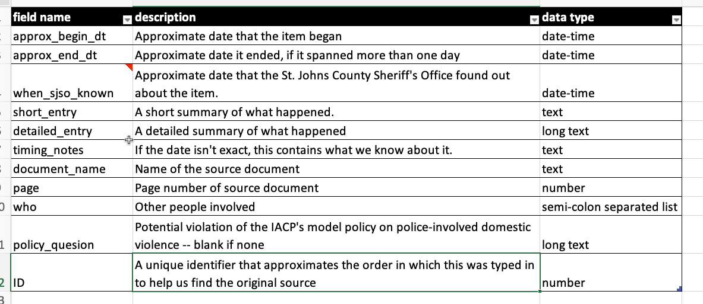

# Build your own database {#start-build-own}

## The evolution of a home-made database

The day in December 2015 that a San Bernadino couple killed 14 people, The New York Times published a short story called ["How Often Do Mass Shootings Occur?](https://www.nytimes.com/2015/12/03/us/how-often-do-mass-shootings-occur-on-average-every-day-records-show.html) On Average, Every Day, Records Show".

That daily story spurred the Times to embark on a project to document each mass shooting in America for a year. Five months later, it published this story:

<iframe src="https://www.nytimes.com/svc/oembed/html/?url=https%3A%2F%2Fwww.nytimes.com%2F2016%2F05%2F23%2Fus%2Famericas-overlooked-gun-violence.html" scrolling="no" frameborder="0" allowtransparency="true" title="A Drumbeat of Multiple Shootings, but America Isn’t Listening" style="border:none;max-width:500px;min-width:300px;min-height:550px;display:block;width:100%;"></iframe>

Here is how Sharon LaFraniere, Daniela Porat and Agustin Armendariz described the results of their work about 10 paragraphs into the story. (I suggest you also read the lede on your own - it's an exquisite example of framing a lede anecdote with detail and context.)

> Seeking deeper insight into the phenomenon, The New York Times identified and analyzed these 358 shootings with four or more casualties, drawing on two databases assembled from news reports and citizen contributors, and then verifying details with law enforcement agencies.
> 
> Only a small handful were high-profile mass shootings like those in South Carolina and Oregon. The rest are a pencil sketch of everyday America at its most violent.
> 
> They chronicle how easily lives are shattered when a firearm is readily available — in a waistband, a glove compartment, a mailbox or garbage can that serves as a gang’s gun locker. They document the mayhem spawned by the most banal of offenses: a push in a bar, a Facebook taunt, the wrong choice of music at a house party. They tally scores of unfortunates in the wrong place at the wrong time: an 11-month-old clinging to his mother’s hip, shot as she prepared to load him into a car; a 77-year-old church deacon, killed by a stray bullet while watching television on his couch.
>
> The shootings took place everywhere, but mostly outdoors: at neighborhood barbecues, family reunions, music festivals, basketball tournaments, movie theaters, housing project courtyards, Sweet 16 parties, public parks. Where motives could be gleaned, roughly half involved or suggested crime or gang activity. Arguments that spun out of control accounted for most other shootings, followed by acts of domestic violence.
>
>The typical victim was a man between 18 and 30, but more than 1 in 10 were 17 or younger. Less is known about those who pulled the triggers because nearly half of the cases remain unsolved. But of those arrested or identified as suspects, the average age was 27.
>
>Most of the shootings occurred in economically downtrodden neighborhoods. These shootings, by and large, are not a middle-class phenomenon.
>
>The divide is racial as well. Among the cases examined by The Times were 39 domestic violence shootings, and they largely involved white attackers and victims. So did many of the high-profile massacres, including a wild shootout between Texas biker gangs that left nine people dead and 18 wounded.
>
> Over all, though, nearly three-fourths of victims and suspected assailants whose race could be identified were black. Some experts suggest that helps explain why the drumbeat of dead and wounded does not inspire more outrage.
>
>
 
Notice how the authors weave the details that were chronicled in their database with the data points. Now, try to imagine how their dataset might have been organized to allow for such a rich description of the phenomenon.

The database, built by Armendariz, and mostly reported by Porat, was designed to anticipate this writing phase:

* The database was split into two separate tables -- one that detailed the 358 events and another that detailed the 1,592 victims.

* It included links to original FOIA requests and documentation they'd need for fact-checking.

* Some columns were categories or items that would be summarized -- the ages and ethnicity of the victims, the severity of the injury, and whether it was solved.  But much of the data included was detailed descriptions that could be searched using sophisticated filters. Still others were tagged with one-word descriptions that allowed the reporters to pluck just the right examples for just the right part of the story, using words like "suspected gang", "child", or "party". Over time, these tags were reviewed and revised, which is common on small databases like this.

* Fact-checking and information for publication was included in the database. For example, the database logged photos, interview and contact notes, and specific entries for name spelling and fact checks. That way the reporters could focus on what was NOT ready for publication, rather than review things they'd already checked.

What didn't they do?

They didn't bother to standardize names and addresses into their pieces -- they had no interest in counting how many "Smith"s were in the database, and didn't care how often they occurred a Main Street.

In other contexts, these fields might be important, but they were only required for filtering and sorting, not for counting. There was no reason to make it more difficult to fill out the database than necessary.

They also didn't try to publish the full dataset. That's an important consideration, especially if the data you are collecting contains sensitive or potentially erroneous information. Getting it to that level of accuracy might have added several months to the project, and probably would not have served readers any better. (The bare bones list of cases, with a few exceptions, was already available and updated elsewhere.)

## When to build your own database

There are a few common reasons to design and build your own data for stories:

* There is a long-running story that is periodically updated with new documents or events that you want to track. 

  One reporter created a spreadsheet to log each event related to Jack Kevorkian, a doctor who became famous for helping people commmit suicide. His list made it easy for him to write a story every time another person died, because he had the full list of people and circumstances and knew what he'd already fact-checked. 

  My first data-driven set of stories came from following the actions of George Steinbrenner, the former principle owner of the New  York Yankees, whose family owned a failing shipbuilding company in Tampa in the early 1990s. After I pressed the "sort" button, I discovered that each time he helped the company gain new Navy contracts by lending it money, he  demanded repayment as soon as the contract was signed, sending it back into a downward spiral.

* You are getting information from disparate sources and you need an easy way to search them, arrange them chronologically, and keep track of what you need to verify. Examples include reviewing court cases across jurisdictions or compiling death records from many medical examiners' officers. This would also work for tracking your own FOIA requests. You've read about this in [Michael Berens' story](https://cronkitedata.s3.amazonaws.com/docs/berens_nerds_words.pdf) of a serial killer in Illinois.

* You want to fill in details for every item on a list, like the mass shootings story above. This is quite common -- you might have a list of opioid overdose deaths from the medical examiner, but you want to fill out the details of this case. At USA Today, Anthony DeBarros did this after 9/11 to tell the story of every person killed in the World Trade Center, including where they were when the planes hit.

## Tools for building databases

The simplest tool for a one-table database is just Google Sheets or Excel. In both Google and Microsoft 365, it's possible to create a data entry form that will feed into a form, so you can make it a little more structured than just a free-form spreadsheet. But when it gets a little more complicated or you want more control over the data types and choices, you might choose to use a different product.

Airtable is one option (ASU has an enterprise account, which will kick in when you create an account with your school email address). More recently, Microsoft created "Lists" to your 365 account, and Google added "Tables" to your Google account. Airtable and Tables are quite limited in the free edition -- so limited that you may find it doesn't meet your needs. But even if you can't use it for your full dataset, it might be useful as a sandbox for you to test different ways to set up your dataset.

These products let you set up related tables, such as the events events and people tables used in the Times story, and create tags or other structured items for you spreadsheet. They're also good for working in teams.

## How to start

Work with everyone who might use the dataset before you start to set out goals. Think about the full range of issues that might come up. Most importantly, how are you going to get the information and how long will it take?  Is it just a list of things in chronological order or to provide a quick overview of your reporting? Or are you trying to count specific types of events, such as police shootings by race or gender or the lawyer who has had the most disciplinary actions taken?

The difference is whether you are primarily using your dataset for *sorting and filtering* versus *grouping* and *counting* by category.

You should also assume that you won't be able to get all of the information you'd hoped, and that real life doesn't often fit into neat rectangular boxes. So it's fine to put in some aspirational columns in case you can get the details, but be sure to stay realistic. If it takes too long to fill out a row in your database, you won't do it.

Here are some other considerations:

1. Try to find an interest group or academic researcher who has already tried to tally the information you're collecting. They may have good structures that you can adapt to your project.  If you can't, try to find a standard that you want to measure your results against -- was a policy followed or not, or was a case solved or not? These are the key statistics that will identify the newsworthiness of your results.

2. Carefully define your "universe". In the case of the Washington Post's Pulitzer Prize-winning "Fatal Flaws" series on deadly police shootings, the reporters chose to focus only on deaths that were the result of gun discharges in the line of duty. That means they aren't able to talk about all of the people killed by police, nor all of the people killed in custody, because some happen off hours and others are strangulations or other causes of death. In other cases, you may choose to FOIA the top 50 cities or counties and ignore all the rest. It's ok to limit your universe. Just be sure that your entire team knows and agrees to the definitions and the limits that places on the results.

2. What is your unit of analysis, or the noun you use to describe a row in your database? Do you want to count events, people, cases, years, or something else? If so, you should have one and only one row for each of those things, which may mean splitting your work inot more than one data frame or table, the way the Times reporters did for people and events.  

3. Build your data dictionary before you start filling out the database, and keep adjusting it as you have to adapt to the real world. Make sure to include a detailed data type (eg, a list separated by semicolons, long text, category, number, date....), and list any standardized words or codes you plan to use ("Y" or "N" for yes and no, for example) .

2. Reduce the number of columns by smartly combining categories into tags, and considering the way you'll use a field. For example, sorting by street name isn't usually very useful (especially when you can filter for it), so there may be no reason to split the street number, name, etc. into different columns. If you enter names in a standard format (eg, Last, First Middle Suffix), then they're easy to split later on but can be kept in one column and still be sorted. In other words, consider whether you want to be able to sort, filter or count entries. Each of them requires a different level of standardization.

3. Anticipate errors. One of the more common problems in creating your own dataset is that the whole purpose of it is to sort or arrange it by date, so you have to enter dates properly. But we rarely do get the exact date for every item in the list.   There are several strategies for this, such as entering year, month and day in different columns; or entering an approximate date, and flagging it as "approximate" in a separate field (my preference).

4. Build in fact-checking. If nothing else, be sure to include the source of the information in the row, and provide a way to get back to the original quickly. For example, if you are typing in events from a court case, enter a link to the case folder in one field, and the page number of the item you're entering in another. If I'm publishing anything from the dataset, I include columns for name checks, fact checks and even whether the narrative has been copy edited.

3. How many columns do you really want? On a spreadsheet, things can bet pretty unwieldy pretty fast. Try to avoid having more than about 15 columns, and try to define them so that most are filled out.

This is an example of a spreadsheet created to log the first 100 days of the Obama administration. The "subject_tags" column let the reporters enter a variety of categories, which were then normalized when it came time to use them.

{width=100%}

Those tags resulted in it being relatively easy to create graphics like this by filtering for related tags and ordering it by date:

{width=100%}

## An example

In 2013, the New York Times and Frontline collaborated on a story on police-involved domestic violence. Most of the story was a narrative of a single case. But it was important to show that this was not the first time the sheriff in the Florida county was slow to investigate his deputies. Another case several years earlier had the same telltale problems.

The Times obtained several key documents in the other case.*  You can [read a copy](https://cronkitedata.s3.amazonaws.com/docs/internal-affairs-report.pdf) of the internal affairs report yourself, but you quickly come away realizing that it's hard to follow, repetitive and you're never quite sure what's happened.  Here is the record layout of the table that we built, and a small snippet of what it looks like.

{width=100%}

And here is what a few rows look like. Notice that they are not organized chronologically, but are organized in the order that they were listed in the underlying document. The "sort" button turns it into a chronology.

{width=100%}

And finally, here is what was written about the case in the final story:

> A year before that, Sheriff Shoar’s disciplinary posture had been called into question in a domestic violence case involving a deputy named Halford (Bubba) Harris II.
>
> Two supervisors learned of accusations that Mr. Harris had abused his wife. But no investigation was immediately opened, records show.
>
> One sergeant did prepare an affidavit documenting the accusations. But he was told by his supervisor to hold it back, so he stuck it under the visor in his squad car, where it remained, even after another officer became aware of further incidents, according to Mr. Harris’s internal affairs file.
>
>The case came to a head on Christmas Eve, when his wife fled their house and called the police. Internal affairs officers uncovered other possible acts of domestic violence before his hiring, records show. His wife said that before they married, he had held a knife to her throat and hit her. His ex-wife said he had threatened her with a gun. No charges were filed.
>
> Col. Todd R. Thompson, the sheriff’s director of law enforcement, recommended that Mr. Harris be fired, saying his actions were “particularly egregious and trouble me deeply.”

Was it necessary to create a spreadsheet logging almost 100 events in this case? No. But we had to go through every document in detail anyway, and this meant we didn't have to do it over and over again.
