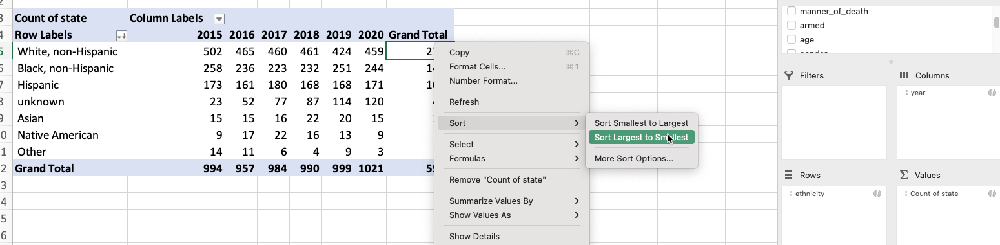

# Grouping with pivot tables { #xl-pivot }

In the wake of a police shooting in 2016, reporter Mitch Smith obtained a [list of traffic stops](https://cronkitedata.s3.amazonaws.com/xlfiles/saintanthony_police.xlsx) from the St. Anthony Police Department in Minnesota. He was writing a story on Philandro Castile's death and was running out of time. He wanted to answer a simple question:  Were minority motorists more likely to be stopped in St. Anthony than whites? 

Rob Gebeloff made a quick pivot table to answer the question. That night, [Smith wrote ](https://www.nytimes.com/2016/07/13/us/philando-castile-minnesota-police-shooting.html): 

>In each of the three small suburbs patrolled by the St. Anthony police, less than 10 percent of the population is black. But data released by the city on Tuesday showed that a far higher percentage of the people ticketed or arrested by St. Anthony officers were African-American.
>
>Last year, around 19 percent of those cited by St. Anthony police were black, as were roughly 41 percent of people arrested by the department, a review of the city’s data showed. Those percentages do not include the large number of defendants whose race was unknown.

Summarizing a list of items in a spreadsheet is done using pivot tables. In other languages, it's considered "aggregating" or "grouping and summarizing".  Think of pivot tables and grouping  as answering the questions, "How many?" and "How much?". They are particularly powerful when your question also has the words "the most" or the "the least" or "of each".  Some examples:

* Which *Zip Code* had *the most* crimes?
* What *month* had *the least* total rainfall?
* *How much* did *each candidate* raise last quarter?
* In playing cards, *how many* of *each suit* do I have in my hand?
* On average, are *Cronkite students* *taller or shorter* than in other schools?

### Confusing grouping with sorting or arranging {-}

Many reporters confuse this summarization with "sorting". One reason is that this is how we express the concept in plain language: "I want to sort Skittles by color".

But in data analysis, sorting and and grouping are very different things. *Sorting* involves shuffling a table's rows into some order based on the values in a column. In other languages, this is called *arranging* or *ordering*, much clearer concepts. *Grouping*, which is what pivot tables do, is a path to aggregating and computing summary statistics such as a count (the number of items), sum (how much they add up to), or average for  category.  It means "make piles and compute statistics for each one."

### When to use filter vs. pivot tables {-}

Something that trips up beginners is a desire to see details and totals  at the same time, which is more difficult than it sounds. 

A filter is used to *display* your selected items as a list. You'll get to see all of the detail and every column. As a convenience, Excel shows you how many items are in that filtered list. That's great when you want to just look at them, or get more information about them. For instance, if you had a list of crimes by ZIP code, you might just want to see the list in your neighborhood -- where, exactly, were they? When did they happen? Was it at night or the morning? What crimes happened on which blocks?

A pivot table is used when you *just want to see summaries* -- does my ZIP code have more crime than others? Are robberies more common than car theft in my Zip code, and how does that compare to others?

In practice, you'll go back and forth between summary and detail. They're both important, just different.

## Tutorial

::: {.alert .alert-info .opacity-2}

This continues with the Washington Post's police shooting database, but I updated it to include the descriptions of ethnicities.  

[Download the new version](https://cronkitedata.s3.amazonaws.com/xlfiles/wapo-shootings-pivot.xlsx)
 
:::

### TL;DR {-}

Here's a video with the same material:

<iframe width="560" height="315" src="https://www.youtube-nocookie.com/embed/P_udA-XFpGY" title="YouTube video player" frameborder="0" allow="accelerometer; autoplay; clipboard-write; encrypted-media; gyroscope; picture-in-picture" allowfullscreen></iframe>

### Setting up the pivot table {-}

Start with your cursor somewhere in your data , and choose *Insert*, then *Pivot table*

If all goes well, it will look like your data disappeared. It didn't -- you're just on a new page. Here's what it looks like:

{width=100%}

### Counting , or "how many"? {-}

The section on the right gives you an outline of what to do. The section on the left will get filled in as you make your pivot table. If you want to see the number of fatalities by ethnicity, drag that column into the "Rows" area, then drag something that's always filled out into the Values area (`state` is a safe one in this data).

{width=100%}

###  Percents of total {-}

It's hard to compare raw numbers unless they're really small. Instead, we'd like to know what *percent* of fatalities by ethnicity. Right-click on any number in the pivot table, and choose "Show data as..." , then choose "Percent of Column total". 

{width=100%}

To remove it, right-click on it and choose "Remove "Count of state2"".

### More variables {-}

Suppose you'd like to see the number of fatalities by year, with the years across the top and the `ethnicity` down the sides. Drag the `year` variable into the column area .  Sorting can get hinky on pivot tables, but in this case it will work to put the largest number on top. This won't work with percentages -- it still sorts by the underlying number. 

{width=100%}

### Even more variables {-}

Say you wanted to see each city's total shootings by year. Which one had the most last year, and which one had the most overall? 

This is actually really hard in a pivot table, because there are cities with the same names in different states. It means you'd need to have a pivot table with TWO columns down the side, and one across the top. Here's my attempt at getting there: 

{width=100%}

This is after some fiddling with the formats, and I still can't sort properly -- the city "Phoenix", including those in Maryland and Arizona, had the second-highest  number of shootings. We can't sort by the combination of city and state. 

Your choices in Excel are limited: Copy and paste the values of the pivot table into a new sheet and sort there, or create a new variable by concatenating the name of the city and state into one column. 

## FAQ
 
### Everything disappeared!{-} 

If you select something outside of that pivot table on the left, the menu on the right disappears. Select something in the pivot table area and it will likely come back.

### I have too many columns {-} 

If you want two sets of statistics -- say, number of fatalities and percent of fatalities -- across the top, it can get very wide and confusing very quickly. One alternative is to change it into more of a vertical rectangle by dragging the "Values" element from the columns to the rows on the right. (This only shows up when you have two calculations being made.)

### I want to sort by percents, not numbers {-} 

You can't. 
 
 
### Things aren't adding up {-}

You have to be super careful about which column you use to Count things -- it has to always be filled out (there can't be any blanks). Go through the filters and find one that doesnt have (Blanks) at the bottom to be sure. 

### Its a crazy number! {-}

You might have dragged a numeric column into the "Values" area. Check to see if it says "Count" or "Sum". Change it to "Count" if it has something else on it, unless you wanted to add up that column. 

### This is so frustrating - I can't get what I want {-}

Right? It's time to go to a programming language! 

 